# Incident Report — Privilege Escalation Detected

**Incident:** Privilege Escalation Tool Executed After Phishing Attachment Opened
**Platform:** LetsDefend
**Severity:** Critical
**Category:** Malware
**Date:** 31/01/21
**Related Alerts:** SOC107, SOC114

> Investigation answers and platform flags are redacted. This report documents the analysis process and reasoning, not the solution to the exercise.

---

## 1. Alert Overview

| Field               | Value                                |
| ------------------- | ------------------------------------ |
| Alert ID            | SOC107 (Event ID 48)                 |
| Trigger Time        | 2021-01-31 16:20:28 (UTC+3)          |
| Rule Name           | SOC107 Privilege Escalation Detected |
| Severity            | Critical                             |
| Source Address      | 172.16.17.45 (RichardPRD)            |
| Destination Address | Not recorded                         |
| Device Action       | Allowed                              |

This rule watches for tools that try to raise an ordinary user account to SYSTEM, which is the highest level of access on a Windows machine. It fired because a file called JuicyPotato.exe ran on a workstation named RichardPRD. JuicyPotato is a publicly available hacking tool with no business use whatsoever, so finding it on a staff laptop is already a problem before anyone asks what it did there.

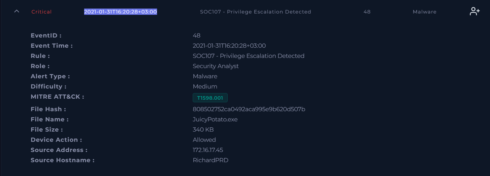

---

## 2. Alert Report

**Verdict:** True Positive

**Time of Activity:**

| Time                        | Event                                                                                                          |
| --------------------------- | -------------------------------------------------------------------------------------------------------------- |
| 2021-01-31 15:48:30 (UTC+3) | Phishing email with the subject "Invoice" delivered to richard@letsdefend.io from accounting@cmail.carleton.ca |
| 2021-01-31 16:15 (UTC+3)    | excel.exe opens the attachment and EQNEDT32.EXE is exploited                                                   |
| 2021-01-31 16:15 (UTC+3)    | EQNEDT32.EXE sends a GET request for network.exe to andaluciabeach.net, allowed by the proxy                   |
| 2021-01-31 16:20:28 (UTC+3) | JuicyPotato.exe runs on RichardPRD, device action Allowed                                                      |
| After 16:20:28              | No further processes and no further outbound traffic recorded from the host                                    |

The proxy log records the download at 20:15:45 and the mail record shows 19:48:30, while the endpoint and browser data show 16:15 and 15:48:30. That four hour gap is a timezone difference rather than a second set of events. Every time above is normalised to UTC+3 so it lines up with the alert.

**Affected Entities:**

| Entity             | Value                                                         |
| ------------------ | ------------------------------------------------------------- |
| Affected host      | RichardPRD, 172.16.17.45, Windows 10, domain letsdefend.local |
| User account       | richard, primary user of the workstation                      |
| Recipient          | richard@letsdefend.io                                         |
| Sender             | accounting@cmail.carleton.ca                                  |
| Sender IP          | 49.234.43.39                                                  |
| Subject            | Invoice                                                       |
| Attachment MD5     | c9ad9506bcccfaa987ff9fc11b91698d, 36/62 on VirusTotal         |
| Payload URL        | http://andaluciabeach.net/image/network.exe                   |
| Payload IP         | 5.135.143.133, contacted on port 443                          |
| Processes involved | excel.exe, EQNEDT32.EXE, JuicyPotato.exe                      |
| Escalation tool    | JuicyPotato.exe, 340 KB, MD5 808502752ca0492aca995e9b620d507b |
| Files dropped      | network.exe downloaded to the host, execution not confirmed   |

**Reasoning:**

The alert triggered on the execution of JuicyPotato.exe originating from RichardPRD (172.16.17.45), the workstation used by richard@letsdefend.io. Investigation confirmed a phishing email carrying an attachment that exploits CVE-2017-11882, a proxy log showing EQNEDT32.EXE requesting network.exe from andaluciabeach.net with excel.exe as its parent process, and the escalation tool running five minutes after that download, which indicates a real attack that reached the privilege escalation stage on a live host.

The payload download was allowed by the proxy instead of blocked, so the attacker's second file reached the machine. Execution of JuicyPotato.exe is confirmed, but the command line arguments were never captured and the command history on the host is empty, so the available telemetry cannot settle whether the escalation to SYSTEM actually worked.

Nothing else was recorded on the host after that point. No further processes, no outbound connections beyond the payload download.

**Escalation:** Required. An attacker achieved code execution through an Office exploit, pulled down a second file without being stopped, and ran a tool whose entire purpose is seizing SYSTEM level access. If it worked, the attacker owns the host and every credential cached on it.

**Recommended Remediation Action:**

1. Keep RichardPRD isolated from the network until forensic analysis is finished. Containment was still switched off at the time of review.
2. Run host forensics to determine whether the escalation to SYSTEM succeeded. Look for new local administrator accounts, scheduled tasks, services, and registry autoruns created around 16:20 on 31 January.
3. Locate and remove network.exe and JuicyPotato.exe from the host.
4. Reset richard's credentials and invalidate active sessions. If the escalation succeeded, treat every credential cached on that machine as compromised.
5. Delete the phishing email from the mailbox, then block the sender accounting@cmail.carleton.ca and the SMTP source 49.234.43.39 at the mail gateway.
6. Block andaluciabeach.net and 5.135.143.133 at the proxy and firewall.
7. Verify the Windows build on RichardPRD. JuicyPotato works on Server releases up to 2016 and Windows 10 up to build 1803. Patch or upgrade the host if it falls in that range.
8. Confirm that CVE-2017-11882 is patched across the estate. Microsoft removed Equation Editor completely in 2018, so any machine still carrying it is badly behind on updates.
9. Hunt for EQNEDT32.EXE execution and for connections to andaluciabeach.net on other hosts.

**Indicators of Compromise:**

| Type         | Indicator                                   | Notes                                           |
| ------------ | ------------------------------------------- | ----------------------------------------------- |
| Hash         | c9ad9506bcccfaa987ff9fc11b91698d            | Phishing attachment, 36/62 on VirusTotal        |
| Hash         | 808502752ca0492aca995e9b620d507b            | JuicyPotato.exe, 57/69 on VirusTotal            |
| IP           | 49.234.43.39                                | SMTP source of the phishing email               |
| IP           | 5.135.143.133                               | Hosts andaluciabeach.net, contacted on port 443 |
| Domain / URL | http://andaluciabeach.net/image/network.exe | Payload URL requested by EQNEDT32.EXE           |
| File Name    | network.exe                                 | Second stage payload, download confirmed        |
| File Name    | JuicyPotato.exe                             | Privilege escalation tool executed on the host  |
| Email        | accounting@cmail.carleton.ca                | Phishing sender, one recipient only             |

**MITRE ATT&CK:**

| Tactic               | Technique                                      | ID        |
| -------------------- | ---------------------------------------------- | --------- |
| Initial Access       | Phishing: Spearphishing Attachment             | T1566.001 |
| Execution            | Exploitation for Client Execution              | T1203     |
| Execution            | User Execution: Malicious File                 | T1204.002 |
| Stealth              | Masquerading: Masquerade File Type             | T1036.008 |
| Command and Control  | Ingress Tool Transfer                          | T1105     |
| Privilege Escalation | Access Token Manipulation: Token Impersonation | T1134.001 |

---

## 3. Investigation

### 3.1 Initial Triage

The alert handed me a filename, a hash, a host, and a device action of Allowed. It said nothing about where the file came from. My working assumption was that a privilege escalation tool does not arrive on a workstation by itself, so something earlier in the day put it there. Finding that earlier step was the actual job, since the alert had already told me the part it could see.

### 3.2 File Reputation

I took the hash from the alert and ran it through VirusTotal. 57 of 69 vendors flagged it, and the labels came back as hacktool rather than trojan or ransomware.

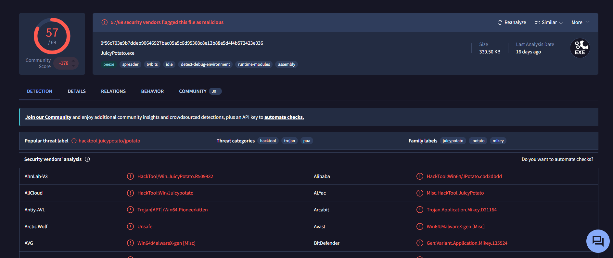

The details page confirms a 64 bit Windows executable of 339.50 KB, which matches the 340 KB in the alert, under the same MD5. The binary has been circulating since 2018.

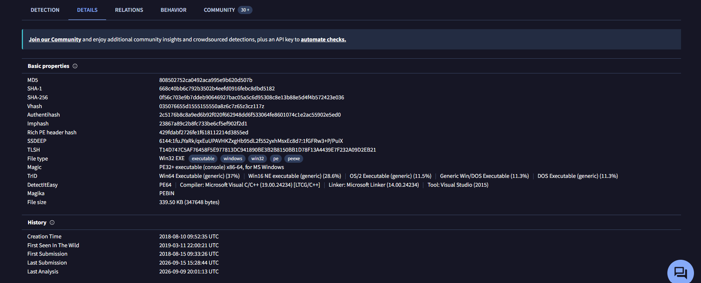

The list of names this file has been uploaded under is a small thing, but it stuck with me. jp.exe, juicypotato64.exe, and something called ccc.pdf are all the same binary. The filename tells you nothing. The hash is the only part worth trusting.

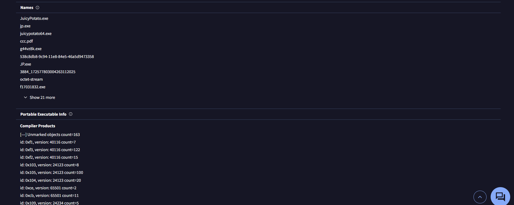

JuicyPotato is not conventional malware. It is a public tool that abuses SeImpersonatePrivilege, a Windows permission held by certain service accounts, to climb from a limited account up to SYSTEM. It opens a local RPC listener, triggers COM activation through a chosen CLSID, catches the SYSTEM token that comes back from the authentication, and starts a new process holding that token.

All of that happens inside the machine, so the tool never needs to reach an attacker server. The contacted domains on VirusTotal are Microsoft and CDN addresses with zero detections, which fits that description and explains why no command and control traffic is tied to this file.

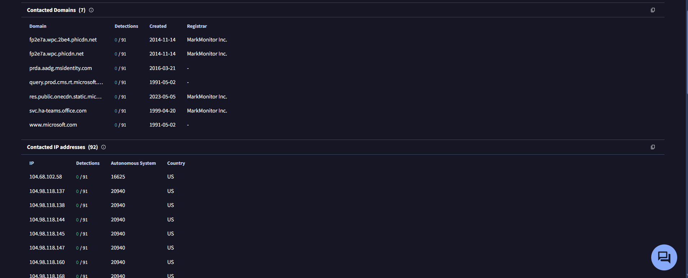

### 3.3 Endpoint Investigation

RichardPRD is a Windows 10 client on the letsdefend.local domain, primary user richard. Containment was switched off, which is why isolation sits at the top of the remediation list.

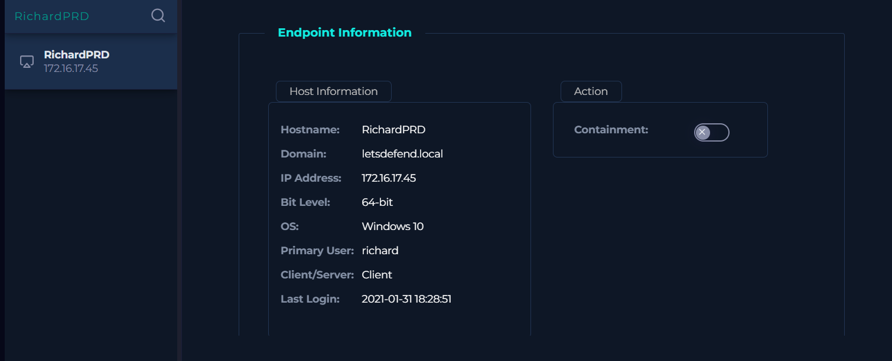

A search of the process list confirms JuicyPotato ran on the host.

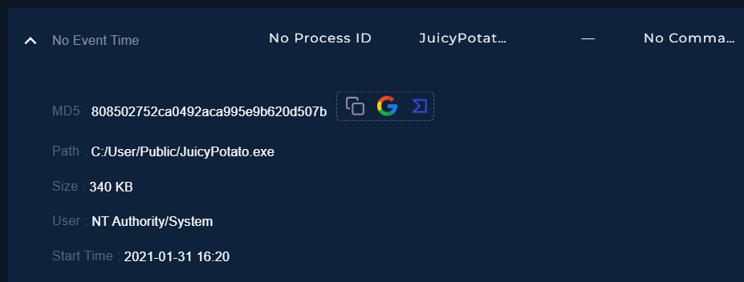

The full process list is where the incident starts making sense. EXCEL.EXE, outlook.exe, EQNEDT32.EXE, and JuicyPotato all sit in the same list. EQNEDT32.EXE is Microsoft Equation Editor, an old Office component for inserting mathematical formulas. Nobody has opened it deliberately in years, and seeing it next to Excel is the classic fingerprint of an Office document exploit.

One caveat I want to be precise about. This view carries no timestamps, no process IDs, no parent process column. It proves these processes existed on the host and stops there. The parent and child relationship came from a different source, which I cover in 3.4.

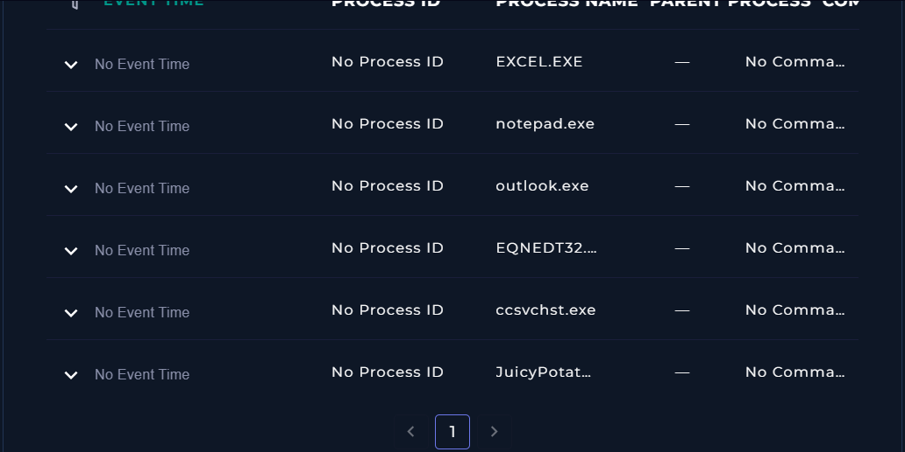

Browser history shows http://andaluciabeach.net/image/network.exe accessed at 16:15 on 31 January, sitting between ordinary BBC articles and a Stack Overflow question. An executable download wedged into a normal browsing day is exactly the kind of thing worth pulling on.

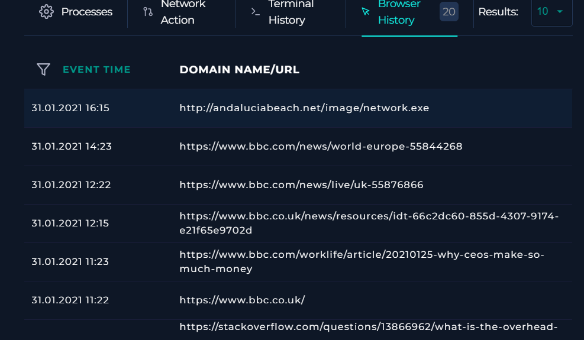

Command history is empty, and this is the single most limiting fact in the investigation. JuicyPotato takes arguments that specify the CLSID and the command to run as SYSTEM. Without them I cannot tell what the attacker asked the tool to do, or whether it did it. Only the execution itself is provable.

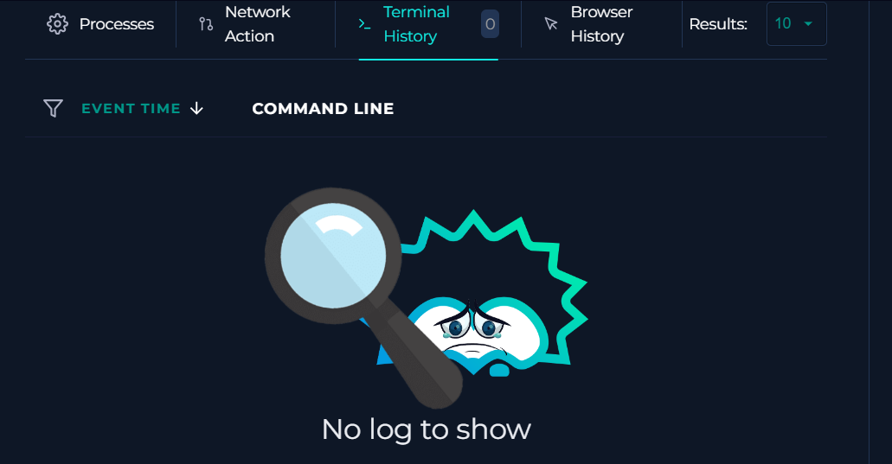

### 3.4 Log Analysis

Filtering Log Management on 172.16.17.45 returned a proxy connection to 5.135.143.133 on port 443 at 20:15:45 on 31 January, plus five firewall entries dated 6 February.

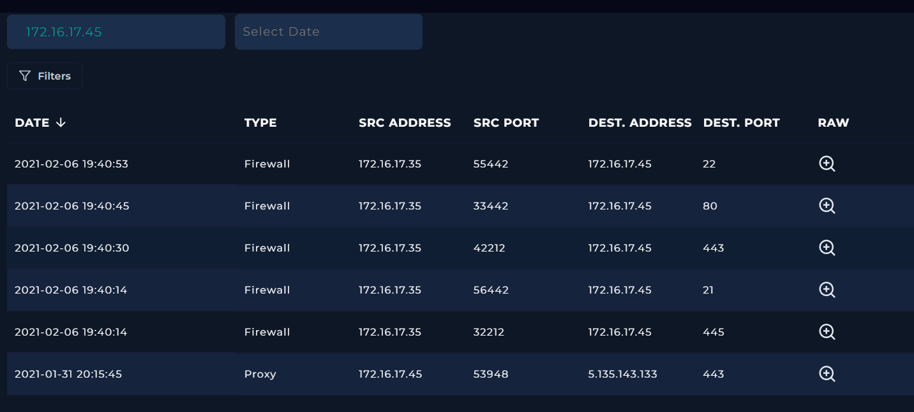

The raw proxy log is the single strongest piece of evidence in this report:

Process EQNEDT32.EXE, request URL http://andaluciabeach.net/image/network.exe, method GET, parent process excel.exe, device action Allowed.

Equation Editor has no legitimate reason to fetch anything from the internet. A GET request from that process for an .exe is proof of exploitation by itself, and the parent process field completes the chain. Excel opened the document, Equation Editor was exploited, the payload came down, and nothing blocked it.

The four hour offset between this log and the browser history comes from the proxy running on UTC while the endpoint and the alert run on UTC+3. Two clocks, one event.

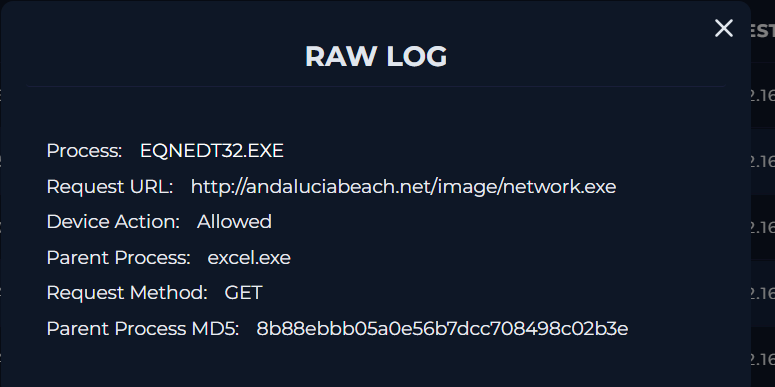

The 6 February entries are a different story. Internal host 172.16.17.35 hit RichardPRD on ports 21, 22, 80, 443, and 445 inside 39 seconds, which is port scanning. The firewall blocked every attempt, and it happened six days after the incident, so I kept it out of this timeline instead of forcing a connection that the evidence does not support. It still goes in the remediation list for someone to look at.

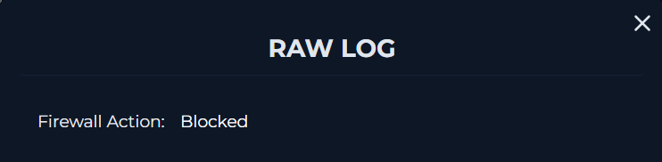

### 3.5 Email Analysis

Working backwards from Excel, the remaining question was how the document reached the host in the first place. Email Security returned exactly one message to richard@letsdefend.io.

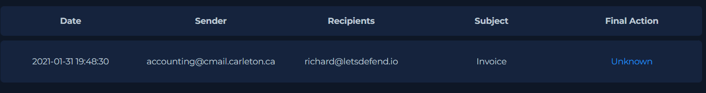

It came from accounting@cmail.carleton.ca with the subject "Invoice", a two line body about an attached invoice, and sender IP 49.234.43.39. The platform records the final action as Unknown rather than Allowed or Blocked. Delivery is not really in question though, given what happened on the host less than half an hour later.

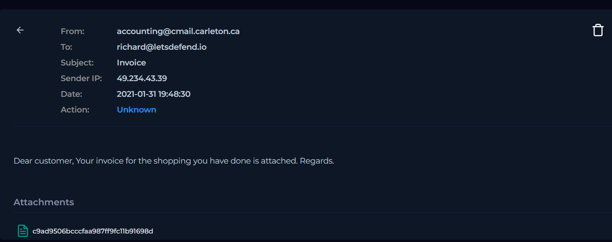

The attachment comes back 36 of 62 on VirusTotal, tagged exploit, executes-dropped-file, and cve-2017-11882. The filename ends in .xlsx, but VirusTotal identifies the real file type as a PowerPoint presentation. The extension is a disguise, and it worked. The user saw an invoice spreadsheet and opened it.

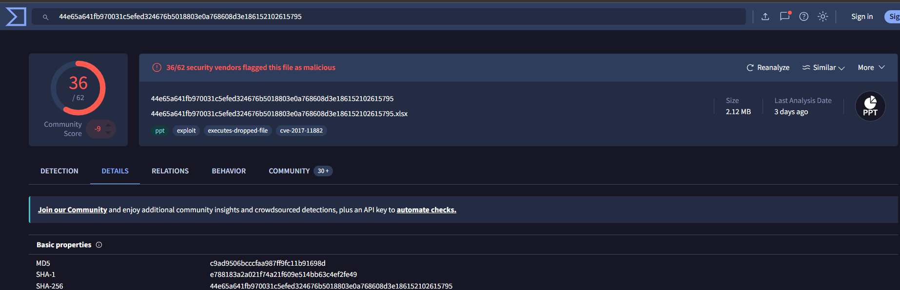

CVE-2017-11882 is a memory corruption bug in Equation Editor that lets an Office document run code. That one fact explains EQNEDT32.EXE turning up in the process list and making an outbound request, and it closes the gap between the email and the download.

The Relations tab lists http://andaluciabeach.net/image/network.exe among the URLs this file contacts, which ties the attachment to the proxy log and the browser history from a completely separate source.

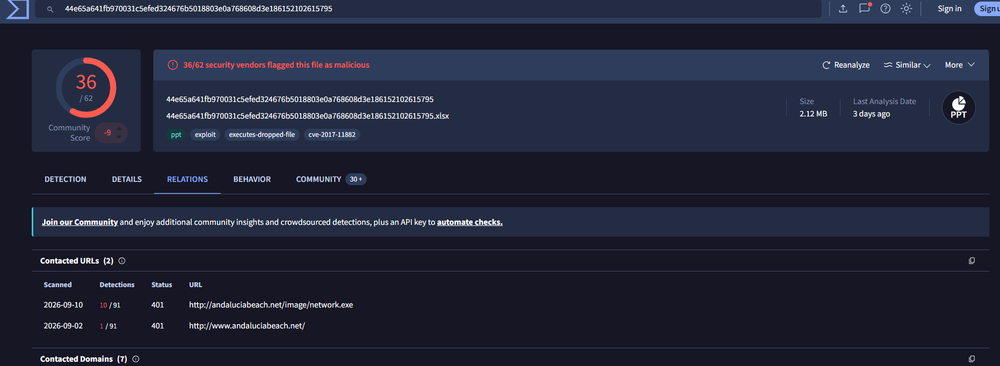

Last check was scope. I filtered all mail by the sender address to see who else received it.

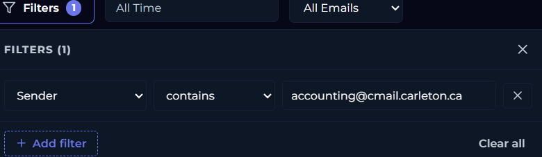

One message, one recipient. That read as a targeted attempt rather than a bulk campaign, and it raised my sense of how seriously to treat the whole thing.

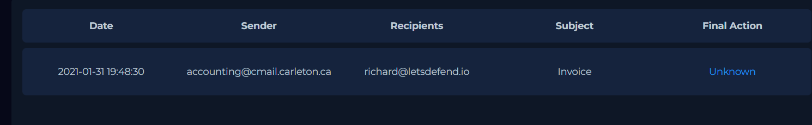

### 3.6 What the Evidence Does Not Prove

Three things I could not establish. I would rather write them down than tell a tidier story than the logs actually support.

Whether the escalation succeeded. The tool ran. With no command line arguments and no command history, that is as far as the evidence reaches.

Whether network.exe executed. The download is confirmed twice over, by the proxy log and the browser history, but the file never shows up in the process list and no alert covers that stage. I inferred its execution from JuicyPotato ending up on disk, since a phishing document on its own does not place a privilege escalation tool there. That is me reasoning across a gap in the telemetry, and it should be read that way.

What happened after 16:20:28. No processes and no outbound connections were recorded past the payload download. The honest reading is that the logging stops at that point, not that the attacker did.

For a real incident, the next step is a disk and memory image of RichardPRD. Everything above is as far as platform telemetry can take it.
