# Incident Report: New scheduled task created

**Incident:** Scheduled task created on host Helena after a Python script from a public GitHub repository was executed
**Platform:** LetsDefend
**Severity:** Critical
**Category:** Malware
**Date:** 14/05/21
**Related Alerts:** SOC144

> Investigation answers and platform flags are redacted. This report documents the analysis process and reasoning, not the solution to the exercise.

---

## 1. Alert Overview

| Field               | Value                                                  |
| ------------------- | ------------------------------------------------------ |
| Alert ID            | SOC144                                                 |
| Trigger Time        | 2021-05-14 15:22:22 (UTC+3)                            |
| Rule Name           | New scheduled task created                             |
| Severity            | Critical                                               |
| Source Address      | 172.16.17.36 (host Helena)                             |
| Destination Address | Not listed in the alert. Proxy logs show 92.27.116.104 |
| Device Action       | Allowed                                                |

Windows records an event whenever a new scheduled task is registered. A scheduled task is a job the operating system runs on a timer, which is what makes it useful for backups and updates, and equally useful for malware that wants to keep running after a reboot. The rule fires on every new task because the task by itself is neutral. The analyst decides whether the program behind it belongs on the machine.

---

## 2. Alert Report

**Verdict:** True Positive

**Time of Activity:**

| Time (UTC+3)        | Activity                                                                   |
| ------------------- | -------------------------------------------------------------------------- |
| 2021-05-14 15:21    | User downloads master.zip from github.com/pythonguru2021x/Sorted-Algorithm |
| 2021-05-14 15:22    | python.exe executes C:\Users\Helena\Downloads\Sorted-Algorithm.py          |
| 2021-05-14 15:22    | Outbound connection from 172.16.17.36:55221 to 92.27.116.104:80            |
| 2021-05-14 15:22:22 | Alert triggers on the creation of a new scheduled task                     |
| 2021-05-14 15:23    | SCHTASKS /CREATE registers the task DailyRoutine                           |
| 2021-05-14 17:13    | ipconfig executed                                                          |
| 2021-05-14 17:16    | ipconfig /all executed                                                     |

The proxy log sits on a different clock than the endpoint data. Everything above is normalised to UTC+3, the timezone used by the alert and the endpoint telemetry.

**Affected Entities:**

| Item              | Value                                                                     |
| ----------------- | ------------------------------------------------------------------------- |
| Host              | Helena, Windows 10, domain LetsDefend                                     |
| Host IP           | 172.16.17.36                                                              |
| User              | Helena                                                                    |
| File              | Sorted-Algorithm.py, 1.16 KB                                              |
| MD5               | 65d880c7f474720dafb84c1e93c51e11                                          |
| SHA-256           | 255392992bf103d218466399d670300453a69f24398b02f316a74826c1f95a82          |
| Download source   | github.com/pythonguru2021x/Sorted-Algorithm/archive/refs/heads/master.zip |
| Address contacted | 92.27.116.104:80                                                          |
| Scheduled task    | DailyRoutine                                                              |
| Payload path      | C:\Windows\Temp\x86_x64_setup.exe                                         |

**Reasoning:**

The alert triggered on the creation of a new scheduled task named DailyRoutine originating from host Helena (172.16.17.36). Investigation confirmed that the user downloaded a Python script from a public GitHub repository one minute earlier, that python.exe ran that script at 15:22, that the host then opened a connection to 92.27.116.104 which VirusTotal associates with Emotet infrastructure, and that the new task was set to launch C:\Windows\Temp\x86_x64_setup.exe every day, which indicates the script was malicious and the attacker had reached the persistence stage.

The connection was allowed by the proxy rather than blocked, and the device action on the alert was Allowed as well, so nothing in the chain was stopped. The scheduled payload x86_x64_setup.exe does not appear anywhere in the host process list, so it had not executed at the time of review. The task runs daily, so it will fire again unless somebody removes it.

Two reconnaissance commands, ipconfig and ipconfig /all, ran on the same host that afternoon at 17:13 and 17:16. Both print network configuration, which is what an operator reads before deciding where to go next inside a network.

**Escalation:**

Required. A malicious script ran on the host, reached known Emotet infrastructure, and left behind a daily task pointing at a payload in a temporary folder. None of it was blocked, and the payload is still staged to run. The download source is a public repository other employees can still reach, so additional victims inside the organisation remain possible.

**Recommended Remediation Action:**

1. Keep Helena isolated until remediation is verified.
2. Delete the scheduled task DailyRoutine.
3. Check C:\Windows\Temp\x86_x64_setup.exe. If the file is there, acquire and hash it before removing it.
4. Delete Sorted-Algorithm.py from the Downloads folder.
5. Run host forensics to establish whether the payload ever executed. Look for dropped files, registry autoruns, and other scheduled tasks.
6. Block 92.27.116.104 at the firewall and the proxy.
7. Hunt for connections to 92.27.116.104 from other internal hosts.

**Indicators of Compromise:**

| Type         | Indicator                                                        | Notes                                       |
| ------------ | ---------------------------------------------------------------- | ------------------------------------------- |
| Hash         | 65d880c7f474720dafb84c1e93c51e11                                 | MD5 of Sorted-Algorithm.py                  |
| Hash         | 255392992bf103d218466399d670300453a69f24398b02f316a74826c1f95a82 | SHA-256 of Sorted-Algorithm.py              |
| IP           | 92.27.116.104                                                    | Contacted on port 80, Emotet infrastructure |
| Domain / URL | github.com/pythonguru2021x/Sorted-Algorithm                      | Repository hosting the script               |
| File Name    | Sorted-Algorithm.py                                              | Script downloaded and executed by the user  |
| File Name    | C:\Windows\Temp\x86_x64_setup.exe                                | Payload path, never observed running        |
| Task Name    | DailyRoutine                                                     | Persistence                                 |

**MITRE ATT&CK:**

| Tactic              | Technique                                 | ID        |
| ------------------- | ----------------------------------------- | --------- |
| Execution           | User Execution: Malicious File            | T1204.002 |
| Persistence         | Scheduled Task/Job: Scheduled Task        | T1053.005 |
| Command and Control | Application Layer Protocol: Web Protocols | T1071.001 |
| Command and Control | Ingress Tool Transfer                     | T1105     |
| Discovery           | System Network Configuration Discovery    | T1016     |

---

## 3. Investigation

### 3.1 Initial Triage

The alert gives a file name, Sorted-Algorithm.py, an MD5 hash, the host Helena, and a device action of Allowed. A Python file named like that could easily belong to a developer, so the first question was whether this task was somebody's maintenance job or somebody else's foothold. Allowed meant nothing had been stopped on the way in, so I worked on the assumption that the host was compromised until the evidence said otherwise.

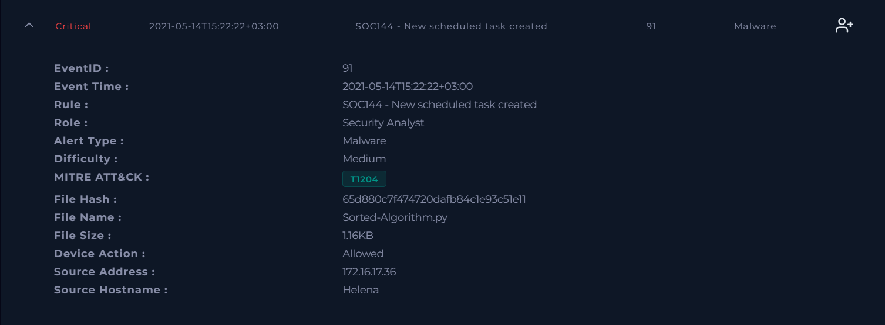

### 3.2 Host Identification

Helena is a Windows 10 client in the LetsDefend domain at 172.16.17.36, and the primary user has the same name. There is a second machine called Helena-2 at 172.16.17.99 that has nothing to do with this. Containment was still off at this stage, matching the Allowed action on the alert.

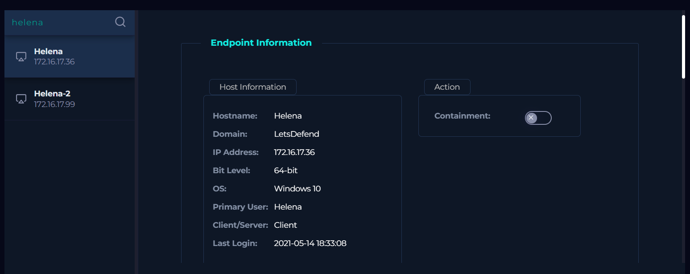

### 3.3 Terminal History

Terminal history put the sequence together. At 15:22 python.exe ran C:\Users\Helena\Downloads\Sorted-Algorithm.py. One minute later, at 15:23, this command created the task:

```
SCHTASKS /CREATE /SC DAILY /TN DailyRoutine /TR C:\Windows\Temp\x86_x64_setup.exe
```

Three details in that single line decide the verdict. /SC DAILY repeats the execution, which is persistence rather than a one off job. /TN DailyRoutine is a bland name that vanishes in a list of tasks an admin scrolls past. /TR points at C:\Windows\Temp\, a folder any user can write to and where no legitimate installer lives.

Two more commands show up later that afternoon, ipconfig at 17:13 and ipconfig /all at 17:16. Before all this, the previous entry is a whoami from 6 April, over a month earlier. This user does not spend much time in a terminal.

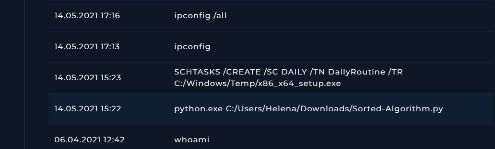

### 3.4 Process List

If the scheduled payload had already run, x86_x64_setup.exe would be in this list. It is not. Of the 15 processes recorded, python.exe is the only one connected to the incident, and the rest is ordinary desktop activity like chrome.exe and Outlook.

So the attack is staged, not finished. Either the payload had not run yet when I reviewed the host, or its execution was never captured. The task fires daily either way, which means the distinction has a short shelf life.

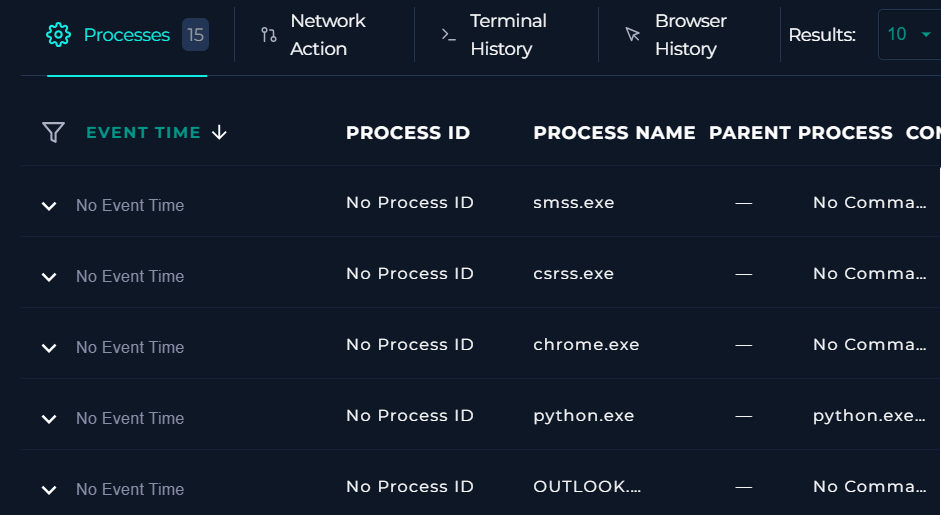

### 3.5 Network Activity

That one minute between the script running and the task appearing was the next thing to explain, so I searched log management for traffic from the host. One proxy entry came back: 172.16.17.36:55221 to 92.27.116.104 on port 80.

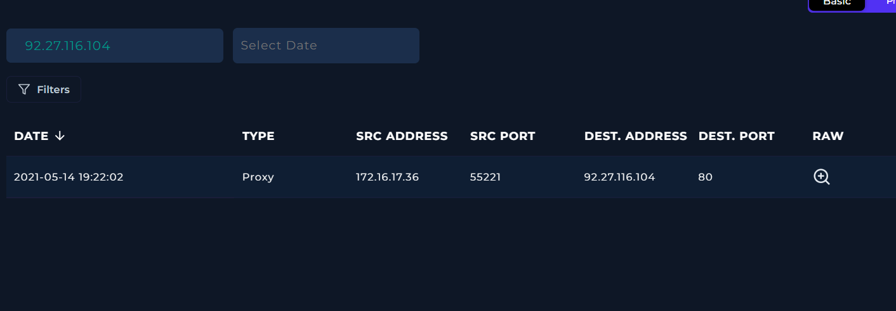

Then the raw log turned out to be empty. Nothing to read, so there is no way to say from this evidence whether the connection pulled down a payload or exchanged commands with an operator. I would rather record that gap than guess at it.


Aligned to the same clock as the endpoint data, the connection lands right after the script executes and just before the task is created. Script runs, host calls out, task gets created.

### 3.6 Threat Intelligence on the Script

VirusTotal gives Sorted-Algorithm.py 2 detections out of 62. Taken alone that number looks almost clean, which says more about signature engines than about the file. There is 1.16 KB of plain Python text here and very little for a signature to match. What the file does is the reason it is malicious, not what it scores.

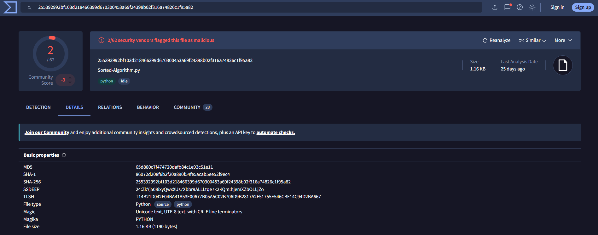

The details tab gave me more than the score did. The same file has been submitted under other names, including SOC Analyst Scheduler Sample.py, and the structural scan flags imports of urllib.request and os as suspicious. Those two modules let a script fetch something over the network and run system commands, which lines up with the connection and the SCHTASKS line on the host.

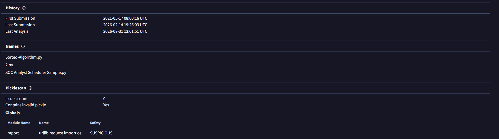

The relations tab lists exactly one contacted address, 92.27.116.104, flagged by 11 vendors.

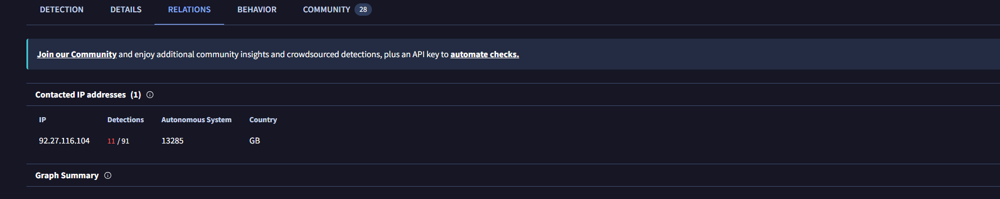

### 3.7 Threat Intelligence on the Address

92.27.116.104 is flagged as malicious by 11 of 91 vendors and sits on AS 13285 in the United Kingdom. It has 262 communicating files, and their names fall into a familiar pattern: randomised executables such as 6kleg7g.exe next to invoice themed Word documents such as INV-06485259891.doc. That combination is typical of Emotet, and one of the referring files on the page is named emotet.txt.

At that point the alert was no longer a question about an unusual scheduled task. It was a malware incident with named infrastructure behind it.

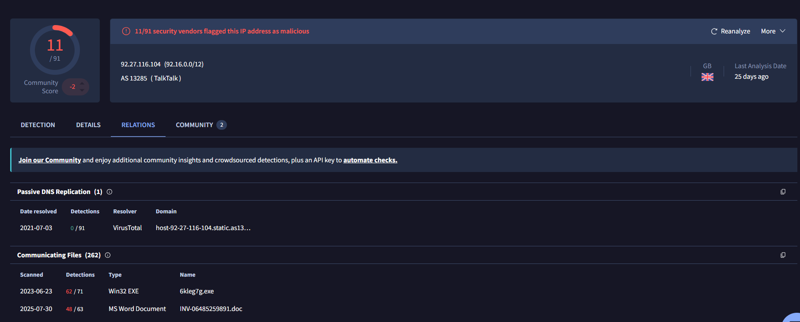

### 3.8 Browser History and Initial Access

I went into this expecting phishing, since that is how most malware reaches a workstation. Browser history said no. At 15:21 the user downloaded master.zip straight from github.com/pythonguru2021x/Sorted-Algorithm. Nobody sent it to her. She went and got it.

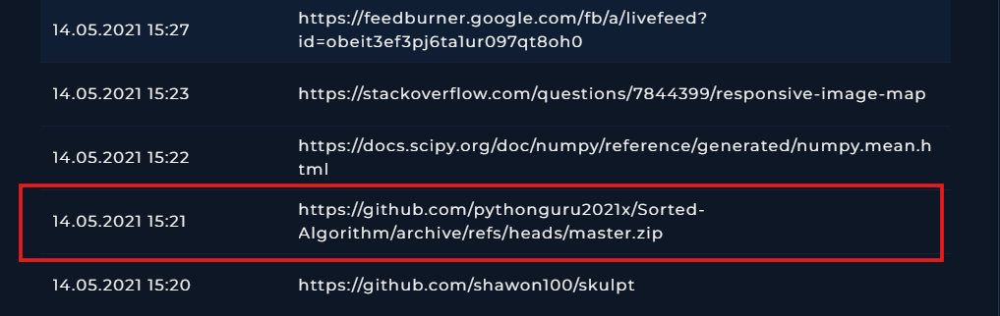

The rest of her history explains why. In the minutes before the download she was on jdoodle, DataCamp, and a Coursera Python course, and the day before she was working through more Coursera lectures and py4e.com. She was learning Python and looking for a sorting algorithm example.

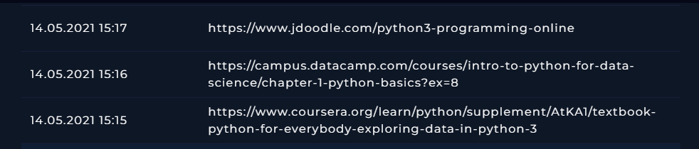

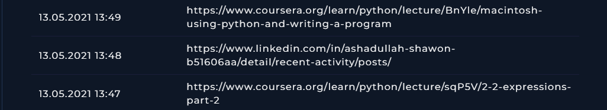

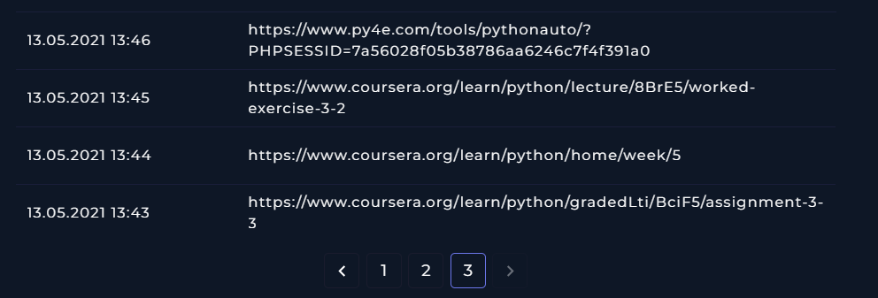

The account name is where the trick lives. pythonguru2021x is built to look like a Python teaching resource, so it turns up in front of the exact person who is searching for one. No attachment, no link in an email. The victim did the download herself, in good faith, in the middle of studying.

### 3.9 What the Evidence Did Not Settle

Three things stayed open.

Whether the payload executed. x86_x64_setup.exe appears nowhere in the process list. With a daily schedule, this becomes a question of when rather than if, unless the task is deleted.

What the connection to 92.27.116.104 carried. The raw proxy log is empty, so a download cannot be separated from command traffic using this evidence alone.

What the script contained. The file was not available for analysis. The flagged imports and the timing of the connection and the task both point to the script as the origin of both actions, but that is inference, not proof.
