# Incident Report: Ransomware Executed on a User Workstation

**Incident:** Ransomware Binary Allowed to Run on Host MarkPRD
**Platform:** LetsDefend
**Severity:** Critical
**Category:** Malware
**Date:** 23/05/21
**Related Alerts:** SOC145

> Investigation answers and platform flags are redacted. This report documents the analysis process and reasoning, not the solution to the exercise.

## 1. Alert overview

| Field               | Value                                |
| ------------------- | ------------------------------------ |
| Alert ID            | SOC145                               |
| Trigger Time        | 2021-05-23 19:32:16 (+03:00)         |
| Rule Name           | SOC145 Ransomware Detected           |
| Severity            | Critical                             |
| Source Address      | 172.16.17.88 (MarkPRD)               |
| Destination Address | Not applicable, host based detection |
| Device Action       | Allowed                              |

The rule looks for files matching known ransomware signatures on managed endpoints. It fired because a 775 KB executable called ab.exe turned up on MarkPRD with a hash already tied to ransomware.

Then there is the last row of that table. Device action: Allowed. The agent recognised the file and let it run anyway, which is why this one could not be closed in five minutes.

## 2. Alert report

**Verdict:** True Positive

**Time of Activity:**

| Time (+03:00)         | Activity                                                            |
| --------------------- | ------------------------------------------------------------------- |
| 2021-05-23 19:32:16   | Alert triggers, `ab.exe` detected on MarkPRD, device action Allowed |
| Timestamp unavailable | `ab.exe` present in the process list of MarkPRD                     |
| Timestamp unavailable | `vssadmin.exe` present in the same process list                     |
| Timestamp unavailable | `wbadmin.exe` present in the same process list                      |
| Timestamp unavailable | `bcdedit.exe` present in the same process list                      |

Endpoint telemetry on this platform does not record execution times for individual processes, so I could not establish the exact order of the four entries above.

**Affected Entities:**

| Entity              | Value                                                            |
| ------------------- | ---------------------------------------------------------------- |
| Affected host       | MarkPRD, 172.16.17.88, Windows 10 64 bit                         |
| Domain              | LetsDefend                                                       |
| User account        | MarkGuna, primary user of the host                               |
| Malicious file      | `ab.exe`, 775.50 KB                                              |
| MD5                 | 0b486fe0503524cfe4726a4022fa6a68                                 |
| SHA256              | 1228d0f04f0ba82569fc1c0609f9fd6c377a91b9ea44c1e7f9f84b2b90552da2 |
| Malware family      | Avaddon ransomware, 60 of 70 vendors on VirusTotal               |
| Masquerade identity | `taskhost.exe`, Host Process for Windows Tasks, unsigned         |
| Processes involved  | `ab.exe`, `vssadmin.exe`, `wbadmin.exe`, `bcdedit.exe`           |
| Infection vector    | Not established, no parent process recorded for `ab.exe`         |
| Antivirus action    | Allowed                                                          |

**Reasoning:**

The alert triggered on the execution of a ransomware binary named ab.exe originating from the workstation MarkPRD (172.16.17.88), used by MarkGuna. Investigation confirmed that 60 of 70 antivirus engines on VirusTotal flag the hash as malicious under the Avaddon ransomware label, that the file claims Microsoft version metadata without carrying a Microsoft signature, and that it appears in the process list of the host. That combination indicates a real infection rather than a signature collision or a stray test file.

The execution was not blocked by the endpoint agent. Process telemetry on the same host also shows vssadmin.exe, wbadmin.exe and bcdedit.exe. All three are legitimate Windows utilities, and on their own none of them would be worth a second look. Appearing together on an ordinary user workstation just after a ransomware detection, they describe the preparation step every ransomware operator runs before encrypting, which is stripping away the local ways to recover.

Encryption itself could not be confirmed, because this telemetry does not expose file system activity, and no command and control traffic shows up around the alert time. Neither gap softens the verdict. An unsigned ransomware binary ran without being stopped, and the local recovery options were touched right after.

**Escalation:** Required. Confirmed ransomware ran unblocked, followed by three utilities used to remove local recovery options. Even with no proof of encryption, that is an active risk measured in minutes, not days. The infection vector is also still unknown, so other hosts may be sitting in the same state.

**Recommended Remediation Action:**

1. Keep MarkPRD isolated through EDR containment until forensics are finished.
2. Run host forensics to find the infection vector. File system timestamps, prefetch, USB history and recently mapped network shares are the places to start.
3. Confirm whether files were encrypted and whether a ransom note was written.
4. Check whether the volume shadow copies and the backup catalogue were actually deleted, then confirm the offline or offsite backups are still intact.
5. Hunt for hash 0b486fe0503524cfe4726a4022fa6a68 across every endpoint.
6. Hunt for the combined execution of vssadmin, wbadmin and bcdedit elsewhere in the estate. This is a behaviour to search for, not a file to block.

**Indicators of Compromise:**

| Type          | Indicator                                                        | Notes                                                          |
| ------------- | ---------------------------------------------------------------- | -------------------------------------------------------------- |
| Hash (MD5)    | 0b486fe0503524cfe4726a4022fa6a68                                 | ab.exe                                                         |
| Hash (SHA256) | 1228d0f04f0ba82569fc1c0609f9fd6c377a91b9ea44c1e7f9f84b2b90552da2 | ab.exe                                                         |
| File Name     | ab.exe                                                           | Same hash also submitted as taskhost.exe, software.exe, ab.bin |
| Host          | MarkPRD / 172.16.17.88                                           | Infected endpoint                                              |

**MITRE ATT&CK:**

| Tactic    | Technique               | ID    |
| --------- | ----------------------- | ----- |
| Execution | User Execution          | T1204 |
| Stealth   | Masquerading            | T1036 |
| Impact    | Inhibit System Recovery | T1490 |

## 3. Investigation

### 3.1 Initial triage

The alert handed me a hash, a filename, a host, and one line that changed the priority of everything after it: Device Action Allowed. I went in expecting a straightforward true positive. The open question was how far the thing had already got.

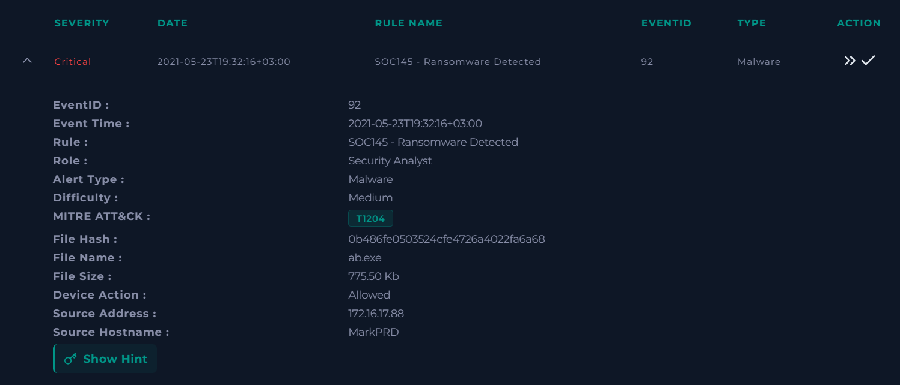

### 3.2 Hash reputation

VirusTotal first, because it is the fastest way to confirm or kill the hypothesis. 60 of 70 vendors flagged the hash, with a threat label pointing at the Avaddon ransomware family. Malicious, confirmed, in under a minute.

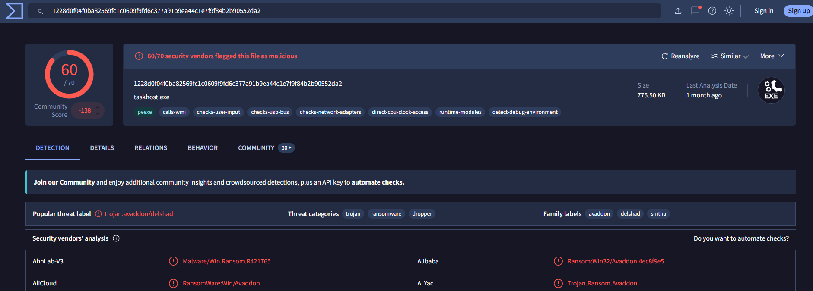

The details tab was more interesting. The same hash has been submitted to VirusTotal under several filenames, including taskhost.exe and software.exe, which says something about how the operator wants the file to look once it lands.

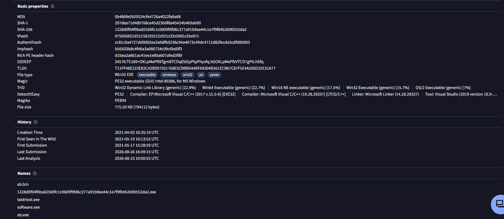

The version information spells it out. The file announces itself as Host Process for Windows Tasks, with Microsoft copyright strings and a Windows product name attached. It carries no digital signature. Genuine Windows binaries always do, so the metadata is fake, and it is fake in a very targeted way. It is dressed for exactly one audience: a tired analyst scrolling a process list at speed.

### 3.3 Endpoint analysis

Malicious file established. Next question: did it actually run? MarkPRD is a Windows 10 client belonging to MarkGuna, and containment was still switched off when I opened the host.

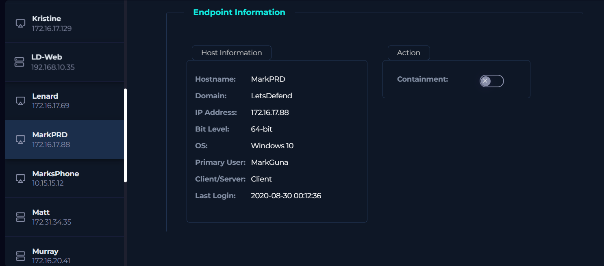

ab.exe sits in the process list with a matching MD5. So, yes.

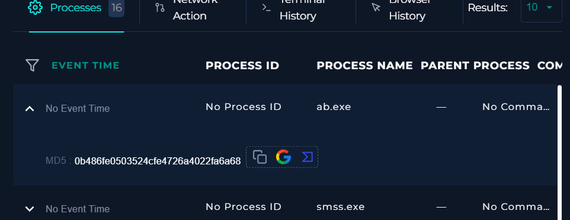

Scrolling down is where this stopped being routine. Three processes stood out from the usual Windows background noise: bcdedit.exe, wbadmin.exe and vssadmin.exe.

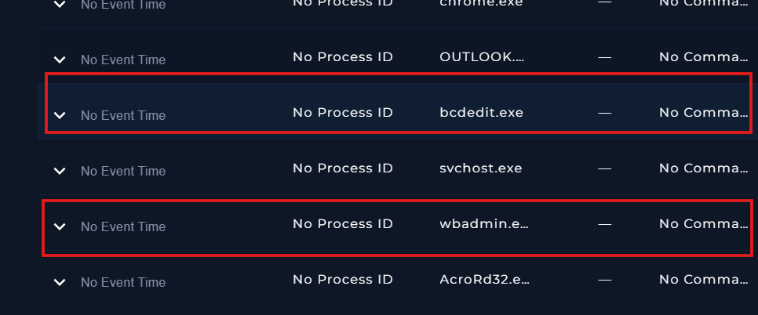

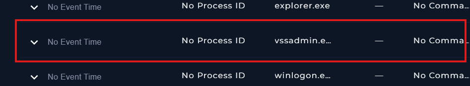

All three are signed Microsoft utilities. They handle shadow copies, the backup catalogue and boot configuration. On a server with an administrator logged in, I would scroll past them. On a sales workstation, minutes after a ransomware hit, they read as one instruction: make sure this machine cannot restore itself.

I could not verify the arguments passed to them, because command line data was not recorded in this telemetry. Worth saying out loud rather than filling the gap with an assumption.

### 3.4 Mail analysis, hypothesis discarded

Email was my next guess for delivery, since that is how most of these payloads arrive. The mailbox for mark@letsdefend.io holds seven messages. Four have an unknown final action, and three carry attachments that all come back malicious.

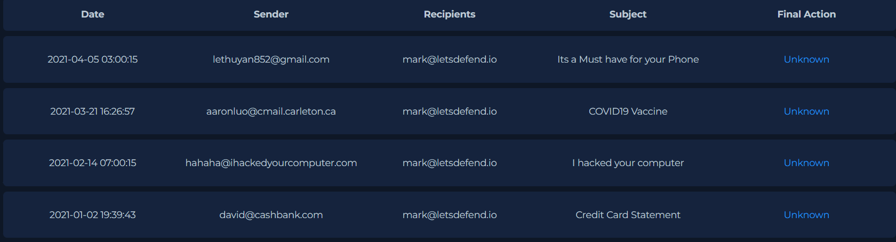

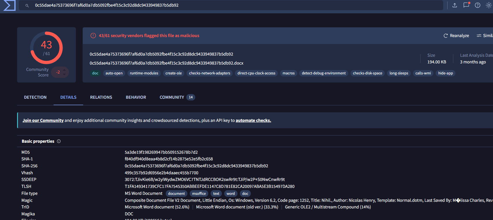

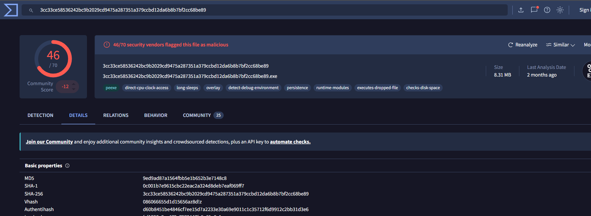

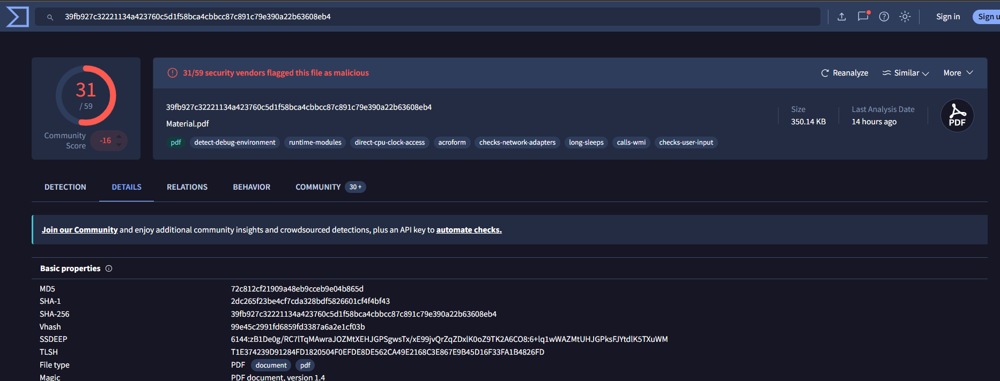

Promising, right up until I checked the dates and the hashes. The newest of those messages is from April 2021 and the oldest from August 2020, while the alert is from May 2021. None of the three attachment hashes match ab.exe. This mailbox has a real problem that deserves its own ticket, but it is not the source of this infection. Hypothesis dropped.

### 3.5 Network analysis, hypothesis discarded

Last angle: outbound traffic. If the binary had called home, the proxy logs around the alert time would show it.

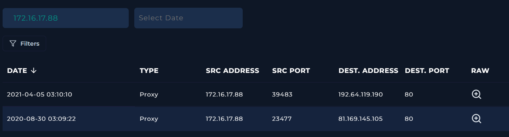

There are two entries for 172.16.17.88 in total. One from April 2021, one from August 2020. Both sit months away from the incident. The raw logs show a chrome.exe request and a powershell.exe request going somewhere unrelated.

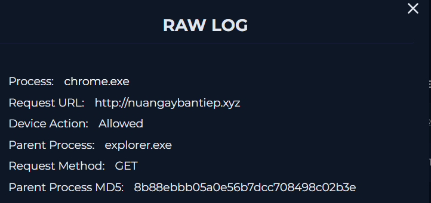

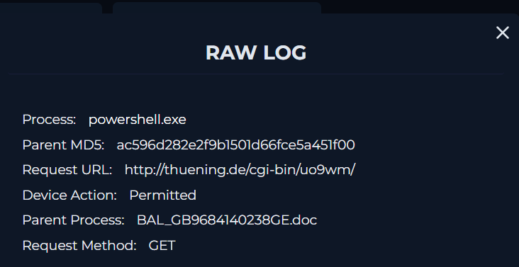

No command and control traffic proven. Add the empty browser history, the empty command history and the missing parent process for ab.exe, and the entry point is simply not in these logs.

### 3.6 What I could not prove

Three things stayed open, and listing them honestly is more useful to whoever picks this up next than a tidy conclusion would be.

The infection vector is unknown. No parent process was recorded for ab.exe. Browser history and command history are both empty. That is normal for ransomware, annoyingly. Detection tends to happen at the encryption stage, long after the initial compromise, and by then the interesting logs have usually rotated out. Finding the entry point here needs disk forensics.

No command and control traffic was observed, as covered above.

Encryption impact is unconfirmed. This platform does not expose file system activity, so whether files were encrypted or a ransom note was dropped is a question for the responder with access to the disk.

### 3.7 Actions taken

MarkPRD was contained through EDR. The alert was closed as a true positive and escalated to incident response.
