# Incident Report: Pass the Hash Attack Detected

**Incident:** Pass the Hash Attack Detected on an Internet Facing Windows Server
**Platform:** LetsDefend
**Severity:** Critical
**Category:** Malware / Credential Access
**Date:** 18/04/23
**Related Alerts:** SOC188

> Investigation answers and platform flags are redacted. This report documents the analysis process and reasoning, not the solution to the exercise.

---

## 1. Alert Overview

| Field               | Value                                |
| ------------------- | ------------------------------------ |
| Alert ID            | SOC188                               |
| Trigger Time        | 2023-04-18 10:36:36 (+03:00)         |
| Rule Name           | SOC188 Pass the Hash Attack Detected |
| Severity            | Critical                             |
| Source Address      | 172.16.20.10 (London-Server)         |
| Destination Address | Domain_Controller (internal)         |
| Device Action       | Detected, not blocked                |

The rule fires when Windows telemetry suggests that an attacker is authenticating with a stolen password hash instead of a password. The detection fired on mimikatz.exe sitting in a user Downloads folder on London-Server. Mimikatz is an open source tool that reads credentials straight out of Windows memory, so finding it on a production server is already a problem before anything else is checked. The L1 note attached to the alert said the file had been downloaded but that execution could not be confirmed.

---

## 2. Alert Report

The report as submitted in the alert's Analyst Comment before escalating, following the platform's own reporting fields.

**Verdict:** True Positive

**Time of Activity:**

| Time                 | Activity                                                        |
| -------------------- | --------------------------------------------------------------- |
| 14:07:05 to 14:20:39 | Six failed login attempts from 77.73.134.24                     |
| 14:25:29             | Successful login as LetsDefend from 77.73.134.24                |
| 14:31:19             | Host reaches the mimikatz release page on GitHub (140.82.121.3) |
| 10:32:41             | mimikatz.exe executed, parent process explorer.exe              |
| 10:34:19             | whoami.exe executed from the cmd.exe spawned by mimikatz        |
| 10:36:21             | PsExec.exe executed against `\\Domain_Controller`               |
| 10:56:22 (UTC)       | Inbound RDP connection from 149.28.129.221, unverified          |

Log Management and endpoint telemetry report these events in different timezones, so the clock values above do not line up on a single axis. The order of events is reconstructed from context rather than from a single synchronised clock. Normalising timezones across sources would be worth raising with the detection engineering team.

**Affected Entities:**

| Entity         | Value                                                                                            |
| -------------- | ------------------------------------------------------------------------------------------------ |
| Hostname       | London-Server (Windows Server 2019)                                                              |
| Host IP        | 172.16.20.10                                                                                     |
| Affected user  | LetsDefend                                                                                       |
| Attacker IP    | 77.73.134.24 (Kazakhstan, AS212496 SIA GOOD)                                                     |
| Tools observed | mimikatz.exe, PsExec.exe                                                                         |
| Staging paths  | `C:\Users\LetsDefend\Downloads\mimikatz_trunk\x64\` and `C:\Users\LetsDefend\Downloads\PSTools\` |
| PsExec MD5     | 24A648A48741B1AC809E47B9543C6F12                                                                 |
| Lateral target | Domain_Controller                                                                                |
| EDR action     | Detected, not blocked                                                                            |

**Reasoning:**

The alert triggered on credential dumping activity originating from London-Server (172.16.20.10) under the account LetsDefend. Investigation confirmed six failed logins from 77.73.134.24 followed by a successful one, a visit to the mimikatz release page immediately afterwards, and the manual execution of mimikatz.exe, whoami.exe and PsExec.exe on the host, which indicates that an external attacker brute forced a valid account, gained interactive access, and moved on to credential theft and lateral movement.

Mimikatz ran with explorer.exe as its parent, so it was launched by hand through the desktop session rather than by a script, and the gaps of one to two minutes between commands match a person typing rather than automation. Sysmon Event ID 1 captured the command line that the standard endpoint telemetry had not recorded: PsExec.exe pointed at \\\\Domain_Controller asking for cmd, running at IntegrityLevel High.

The EDR detected the activity but allowed it to run. Whether the shell on the Domain Controller actually opened cannot be answered from this host, because no telemetry for that machine was available to me, so lateral movement is unconfirmed rather than ruled out. On London-Server itself the last suspicious event is the PsExec execution at 10:36:21, and process activity after that point is ordinary.

**Escalation:**

Requaired. The host was contained and the alert closed as a true positive at L1, but the scope of the incident reaches past this server. An external attacker holds, at minimum, one valid domain account and has run a credential dumping tool with elevated rights on a Windows Server 2019 box.

**Recommended Remediation Action:**

1. Review Domain Controller logs as the immediate priority. Look for Event ID 4624 Logon Type 3 with NTLM authentication coming from 172.16.20.10 around 10:36, and for service creation consistent with PsExec.
2. Keep London-Server isolated until forensic analysis is finished.
3. Reset the LetsDefend account credentials, and every other account whose credentials may have been cached on this host.
4. If Domain Controller compromise is confirmed, treat the whole domain as compromised and plan a full credential reset, krbtgt included.
5. Block 77.73.134.24 at the perimeter firewall.
6. Review why RDP on this host is reachable from the internet. Put it behind the VPN and enforce network level authentication.
7. Investigate why six consecutive failed logins produced neither an account lockout nor an alert.
8. Remove mimikatz_trunk and PSTools from the Downloads folder.

**Indicators of Compromise:**

| Type      | Indicator                                           | Notes                                            |
| --------- | --------------------------------------------------- | ------------------------------------------------ |
| Hash      | 24A648A48741B1AC809E47B9543C6F12                    | MD5 of PsExec.exe as executed                    |
| IP        | 77.73.134.24                                        | Attacker source, flagged malicious on VirusTotal |
| IP        | 149.28.129.221                                      | Inbound RDP, Vultr VPS, unverified               |
| File Name | mimikatz.exe                                        | Credential dumping tool                          |
| File Name | PsExec.exe                                          | Remote execution tool                            |
| File Path | `C:\Users\LetsDefend\Downloads\mimikatz_trunk\x64\` | Tool staging path                                |
| File Path | `C:\Users\LetsDefend\Downloads\PSTools\`            | Tool staging path                                |

**MITRE ATT&CK:**

| Tactic               | Technique                                                | ID        |
| -------------------- | -------------------------------------------------------- | --------- |
| Resource Development | Obtain Capabilities: Tool                                | T1588.002 |
| Credential Access    | Brute Force                                              | T1110     |
| Initial Access       | Valid Accounts                                           | T1078     |
| Execution            | Command and Scripting Interpreter: Windows Command Shell | T1059.003 |
| Discovery            | System Owner/User Discovery                              | T1033     |
| Lateral Movement     | Remote Services: SMB/Windows Admin Shares                | T1021.002 |

---

## 3. Investigation

### 3.1 Initial triage

The alert gave me a critical severity, a hostname, a file path, and an L1 note saying the file was downloaded but execution was unclear. Downloaded and executed are two very different incidents, so that was the first question: did mimikatz.exe actually run, and if it did, who ran it.

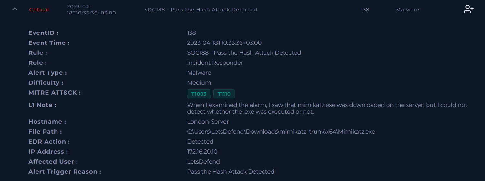

Severity also set the pace. Critical plus a credential dumping tool plus a server rather than a workstation means I treat this as live until the evidence says otherwise.

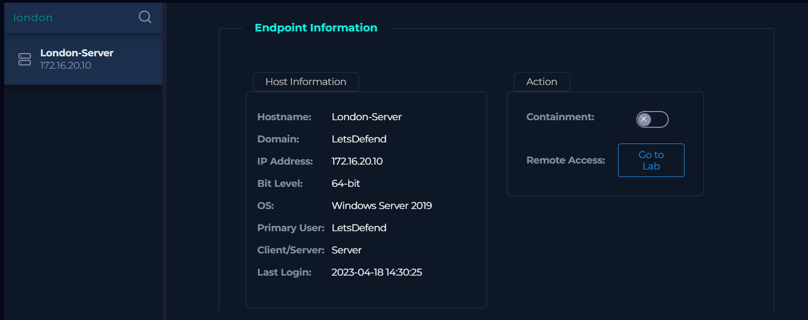

London-Server is a Windows Server 2019 machine with LetsDefend as its primary user, last login 2023-04-18 14:30:25.

### 3.2 Endpoint telemetry

Two tabs came back empty, which was the first odd thing. Network Action had no entries at all, and Browser History had none either.

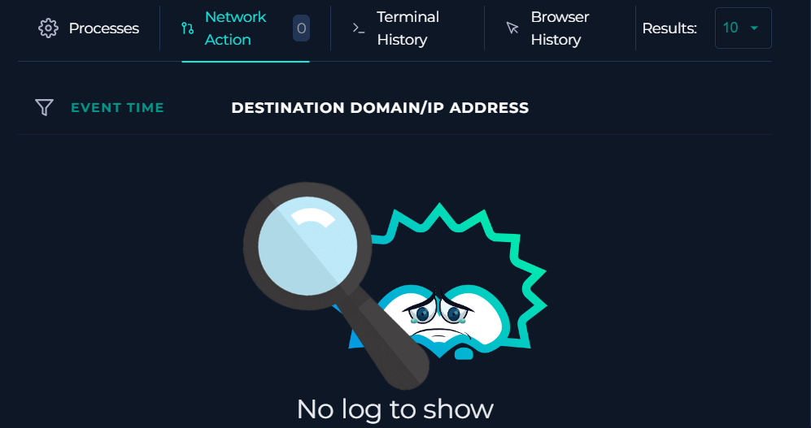

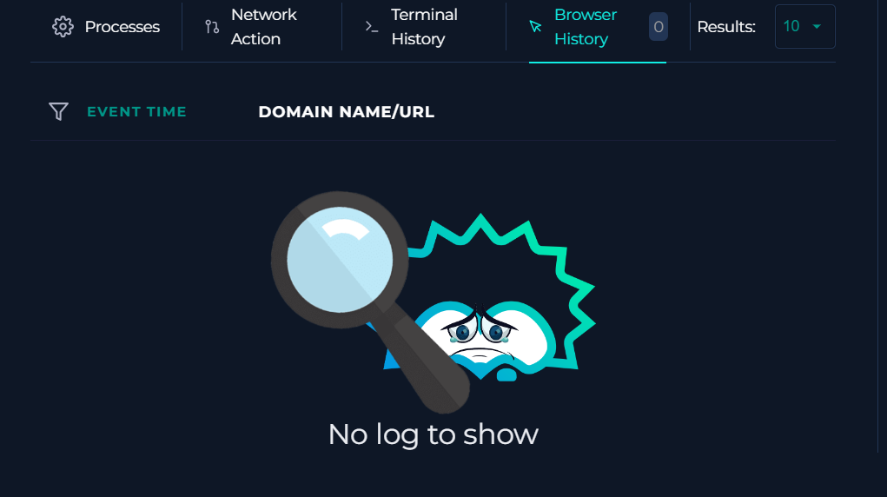

Empty tabs are not proof that nothing happened. The LetsDefend endpoint agent does not collect everything, and later the proxy log showed a GitHub visit that the browser history never recorded. If I had stopped at this screen I would have closed the alert as a download with no execution, which is exactly the wrong call.

### 3.3 Terminal history

Terminal history answered the question the L1 note had left open.

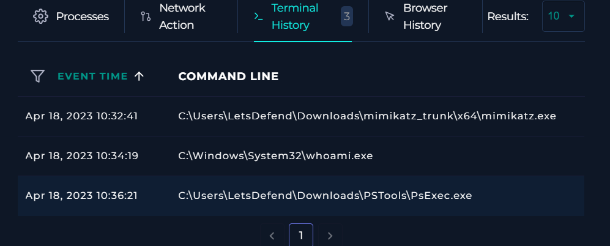

Three commands, in order: mimikatz.exe at 10:32:41, whoami.exe at 10:34:19, PsExec.exe at 10:36:21. So mimikatz did run. The pattern is familiar: dump credentials, check who you are, then use what you found somewhere else. PsExec is a legitimate Microsoft utility for running commands on remote machines, which told me to start looking for a second host.

### 3.4 Process list

The process list lines up with the command history.

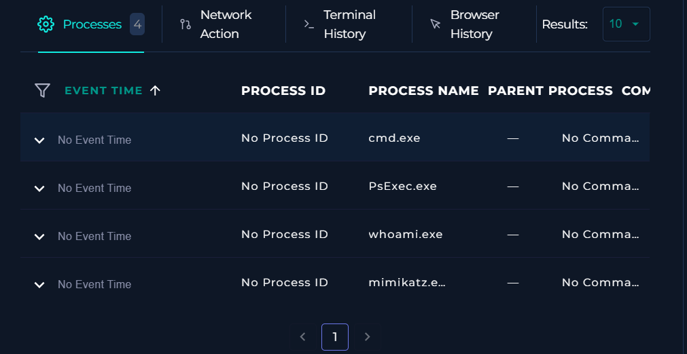

The parent process is where this gets interesting. Mimikatz.exe was launched by explorer.exe, the Windows desktop shell.

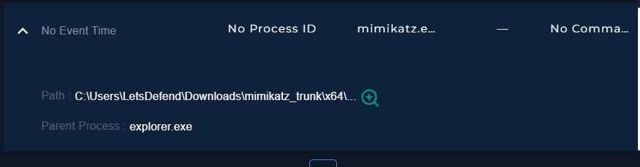

Explorer as a parent means somebody double clicked the file in a live desktop session. A script or a scheduled task would have left a different parent behind. Someone was at the keyboard. The gaps between the three commands, one to two minutes each, back that up. Automation does not pause to think.

Mimikatz then spawned cmd.exe as a child, which is where whoami ran from.

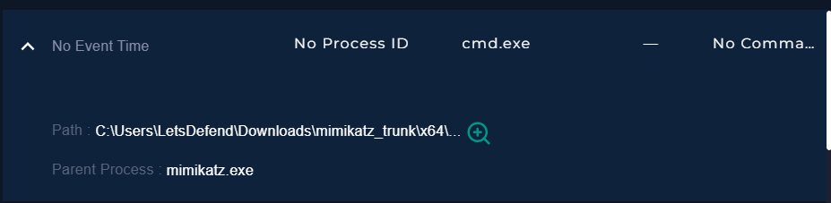

### 3.5 Log Management

With execution confirmed, the next question was how the attacker got in. Log Management, filtered on 172.16.20.10, gave two answers.

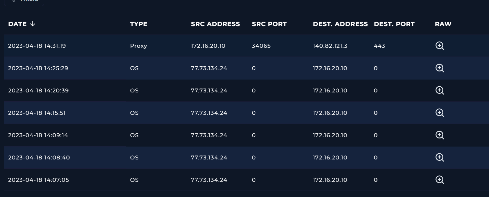

The first is a run of login events from 77.73.134.24. Six failed, then one that worked at 14:25:29. Red marks the failures, green the success.

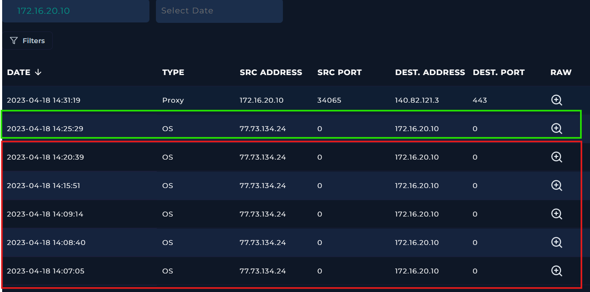

Six failures and a success in eighteen minutes is a brute force that landed. The address itself has a poor reputation on VirusTotal, hosted in Kazakhstan under AS212496 (SIA GOOD), with more than 1,100 communicating files, many of them scoring above 50 of 72 engines.

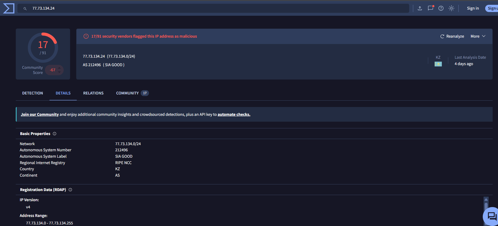

The second answer is a proxy log at 14:31:19 from the host out to 140.82.121.3 on port 443, minutes after the successful login. The raw log names the destination.

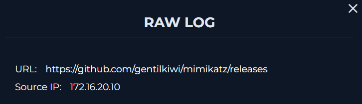

The mimikatz releases page. The order matters here: brute force, login, then download. This was not a developer who grabbed a security tool months ago and forgot about it. The tool arrived after the intrusion. The visit never appeared in browser history, which is the gap I mentioned in 3.2.

### 3.6 Logging into the host

Endpoint telemetry had told me what ran but not with what arguments, and PsExec without its arguments is only half a finding. So I logged into the host.

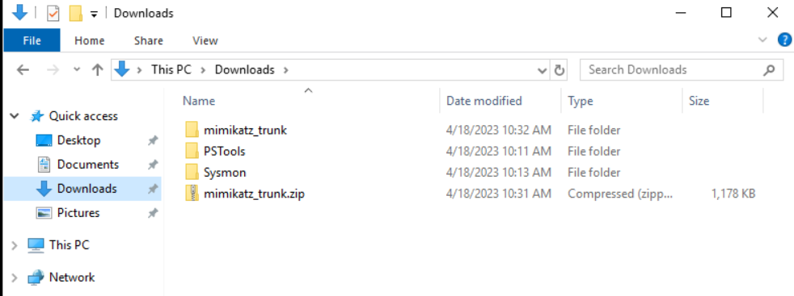

Both mimikatz_trunk and PSTools are in Downloads, with a mimikatz_trunk.zip timestamped 10:31, one minute before mimikatz.exe ran. There is also a Sysmon folder, which was the useful part. Sysmon records full command lines, and Event Viewer had the Event ID 1 I needed.

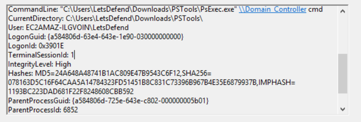

The full command line was there:

```
"C:\Users\LetsDefend\Downloads\PSTools\PsExec.exe" \\Domain_Controller cmd
```

The target is the Domain Controller. The requested action is cmd, an interactive command shell. IntegrityLevel is High, so this ran with elevated rights, and the MD5 in the same event (24A648A48741B1AC809E47B9543C6F12) identifies the binary. An interactive shell on a Domain Controller is as bad as it gets in a Windows environment, because that machine holds the credentials for every account in the domain.

It also says something about the logging setup. The most important evidence in this investigation was sitting on the host, invisible to anyone who did not log in and open Event Viewer.

### 3.7 What the evidence does not establish

Four things stayed unresolved, and an L2 analyst needs them written down rather than implied.

The big one is whether lateral movement to the Domain Controller worked. PsExec was aimed at it, but no telemetry for that machine was available to me, and this single question decides whether this is one compromised server or a domain wide incident.

Credential extraction is unproven as well. Mimikatz ran, but its arguments were never recorded, and I found no lsass access event and no dump file, so which module was used and what it produced are both unknown.

Then there is the alert name. Nothing I found confirms that a hash was used for authentication, because no NTLM authentication event showed up in the telemetry available to me. Pass the hash is the detection's label here, not my finding.

Lastly, the inbound RDP connection from 149.28.129.221 at 10:56:22 UTC. The address belongs to a Vultr VPS and VirusTotal does not flag it, and I accessed the host myself during the investigation, so this connection needs to be checked against the analyst session before anyone attributes it to the attacker.
