# Incident Report: Exfiltration Over Pastebin Detected

**Incident:** Phishing Attachment Leads to System Discovery and Exfiltration Over Pastebin
**Platform:** LetsDefend
**Severity:** High
**Category:** Data Exfiltration
**Date:** 26/06/24
**Related Alerts:** SOC293

> Investigation answers and platform flags are redacted. This report documents the analysis process and reasoning, not the solution to the exercise.

---

## 1. Alert overview

| Field               | Value                                      |
| ------------------- | ------------------------------------------ |
| Alert ID            | SOC293                                     |
| Trigger Time        | 2024-06-26 07:16:16 (+03:00)               |
| Rule Name           | SOC293 Exfiltration Over Pastebin Detected |
| Severity            | High                                       |
| Source Address      | 172.16.17.63 (Gabriela)                    |
| Destination Address | 104.20.3.235 (pastebin.com)                |
| Device Action       | Allowed                                    |

Pastebin is a public text hosting site. Anyone can post text to it through a simple web API without logging in, which makes it a cheap and quiet place to drop stolen data. An office workstation has no business sending anything there, so this rule watches for outbound traffic to pastebin.com. What raised this one above a routine hit is the process behind the connection. It was powershell.exe, not a browser.

---

## 2. Alert report

**Verdict:** True Positive

**Time of Activity**

| Time                | Event                                                                                                        |
| ------------------- | ------------------------------------------------------------------------------------------------------------ |
| 2024-06-26 10:14:00 | Phishing email delivered to Gabriela@letsdefend.io from info@dachfix.com, final action Allowed               |
| 2024-06-26 07:15:42 | User downloads quick-fix.zip from an Amazon S3 URL through chrome.exe, device action Allowed                 |
| 2024-06-26 07:16:16 | system_users.ps1 runs under powershell.exe with ExecutionPolicy Bypass, parent explorer.exe, alert triggered |
| 2024-06-26 07:16:16 | whoami.exe /all runs and the output is written to sys_usrs.txt in the user profile                           |
| 2024-06-26 07:16:16 | sys_usrs.txt posted to pastebin.com through api_post.php over port 443, connection allowed                   |
| 2024-06-26 07:16:16 | Paste URL returned by the API written to paste.txt beside the collected data                                 |

The platform shows timestamps in different timezones depending on the module, so the email row does not line up with the rest on a single clock. Thirty four seconds separate the download from the alert. The user acted the moment the file landed, which is the reaction the email was designed to get. The four script stages carry no individual timestamps and all sit inside the same execution window.

**Affected Entities**

| Entity                | Value                                                                                |
| --------------------- | ------------------------------------------------------------------------------------ |
| Affected host         | Gabriela, 172.16.17.63, Windows 10 64 bit, domain LetsDefend, classified as a client |
| User account          | LetsDefend                                                                           |
| Recipient             | Gabriela@letsdefend.io                                                               |
| Sender                | info@dachfix.com                                                                     |
| Sender IP             | 103.145.252.87                                                                       |
| Subject               | Download and Apply the Critical Fix for Device Issues                                |
| Payload hash          | 2f2d8121d6b351a32a5c55995450200f3cafd3d26b2cf5f646cd3a80f175450e                     |
| Download URL          | https://files-ld.s3.us-east-2.amazonaws.com/quick-zip.fix                            |
| Files dropped         | quick-fix.zip, system_users.ps1, fix.lnk, sys_usrs.txt, paste.txt                    |
| Script path           | C:\Users\LetsDefend\Downloads\quick-fix\                                             |
| Command line          | powershell.exe -ExecutionPolicy Bypass -File .\system_users.ps1                      |
| Processes involved    | chrome.exe, explorer.exe, powershell.exe, whoami.exe                                 |
| Exfiltration endpoint | https://pastebin.com/api/api_post.php                                                |
| Paste URL             | https://pastebin.com/rM7up09b, no longer accessible                                  |
| Data sent             | sys_usrs.txt, the output of whoami /all                                              |

**Reasoning**

The alert triggered on a PowerShell script contacting pastebin.com from the host Gabriela (172.16.17.63). Investigation confirmed that the user received a phishing email claiming a critical device fault, downloaded the attached quick-fix.zip, and ran system_users.ps1 out of the extracted folder, and that the script wrote the full output of whoami /all to sys_usrs.txt before posting it to the Pastebin API with a hardcoded key. This indicates the exfiltration completed rather than stopping at an attempt.

The connection was allowed by the perimeter controls instead of blocked. The paste URL returned by the API was sitting in paste.txt on the host, so the upload got a success response back. The paste is dead now, pulled either by Pastebin or by the attacker, but the data had already left the machine and spent that time on a public page readable by anyone holding the link.

The volume is small. What left is one account's identity, group memberships and privileges, which is reconnaissance material rather than business data. It still matters, because privilege and group information is what an attacker reads before deciding whether an account is worth escalating from.

**Escalation**

Requaired. The attacker got code execution on a workstation and a successful outbound upload, which puts this past what an L1 analyst should close. The host is isolated.

**Recommended Remediation Action**

1. Keep Gabriela isolated until host forensics is finished.
2. Examine the fix.lnk target to establish the full execution chain and whether a second payload ran.
3. Read sys_usrs.txt to see which groups and privileges were exposed, then decide on a credential reset and privilege review based on what is in it.
4. Block the sender info@dachfix.com and the SMTP source 103.145.252.87 at the mail gateway.
5. Block https://files-ld.s3.us-east-2.amazonaws.com/quick-zip.fix at the proxy. Do not block the S3 address itself, since that infrastructure is shared with legitimate services.
6. Report the Pastebin API key qpBFeW7fi0eWTDNMPcjH4HPPBDzzhJ6B to Pastebin so the attacker account can be taken down.
7. Check web archives and caches for https://pastebin.com/rM7up09b to find out whether the data was copied before the paste disappeared.
8. Search mail logs for other recipients of messages from info@dachfix.com.
9. Remove the quick-fix folder, sys_usrs.txt and paste.txt from the host once forensics is done with them.

**Indicators of Compromise**

| Type         | Indicator                                                        | Notes                                             |
| ------------ | ---------------------------------------------------------------- | ------------------------------------------------- |
| Hash         | 2f2d8121d6b351a32a5c55995450200f3cafd3d26b2cf5f646cd3a80f175450e | quick-fix.zip, 1/51 on VirusTotal                 |
| IP           | 103.145.252.87                                                   | SMTP source of the phishing mail                  |
| IP           | 104.20.3.235                                                     | pastebin.com, shared infrastructure, do not block |
| Email        | info@dachfix.com                                                 | Phishing sender                                   |
| Domain / URL | https://files-ld.s3.us-east-2.amazonaws.com/quick-zip.fix        | Payload download                                  |
| Domain / URL | https://pastebin.com/api/api_post.php                            | Exfiltration endpoint                             |
| Domain / URL | https://pastebin.com/rM7up09b                                    | Paste holding the stolen output, now removed      |
| File Name    | quick-fix.zip, system_users.ps1, fix.lnk                         | Archive and its contents                          |
| File Name    | sys_usrs.txt, paste.txt                                          | Artifacts the script left in the user profile     |

**MITRE ATT&CK**

| Tactic         | Technique                                     | ID        |
| -------------- | --------------------------------------------- | --------- |
| Initial Access | Phishing: Spearphishing Attachment            | T1566.001 |
| Execution      | User Execution: Malicious File                | T1204.002 |
| Execution      | Command and Scripting Interpreter: PowerShell | T1059.001 |
| Discovery      | System Owner/User Discovery                   | T1033     |
| Exfiltration   | Exfiltration Over Web Service                 | T1567     |

---

## 3. Investigation

### 3.1 Initial triage

The alert says a PowerShell script called system_users.ps1 reached pastebin.com from the host Gabriela, and the device action is Allowed. Two details jumped out before I opened anything. The script sits in a Downloads subfolder, so it came from outside rather than from IT, and the command line carries ExecutionPolicy Bypass, a flag people set when they expect the machine to refuse. My assumption going in was a user executed file rather than a compromised service, so the first job was working out how the file got there.

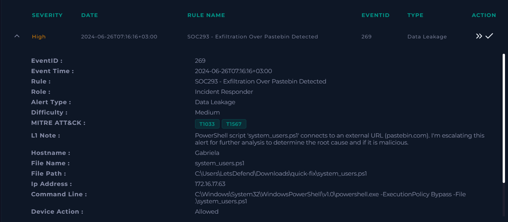

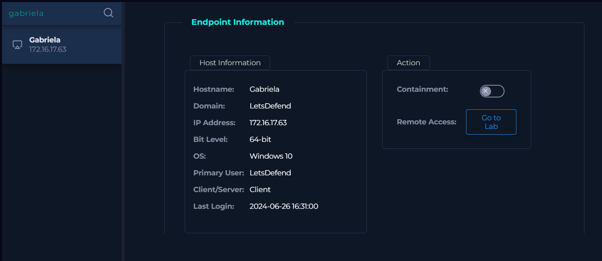

### 3.2 Endpoint analysis

Terminal history shows the script ran exactly as the alert described, with ExecutionPolicy Bypass and a relative script path. That flag overrides the PowerShell execution policy and nothing else. It does not touch antivirus or any other control, which I want to say plainly because the flag often gets read as stronger evasion than it is.

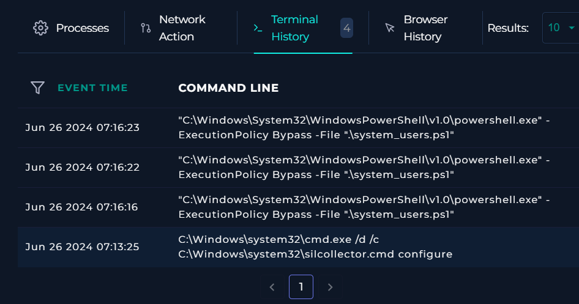

Browser history has a visit to amazonaws.com just before the alert, which gives a delivery path to chase.

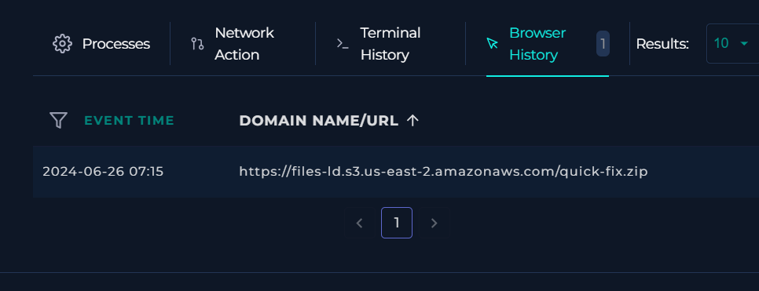

### 3.3 Confirming the download

Log Management backs up the browser history. A proxy entry records a download from an S3 bucket at 07:15:42, and the raw log carries the full URL, the SHA256 hash, the user, the fetching process and the device action.

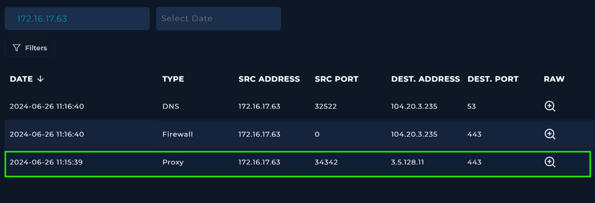

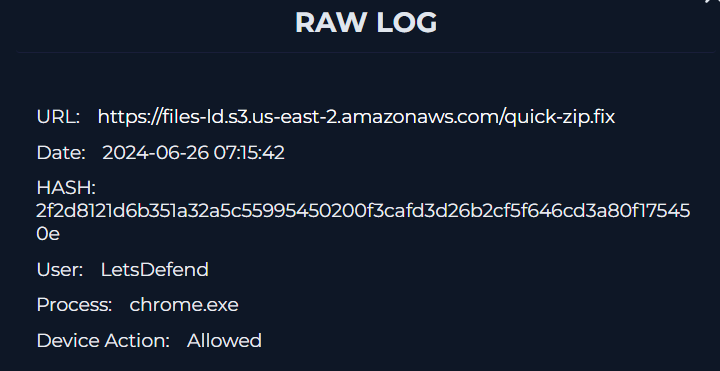

The process is chrome.exe and the action is Allowed, so nothing stopped the file on the way in. The hash comes back from VirusTotal at 1 detection out of 51. A score that low is ordinary for an archive holding a plain text script, because there is no packed binary for signature engines to catch. The Behavior tab was more use to me than the score: it links this hash to Pastebin activity on its own, which matched the alert before I had read a line of the script.

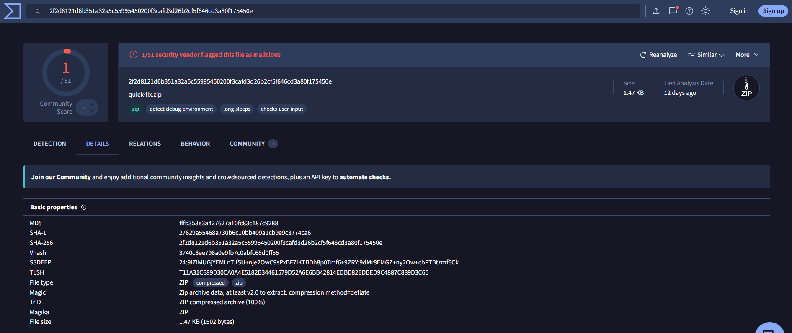

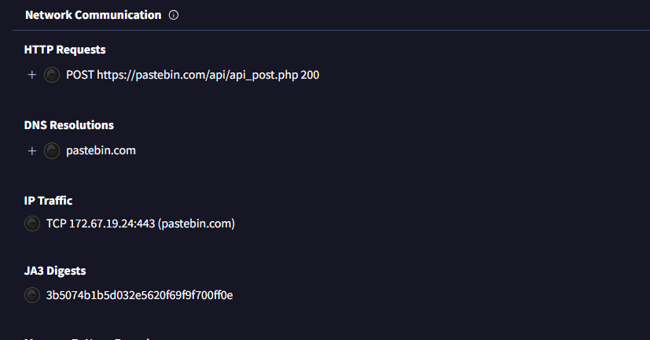

### 3.4 Network activity

Filtering Log Management on 172.16.17.63 returns three connections. The oldest is the S3 download already covered. The other two both go to 104.20.3.235, one on port 53 and one on port 443.

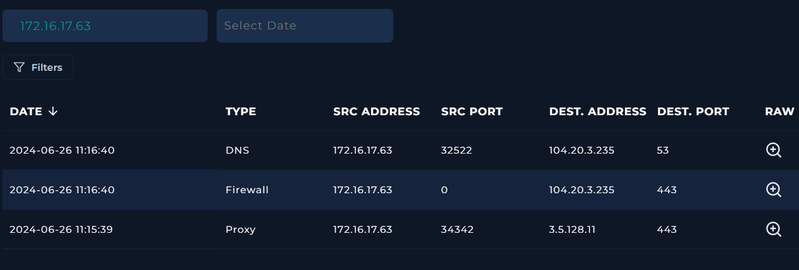

Port 53 is the DNS lookup that resolved pastebin.com.

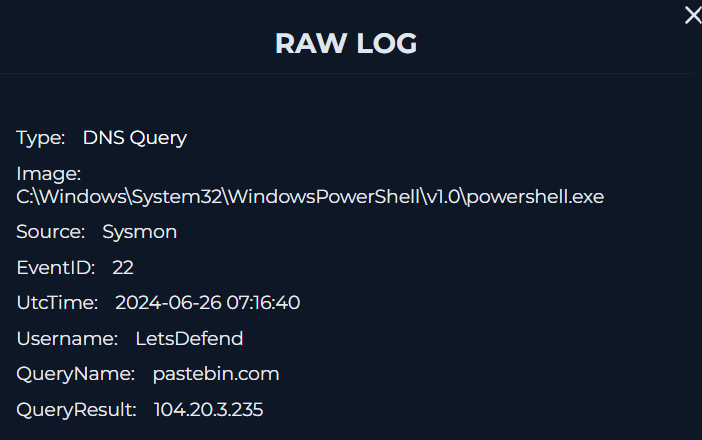

Port 443 is the one that counts. The raw log names the image as powershell.exe and the destination host as pastebin.com. A script making an HTTPS request to a paste service is not an accident, and it also rules out the dull explanation that somebody just browsed to Pastebin in a tab. One field does not fit: UtcTime in this raw log reads 2024-09-03, months off every other timestamp in the case. I treated that as lab data inconsistency rather than evidence, since the DNS lookup, the alert and the file artifacts all agree with each other.

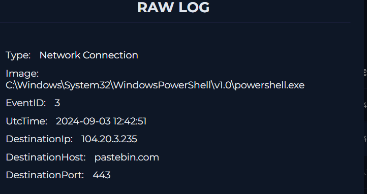

### 3.5 Email analysis

Gabriela received one message in the window that matters.

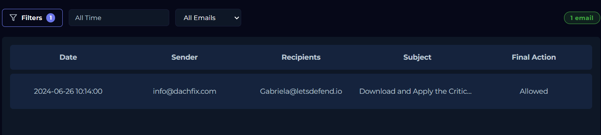

It comes from info@dachfix.com with the subject "Download and Apply the Critical Fix for Device Issues", sender IP 103.145.252.87, and the gateway let it through. The body claims a critical issue affecting company devices and pushes for immediate action.

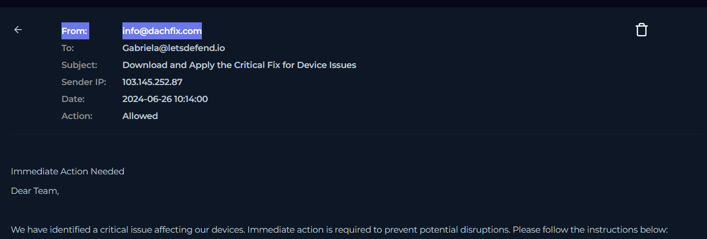

The instructions tell the user to download the attachment and apply the fix.

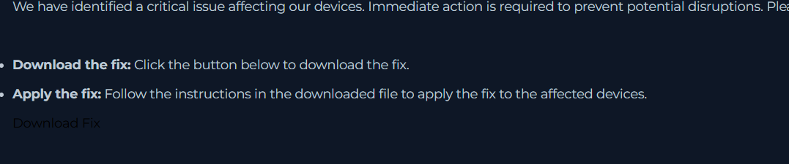

The attachment is quick-fix.zip, the same name as the file in the download log and the same folder name as the script path in the alert. That closes the loop between the mail and the execution.

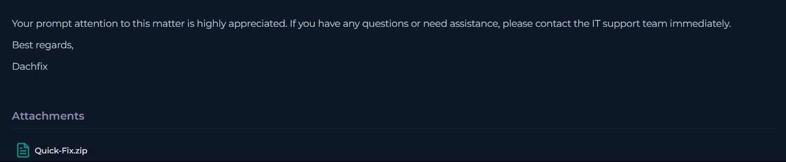

### 3.6 Host inspection and script analysis

Logging into the host and opening Downloads shows the extracted quick-fix directory.

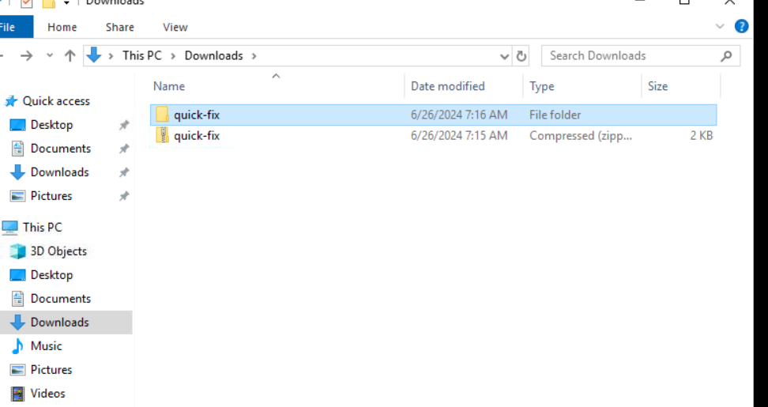

Inside it are two files: system_users.ps1 and fix.lnk. The shortcut is the likelier entry point from the attacker's side, since a user will click something that looks like a program long before they double click a .ps1 file. I never opened its target, which leaves a gap I come back to at the end.

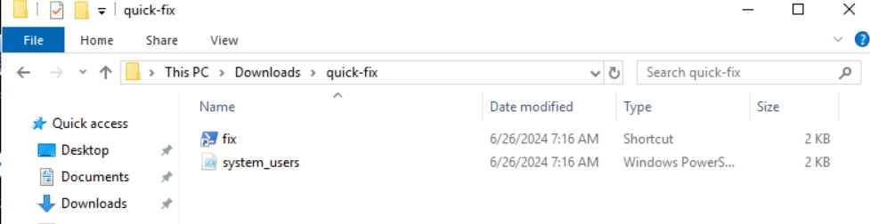

Reading system_users.ps1 in Notepad answered most of the remaining questions.

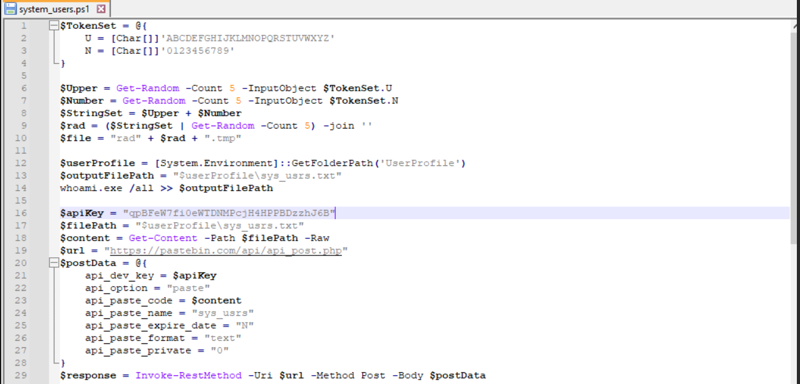

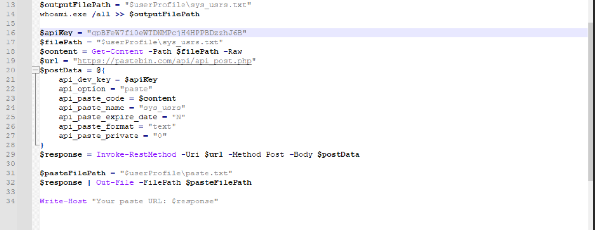

The script does four things. It generates a random name. It runs whoami.exe /all and saves the output to sys_usrs.txt in the user profile, which captures the username, the SID, every group membership including domain groups, and every privilege the account holds. It reads that file back and posts the contents to Pastebin through the official API with a hardcoded key, setting the paste to public and to never expire. Public is the part I would flag for management: the data did not only go to the attacker, it was readable by anyone who stumbled across the link. Last, it writes the paste URL that the API returns into paste.txt.

That final step helped me more than anything else in the script. It tells me where the attacker's own receipt is stored.

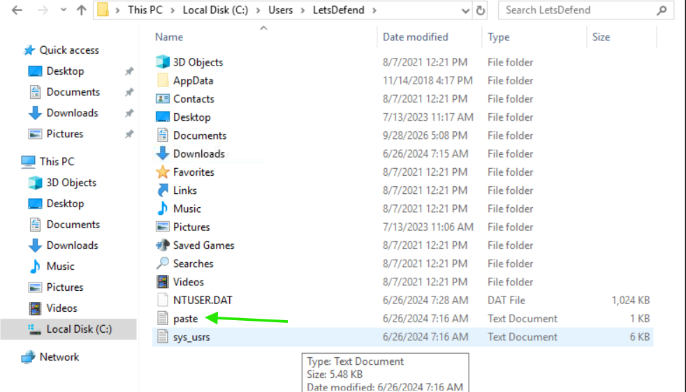

paste.txt is there, and it holds a URL.

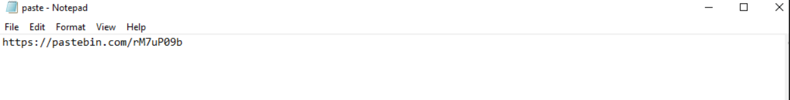

That URL is the proof the upload went through, because Pastebin hands back a link only after it has accepted the content.

Opening it goes nowhere. The paste has been removed, either by Pastebin or by the attacker tidying up.

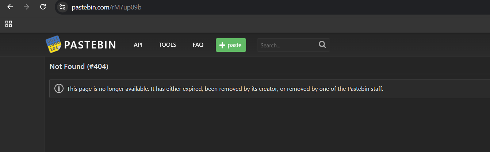

Less of a setback than it looks. The script names the file it uploads, so the contents are still on the host and can be read straight from disk. sys_usrs.txt holds the account and privilege listing the script went after, which confirms what was taken without needing the paste at all.

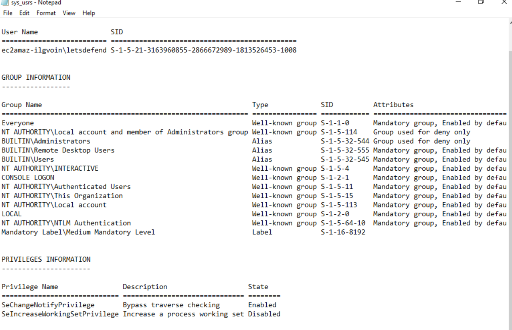

### 3.7 What this investigation did not establish

Three questions stayed open, and I would rather state them than leave a reader to assume I covered everything.

The target of fix.lnk was never examined. It may be what launched the script, or it may do something else. Until somebody reads it, the start of the execution chain is an assumption, not a finding.

Whether anyone opened the paste before it vanished cannot be answered. The link is dead and there is no telemetry on who fetched it. The safe position is to treat the data as exposed.

Whether other commands ran during the session is unknown. Terminal history shows what it recorded, which is not the same as everything that happened. That is part of why the host stays isolated until forensics finishes.
