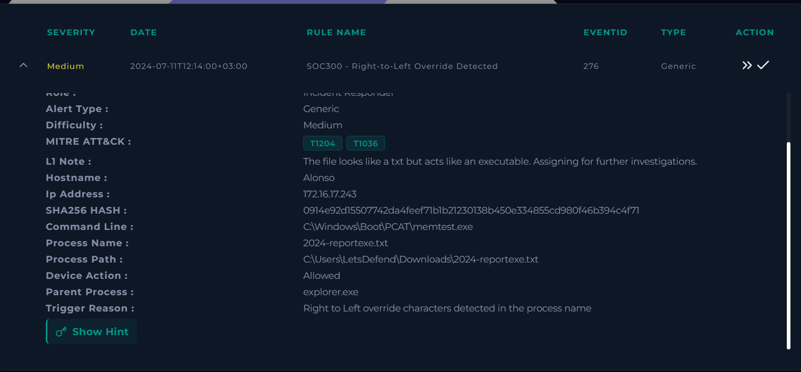
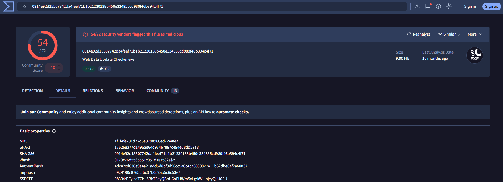
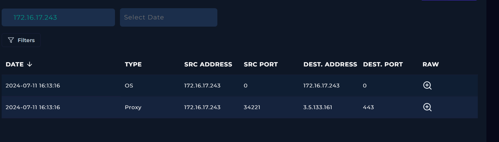
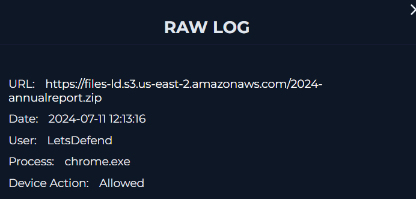
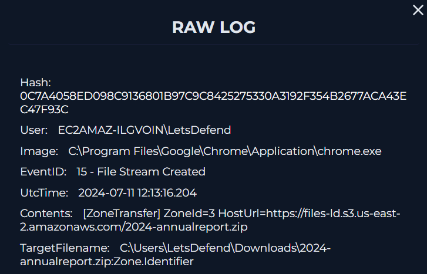
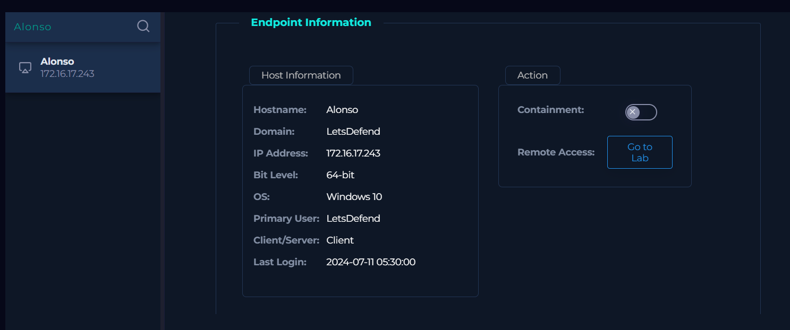
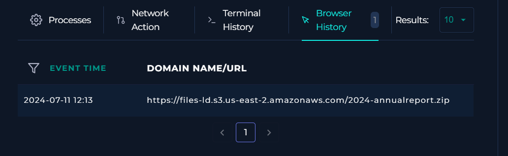
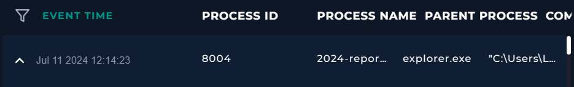
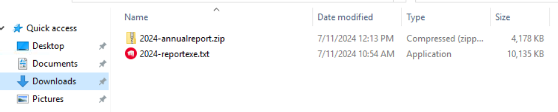
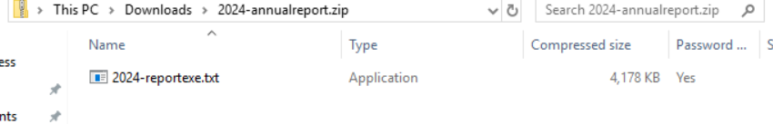

# Incident Report: Right to Left Override Masquerade on Host Alonso

**Incident:** Executable Disguised as a Text File Using a Unicode Override Character
**Platform:** LetsDefend
**Severity:** Medium
**Category:** Malware
**Date:** 11/07/24
**Related Alerts:** SOC300

> Investigation answers and platform flags are redacted. This report documents the analysis process and reasoning, not the solution to the exercise.

---

## 1. Alert overview

| Field               | Value                                   |
| ------------------- | --------------------------------------- |
| Alert ID            | SOC300 (Event ID 276)                   |
| Trigger Time        | 2024-07-11 12:14:00 +03:00              |
| Rule Name           | Right-to-Left Override Detected         |
| Severity            | Medium                                  |
| Source Address      | 172.16.17.243 (host Alonso)             |
| Destination Address | Not applicable, the alert is host based |
| Device Action       | Allowed                                 |

The rule watches for Unicode character U+202E in a process name. That character is the Right to Left Override, a legitimate formatting control used for Arabic and Hebrew text, which reverses the display order of everything after it. Attackers abuse it to make an executable look like a harmless document. Nothing in a normal Windows estate has a reason to put it in a filename, so a single hit is worth treating as real.

---

## 2. Alert report

**Verdict:** True Positive

**Time of activity:**

All timestamps below are in endpoint local time. Log Management renders the same events with a four hour offset, which is worth knowing before building a timeline from both sources.

| Time                       | Event                                                                            |
| -------------------------- | -------------------------------------------------------------------------------- |
| 2024-07-11 10:54           | Timestamp of the executable inside the archive, preserved from the source system |
| 2024-07-11 12:13           | Browser history records access to the download URL                               |
| 2024-07-11 12:13:16        | Chrome downloads 2024-annualreport.zip (Sysmon Event ID 15, ZoneId=3)            |
| 2024-07-11 12:14:23        | User executes the disguised file (PID 8004, parent explorer.exe)                 |
| 2024-07-11 12:14:23        | Process spawns C:\Windows\Boot\PCAT\memtest.exe                                  |
| 2024-07-11 12:15:15 onward | Outbound traffic reviewed, no connections to suspicious infrastructure           |

Sixty seven seconds passed between the download finishing and the user double clicking the file.

**Affected entities:**

| Entity                 | Value                                                                              |
| ---------------------- | ---------------------------------------------------------------------------------- |
| Affected host          | 172.16.17.243 (Alonso), Windows 10 client                                          |
| User account           | EC2AMAZ-ILGVOIN\LetsDefend                                                         |
| Downloaded archive     | C:\Users\LetsDefend\Downloads\2024-annualreport.zip (password protected, 4,178 KB) |
| Executed file          | C:\Users\LetsDefend\Downloads\2024-report[U+202E]txt.exe (10,135 KB)               |
| Payload hash (SHA-256) | 0914e92d15507742da4feef71b1b21230138b450e334855cd980f46b394c4f71                   |
| Archive hash (SHA-256) | 0C7A4058ED098C9136801B97C9C8425275330A3192F354B2677ACA43EC47F93C                   |
| Child process          | C:\Windows\Boot\PCAT\memtest.exe (legitimate Windows binary, unmodified)           |

**Reasoning:**

The alert triggered on the execution of a process carrying Unicode character U+202E in its name, originating from host Alonso (172.16.17.243) under the account EC2AMAZ-ILGVOIN\LetsDefend. Investigation confirmed the file is stored on disk as 2024-report[U+202E]txt.exe while Explorer displays it as 2024-reportexe.txt, that it arrived inside a password protected archive pulled from the internet by Chrome, and that the user launched it from Explorer sixty seven seconds after the download completed, which indicates the disguise worked and unknown code ran on the workstation.

The execution was allowed rather than blocked. No control stopped a password protected archive containing an executable at the gateway, and no control stopped an unsigned binary running out of a user Downloads folder. The hash of the executed file is flagged malicious by 54 of 72 vendors on VirusTotal.

The only child process observed is C:\Windows\Boot\PCAT\memtest.exe, which was checked on the host and matches the unmodified Windows memory diagnostic binary by hash and file date. It spawned nothing of its own, and traffic after execution resolves only to Microsoft, Google, CDN endpoints, loopback, and AWS instance metadata. Impact beyond that point could not be confirmed, though the absence of visible payload behaviour does not change the fact that code of unknown purpose ran with nothing in its way.

**Escalation:**

Requaired.

A binary flagged by 54 of 72 antivirus vendors ran on host Alonso after a filename trick fooled the user. The download, the extraction, and the execution all completed without a single control intervening, so the host has to be treated as compromised until someone proves otherwise.

Scope so far is one host and one account. The spawned child is a legitimate unmodified Windows binary, no system file was replaced, no persistence was found, and no suspicious outbound connections appeared in the reviewed window.

**Recommended remediation action:**

1. Preserve copies of 2024-annualreport.zip and the executable as evidence, then remove both from the Downloads directory.
2. Block hash 0914e92d15507742da4feef71b1b21230138b450e334855cd980f46b394c4f71 across all endpoints.
3. Hunt for other hosts that downloaded the same archive or ran a file matching the hash.
4. Quarantine password protected archives containing executables at the mail and web gateway, since scanners cannot inspect them.
5. Restrict execution of unsigned binaries from user Downloads directories through application control.
6. Alert on any filename containing Unicode U+202E, and on ZoneId=3 files executing from a user profile directory shortly after download.
7. Turn on file extension display in Explorer across the estate, and cover the Right to Left Override trick in user awareness training.

**Indicators of compromise:**

| Type      | Indicator                                                        | Notes                                                  |
| --------- | ---------------------------------------------------------------- | ------------------------------------------------------ |
| Hash      | 0914e92d15507742da4feef71b1b21230138b450e334855cd980f46b394c4f71 | Executed payload, 54 of 72 on VirusTotal               |
| Hash      | 0C7A4058ED098C9136801B97C9C8425275330A3192F354B2677ACA43EC47F93C | Downloaded archive containing the payload              |
| File Name | 2024-report[U+202E]txt.exe                                       | Masqueraded executable, displays as 2024-reportexe.txt |
| File Name | 2024-annualreport.zip                                            | Password protected archive                             |

**MITRE ATT&CK:**

| Tactic    | Technique                            | ID        |
| --------- | ------------------------------------ | --------- |
| Stealth   | Masquerading: Right-to-Left Override | T1036.002 |
| Execution | User Execution: Malicious File       | T1204.002 |
| Stealth   | Obfuscated Files or Information      | T1027     |

---

## 3. Investigation

### 3.1 Initial triage

The alert gives a process name that looks like a text file and a command line that points at memtest.exe. Those two things do not belong together, which is where the investigation started. A report document has no reason to launch a memory diagnostic tool.

The alert detail also records the parent process as explorer.exe and the device action as Allowed, so the working hypothesis going in was a user initiated execution that nothing stopped. The job at that point was to establish how the file arrived and what it did afterwards.

### 3.2 Understanding the filename trick

U+202E tells the renderer to display everything after it in reverse. Arabic and Hebrew need that behaviour. An attacker can also drop it into the middle of a filename, so the operating system reads the real name while the user reads the reversed one.

The file is stored as 2024-report[U+202E]txt.exe. Explorer paints the tail backwards and shows 2024-reportexe.txt. The user sees a text document. Windows runs a binary.

Explorer does leave two tells. The Type column reads Application, and the file weighs 10,135 KB. A text file is neither of those things. But nobody reads the Type column. They read the name, which is exactly what the technique counts on.

The payload hash came back at 54 of 72 vendors on VirusTotal. At that point there was no benign reading left.

### 3.3 Tracing the delivery through log management

Filtering Log Management on 172.16.17.243 returned two entries. Both sit at 16:13:16 in the console, which is the same moment as 12:13:16 on the endpoint once the four hour offset is accounted for.

The proxy entry is the entry point. Chrome fetched 2024-annualreport.zip from an external URL under the LetsDefend account, and the device action on that request was Allowed.

The second entry is a Sysmon Event ID 15, File Stream Created, which fires when a downloaded file gets its Zone.Identifier marker. The contents are worth reading field by field, because together they close off several alternative explanations:

- ZoneId=3 means the file came from the internet rather than a local share or removable media.
- HostUrl records the origin of the download.
- The image is chrome.exe, so the browser did the fetching.
- TargetFilename is 2024-annualreport.zip in the user Downloads folder.

### 3.4 Endpoint and browser history

Endpoint Security identifies Alonso as a Windows 10 client at 172.16.17.243 with LetsDefend as the primary user. Containment was off at the time of review.

Browser history holds a single matching entry at 12:13 pointing at the same archive URL recorded in the proxy log. Two independent sources now agree on how the file reached the host, which rules out a share drive or a USB stick.

### 3.5 Execution and the child process

The process list records PID 8004 at 12:14:23 with explorer.exe as the parent. That parent matters. A process launched by explorer.exe was double clicked by a person, not dropped and run by another program, so this is user execution rather than automated delivery.

The image path confirms the file ran straight out of C:\Users\LetsDefend\Downloads, the same directory the archive landed in.

The target command line is C:\Windows\Boot\PCAT\memtest.exe. memtest.exe is a genuine Windows utility for testing RAM. It lives in the boot directory and normally runs at startup, not from inside a live session. A report document calling it has no innocent explanation I can think of.

My first thought was that the malware had reached for a signed Microsoft binary instead of dropping its own. Worth checking whether the file sitting in that path was still the real one. On the host, its hash is 05CB49BA7AA83846D874A26F36E005083861CA074186C47FED38C3073E33B08B, which is nothing like the parent process hash, and its LastWriteTime is 2021-06-09. A listing of C:\Windows\Boot\PCAT shows everything dated between 2018 and 2021 with nothing touched on the day of the incident. The binary is the stock Windows one, untouched, and no file was swapped into the boot directory.

The hypothesis that a system file had been replaced was discarded on that evidence. What the payload wanted from memtest.exe stayed unanswered, which is why it went to L2 as an open question rather than being written off.

### 3.6 Confirming the archive on the host

Logging into the host directly, the Downloads folder holds both files. The archive carries a 12:13 PM timestamp and the executable carries 10:54 AM, which is earlier than the download itself. That ordering is normal for archived files, since the timestamp travels with the file. It tells us when the attacker built the file on their own machine, not when anything happened on Alonso.

The size and Type columns are visible here too. The file that shows as 2024-reportexe.txt is listed as an Application at 10,135 KB.

Opening the archive shows a single file inside, the same masqueraded executable, and the Password column reads Yes.

The password is the detail I would flag hardest. A mail gateway or antivirus engine cannot read inside an archive it cannot open, so the payload rode in unscanned. And the password had to reach the user some other way, otherwise the attack goes nowhere. That makes it deliberate evasion, not somebody being tidy with their attachments.

### 3.7 Checking for follow up activity

Network activity from 12:15:15 onward was reviewed for anything the payload might have reached out to. Every destination resolves to Microsoft, Google, or CDN infrastructure, alongside loopback traffic and AWS instance metadata consistent with the host running as an EC2 instance. No suspicious destination appeared, and the spawned process created no children of its own.

That is as far as L1 telemetry reaches. Nothing surfaced, but the review window is narrow, and plenty of payloads wait. The case went up to L2 instead of being closed.
