# Incident Report: SOC302 Suspicious Base64 Encoding/Decoding Commands Detected

**Incident:** Base64 decoding of a credential file after a successful SSH brute force
**Platform:** LetsDefend
**Severity:** High
**Category:** Unauthorized Access
**Date:** 17/07/24
**Related Alerts:** SOC302

> Investigation answers and platform flags are redacted. This report documents the analysis process and reasoning, not the solution to the exercise.

## 1. Alert overview

| Field               | Value                                                 |
| ------------------- | ----------------------------------------------------- |
| Alert ID            | SOC302                                                |
| Trigger Time        | 2024-07-17 12:18:18 (+03:00)                          |
| Rule Name           | Suspicious Base64 Encoding/Decoding Commands Detected |
| Severity            | High                                                  |
| Source Address      | 172.16.17.74 (Wilburn)                                |
| Destination Address | 172.16.17.74 (local execution)                        |
| Device Action       | Allowed                                               |

The rule watches for base64 encode and decode commands on endpoints. By itself that is an ordinary thing for an administrator to run, which is why this rule fires a lot and why most of what it catches is noise. It becomes interesting when the decode has company. Here it did: the L1 note on the same record reported a brute force from 143.244.44.163 a few minutes earlier, with no verdict on whether the attacker got in.

## 2. Alert report

**Verdict:** True Positive

**Time of Activity**

Log Management renders these events four hours behind the endpoint terminal history, and the alert header uses a third offset again. The table below follows Log Management. The ordering matches the terminal history exactly, so the sequence is reliable even where the clocks disagree.

| Time (Log Management) | Activity                                                                                  |
| --------------------- | ----------------------------------------------------------------------------------------- |
| 10:43:11 to 10:43:53  | Repeated failed SSH logins from 143.244.44.163 against 172.16.17.74, cycling usernames    |
| 10:44:46              | Successful SSH login, accepted password for the account analyst                           |
| 10:48:19              | find / -type f -name _password_                                                           |
| 10:48:55              | find / -type f -name _important_                                                          |
| 10:49:15              | cat important                                                                             |
| 10:50:34              | python3 one liner decoding /root/Documents/important with base64.b64decode, alert trigger |
| 10:50:46              | cat decoded_file.txt                                                                      |

**Affected Entities**

| Field               | Value                                                                 |
| ------------------- | --------------------------------------------------------------------- |
| Hostname            | Wilburn                                                               |
| Host IP             | 172.16.17.74                                                          |
| Operating System    | Ubuntu 20.04.02                                                       |
| Compromised Account | analyst                                                               |
| Access Method       | SSH, port 22                                                          |
| Attacker IP         | 143.244.44.163 (Datacamp Limited, AS212238, VPN range, United States) |
| Source File         | /root/Documents/important                                             |
| Output File         | /root/Documents/decoded_file.txt                                      |
| Trigger Command     | decoded = base64.b64decode(encoded)                                   |

**Reasoning:**

The alert triggered on a base64 decode command executed on Wilburn (172.16.17.74) by the account analyst. Investigation confirmed that 143.244.44.163 ran an SSH brute force against the host, that one attempt succeeded at 10:44:46, and that the session then searched the filesystem for files named _password_ and _important_ before decoding /root/Documents/important and reading the output, which indicates the decode was the final step of a hands on intrusion rather than routine administration.

The connection was allowed rather than blocked. SSH on this host was reachable from the internet, nothing rate limited the attempts, and the attacker cycled through usernames for roughly ninety seconds without interference. The decoded output, decoded_file.txt, holds ten rows of IP address, username and password. Every credential in that file has to be treated as compromised.

Log Management shows no connections to any of the ten listed IP addresses, and a search for the attacker IP across the environment returns 172.16.17.74 as the only destination. There is no sign of lateral movement so far, which is a statement about timing rather than safety.

**Escalation:** Escalated to L2. The brute force gave the attacker an interactive shell, and the file they decoded carries working credentials for ten other systems. L2 should start there: reset those credentials and put the corresponding systems under watch for login attempts. Forensics on Wilburn can follow. The host is isolated and no longer moving, but the credentials are loose.

**Recommended Remediation Action:**

1. Reset every credential listed in decoded_file.txt and monitor those ten systems for login attempts. This sits ahead of everything else on the list.
2. Keep Wilburn isolated until forensic analysis is finished.
3. Reset the analyst account and invalidate its active sessions and any SSH keys.
4. Block 143.244.44.163 at the perimeter firewall.
5. Restrict SSH on this host to VPN or a bastion and enforce key based authentication. Password SSH exposed to the internet is what made the brute force viable.
6. Add rate limiting and account lockout for SSH.
7. Pull the full auth log and shell history from the host to recover anything the terminal history view did not display.
8. Remove the credential file from the host. Base64 is encoding, not encryption, and it bought the defenders nothing here.
9. Hunt for 143.244.44.163 across the environment, including on the systems whose credentials appeared in the decoded file.

**Indicators of Compromise:**

| Type      | Indicator                           | Notes                                                              |
| --------- | ----------------------------------- | ------------------------------------------------------------------ |
| IP        | 143.244.44.163                      | Attacker source, SSH brute force, reported on AbuseIPDB, VPN range |
| File Name | /root/Documents/decoded_file.txt    | Output file holding the decoded credentials                        |
| File Name | /root/Documents/important           | Base64 encoded credential file on the host                         |
| Command   | decoded = base64.b64decode(encoded) | Decode operation that triggered the alert                          |
| Account   | analyst                             | Account compromised by the brute force                             |

**MITRE ATT&CK:**

| Tactic          | Technique                                     | ID        |
| --------------- | --------------------------------------------- | --------- |
| Initial Access  | Brute Force                                   | T1110     |
| Initial Access  | Valid Accounts                                | T1078     |
| Initial Access  | External Remote Services                      | T1133     |
| Execution       | Command and Scripting Interpreter: Unix Shell | T1059.004 |
| Discovery       | File and Directory Discovery                  | T1083     |
| Defense Evasion | Deobfuscate/Decode Files or Information       | T1140     |
| Collection      | Data from Local System                        | T1005     |

## 3. Investigation

### 3.1 Initial triage

The alert on its own is thin. A base64 decode on an Ubuntu host, high severity, no outbound connection attached to it. What made it worth opening was the L1 note in the same record, describing a brute force from 143.244.44.163 minutes earlier that the analyst could not confirm one way or the other.

That left one question to answer before anything else. If the brute force failed, the decode belongs to whoever normally administers the host and this is a false positive. If it succeeded, the decode belongs to the attacker.

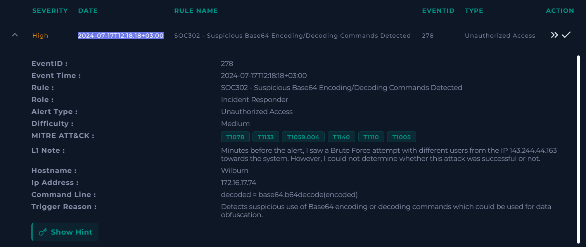

### 3.2 Did the brute force succeed

Filtering Log Management on 143.244.44.163 returned a wall of connections to 172.16.17.74 on port 22, arriving seconds apart from different source ports.

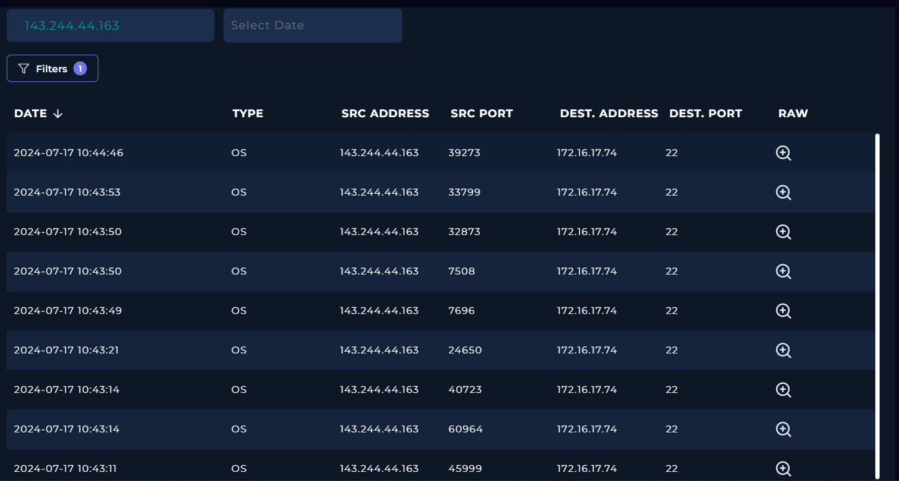

The newest entry in that set is the one that mattered. Its raw log records an accepted password for the account analyst at 10:44:46, from the same address that had been failing for the previous ninety seconds.

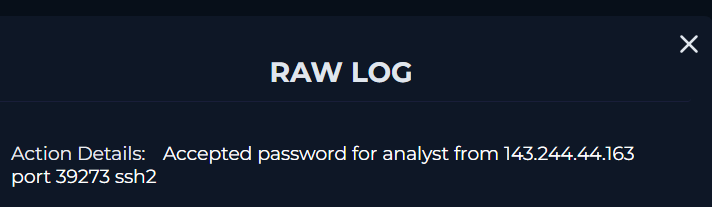

So the first hypothesis was dead. Everything after 10:44:46 on this host had to be read as attacker activity.

### 3.3 Reputation of the source IP

VirusTotal gives 143.244.44.163 one detection out of 91, which looks reassuring until you read the rest of the page. AS212238, Datacamp Limited, tagged as VPN, located in the United States. AbuseIPDB carries older reports against the same address for brute force and SSH abuse.

A low VirusTotal score on a VPN exit node does not mean much in either direction. Vendors are cautious about flagging shared hosting, and a rented block changes hands constantly. The authentication logs had already settled the question, so reputation here only answered where the traffic came from.

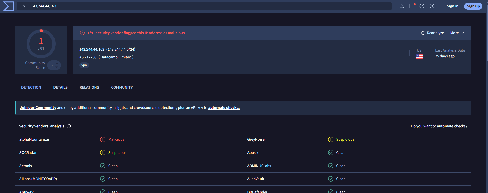

### 3.4 What happened after the login

Pivoting the filter onto the host itself put the successful login in sequence with what came next. Three records sit above it, all local to 172.16.17.74.

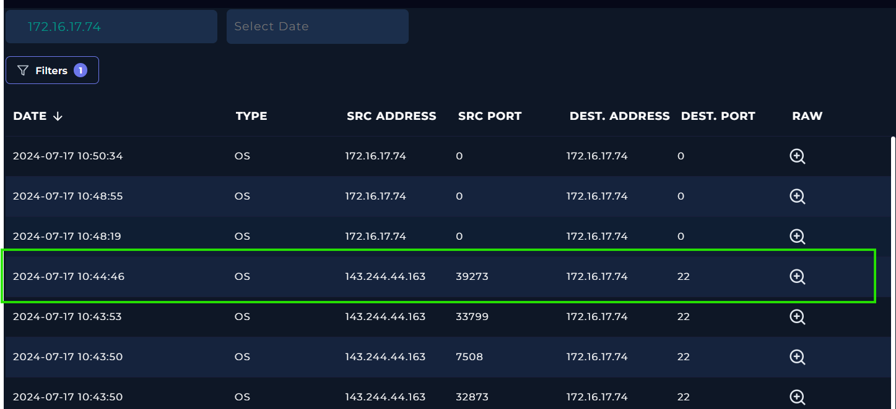

The first two are audit records for find commands. One sweeps the whole filesystem for filenames containing password.

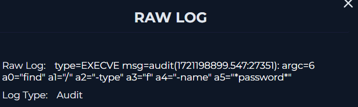

The other does the same for important.

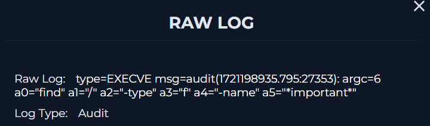

Those are the searches someone runs when they have landed on a machine they do not know and are hunting for credentials. No reconnaissance of the system itself, no interest in what the host does. Straight to the filenames.

### 3.5 Decoding the command that fired the alert

The third record was a python3 invocation logged as hexadecimal, which is how the audit subsystem captured the argument string.

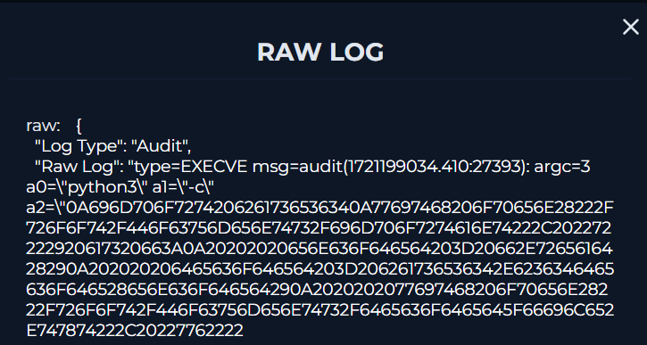

A From Hex recipe in CyberChef turned it back into readable Python. The script opens /root/Documents/important, passes the contents through base64.b64decode and writes the result to /root/Documents/decoded_file.txt.

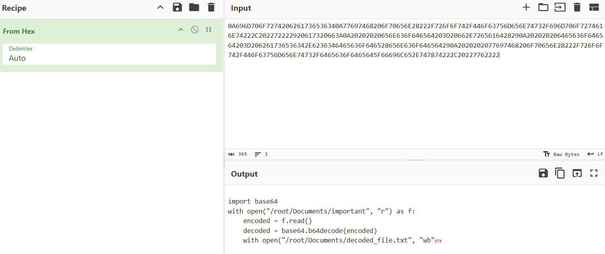

There is the alert, fully explained. Storing the file base64 encoded keeps a word like password invisible to anything scanning file contents for plaintext. Decoding it locally is a deliberate step around that protection, and that is the behaviour this rule exists to catch.

### 3.6 Endpoint confirmation

Endpoint Security lists Wilburn as an Ubuntu 20.04.02 client with analyst as the primary user, matching the account named in the accepted password log.

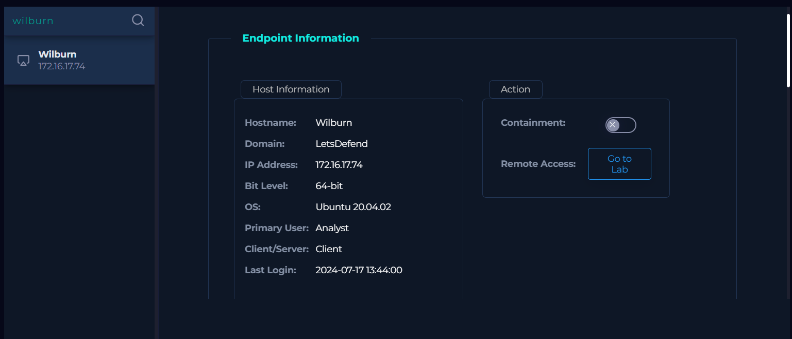

Process history shows repeated su calls under bash in the same window. That reads as privilege escalation attempts, although the view does not record whether any of them worked, so I left it as an observation rather than a finding.

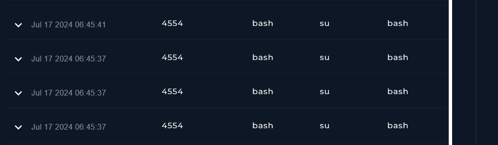

Terminal history then confirmed the whole chain in a single screen, and added two commands Log Management had not surfaced: an ls, and a cat important immediately before the decode. The ordering is the useful part. The attacker opened the file, found it unreadable, and only then wrote the one liner. The decode was a reaction to what they saw, not something planned in advance.

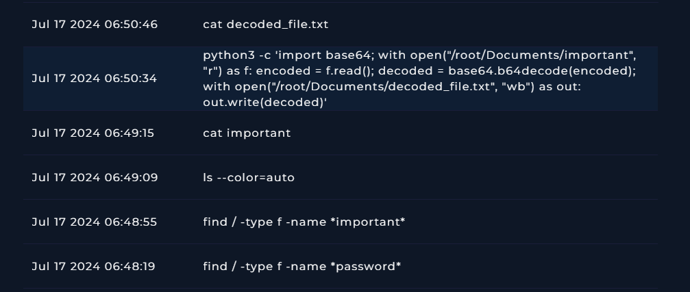

The final entry is cat decoded_file.txt, so the contents were read on the host.

### 3.7 What was in the file

Connecting to the host and reading decoded_file.txt settled what had actually been lost. Ten rows, each one an IP address with a username and a password.

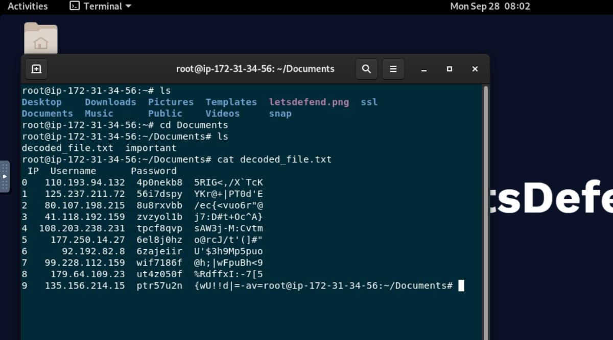

A single compromised Ubuntu host is a containable problem. Ten sets of credentials for other systems, read four minutes after the attacker got in, is a different and larger one.

### 3.8 Checking for lateral movement

Two searches in Log Management. The first looked for connections to each of the ten IP addresses from the decoded file and came back empty. The second looked for 143.244.44.163 anywhere in the environment and returned 172.16.17.74 as the only destination.

Nothing has moved yet. Given that the credentials are still in the attacker's possession, I would not read that as containment.

### 3.9 What the investigation could not prove

Three gaps are worth stating plainly, because a report that only shows the path that worked is less useful to whoever picks this up next.

Other file access is unknown. Terminal history captured the searches and the decode, but a file opened in an editor, or read by something that does not shell out, would not necessarily appear there.

Exfiltration is unproven. No outbound transfer showed up in the logs. The attacker had an interactive shell for several minutes and ten lines of text is a trivial amount of data to copy, so absence of evidence is doing a lot of work in that sentence.

The length of the session is also unknown. Nothing recorded a logout or a termination, so on the available evidence the access window has no end point.
