# Incident Report: Suspicious Base64 Encoding Commands Detected on Host Clark

**Incident:** SSH Account Compromise Leading to Encoded Exfiltration of System Account Data
**Platform:** LetsDefend
**Severity:** Medium
**Category:** Brute Force / Data Exfiltration
**Date:** 07/08/24
**Related Alerts:** SOC302

> Investigation answers and platform flags are redacted. This report documents the analysis process and reasoning, not the solution to the exercise.

---

## 1. Alert Overview

| Field               | Value                                                 |
| ------------------- | ----------------------------------------------------- |
| Alert ID            | SOC302 (Event ID 286)                                 |
| Trigger Time        | 2024-08-07 08:26:25 (+03:00)                          |
| Rule Name           | Suspicious Base64 Encoding/Decoding Commands Detected |
| Severity            | Medium                                                |
| Source Address      | 89.187.185.184                                        |
| Destination Address | 172.16.20.43 (Clark)                                  |
| Device Action       | Allowed                                               |

The rule looks for shell commands that encode or decode data with Base64. Base64 is not malicious on its own. System administrators and scripts use it every day. What makes it worth alerting on is the context it usually appears in: attackers reach for it to obfuscate payloads before execution or to disguise data before sending it out of the network.

The L1 note attached to the ticket is what gives this alert weight. A few minutes before it fired, the same host had taken a run of SSH login attempts from 89.187.185.184 using several different usernames, and the L1 analyst could not tell whether any of them worked. This investigation exists to answer that one question.

---

## 2. Alert Report

**Verdict:** True Positive

**Time of Activity:**

Timestamps below follow the endpoint clock. The Log Management module presents the same events with a four hour offset, so an event recorded at 08:26:25 on the host appears as 12:26:25 in the log search.

| Time (host clock)   | Event                                                                              |
| ------------------- | ---------------------------------------------------------------------------------- |
| 2024-08-07 08:21:14 | SSH login attempts begin from 89.187.185.184 against invalid users Yusuf and Dikec |
| 2024-08-07 08:21:16 | Accepted password for analyst, successful SSH login on port 55377                  |
| 2024-08-07 08:21:17 | Further failed attempt against invalid user Hitman                                 |
| 2024-08-07 08:22:13 | Second successful login as analyst on port 30031                                   |
| 2024-08-07 08:22:3x | whoami, groups, sudo su, privilege escalation to root                              |
| 2024-08-07 08:22:34 | whoami executed as root                                                            |
| 2024-08-07 08:23:12 | netstat -tuln, listening service discovery                                         |
| 2024-08-07 08:23:17 | hostname                                                                           |
| 2024-08-07 08:23:39 | cat /etc/os-release, operating system identification                               |
| 2024-08-07 08:24:02 | cat /etc/group, group enumeration                                                  |
| 2024-08-07 08:24:32 | getent passwd, account enumeration                                                 |
| 2024-08-07 08:25:08 | cd Documents/                                                                      |
| 2024-08-07 08:25:27 | touch test.txt, staging file created                                               |
| 2024-08-07 08:25:34 | vi test.txt, file populated with the contents of /etc/passwd                       |
| 2024-08-07 08:26:25 | Base64 utility selection command executed, alert trigger                           |
| 2024-08-07 08:26:27 | cat test.txt \| $cmd > /root/Documents/encoded.dat, data encoded                   |
| 2024-08-07 08:26:48 | curl POST upload to ukr-net-files-loading-application.ru/upload                    |
| 2024-08-07 08:26:59 | Second identical upload                                                            |

Five minutes and forty three seconds separate the first successful login from the completed upload.

**Affected Entities:**

| Entity                   | Value                                                                            |
| ------------------------ | -------------------------------------------------------------------------------- |
| Affected host            | 172.16.20.43 (Clark), Ubuntu 20.04.02 server, internal hostname ip-172-31-36-118 |
| Compromised account      | analyst (UID 1001, GID 1001, /home/analyst, /bin/bash)                           |
| Privilege obtained       | root (UID 0) via sudo su                                                         |
| Attacker source          | 89.187.185.184 (AS 60068, Datacamp Limited)                                      |
| Service exposed          | SSH on port 22                                                                   |
| Exfiltration destination | http://ukr-net-files-loading-application.ru/upload                               |
| Staging files            | /root/Documents/test.txt, /root/Documents/encoded.dat                            |
| Data exfiltrated         | A copy of /etc/passwd, the full list of system accounts                          |

**Reasoning:**

The alert triggered on a shell command that picks a Base64 utility based on the operating system, run from a root shell on host Clark (172.16.20.43) after an SSH login as the user analyst from 89.187.185.184. Investigation confirmed that the same session logged in successfully, escalated to root with sudo su, copied the contents of /etc/passwd into a staging file, encoded that file, and uploaded it to http://ukr-net-files-loading-application.ru/upload, which indicates the Base64 command was one step inside a completed exfiltration chain rather than routine administration.

One detail in the authentication log carries most of the weight. There are no failed attempts against analyst at any point. The failures all target Yusuf, Dikec and Hitman, three accounts that do not exist on the host, while analyst was accepted on the very first try. Guessing does not look like that. The attacker already held a working password, whether through reuse, an earlier compromise, or a leak, and the invalid usernames are likely leftover noise from a list built for a different target.

The outbound connection was allowed rather than blocked. Both uploads completed, eleven seconds apart, to a destination flagged as malicious by 14 of 96 vendors on VirusTotal. Nothing was planted for persistence: /root/.ssh/authorized_keys holds only the default AWS AMI key, /home/analyst/.ssh/authorized_keys does not exist, and every cron entry on the host predates the incident by years.

**Escalation:**

Escalated to L2.

The host sustained a full root compromise and the exfiltration finished without interruption. The repeat upload confirms the outbound path was working, not merely attempted. Two actions cannot wait for the L2 queue: isolate 172.16.20.43 and disable the analyst account.

L2 should pick up the credential question first. No failed attempts were recorded against analyst, so the password was known before the attack rather than discovered during it. That points at reuse or a prior leak, and the same password may still be valid on other systems in the environment.

Scope is narrow in the attacker's favour. Activity stays on this host and this account, no SSH keys were planted, no cron entries were added, and no lateral movement appears in the logs. The file that left the host is /etc/passwd, which carries no password hashes. Those sit in /etc/shadow and were not touched.

**Recommended Remediation Action:**

1. Isolate host 172.16.20.43 from the network, disable the analyst account, and terminate every active session.
2. Reset the analyst credentials, then find and reset the same credentials anywhere else they are in use. The password was known before the attack started, so it may still be valid elsewhere.
3. Block 89.187.185.184 at the perimeter and ukr-net-files-loading-application.ru at the DNS and proxy layer.
4. Preserve /root/Documents/test.txt and /root/Documents/encoded.dat as evidence, then remove them from the host.
5. Review sudo rights for analyst and for every other non administrative account. Unrestricted sudo on a standard user account turned an account compromise into a root compromise in under twenty seconds.
6. Harden SSH access: disable password authentication in favour of keys, move the service behind a VPN or bastion host instead of exposing it directly, and deploy fail2ban or an equivalent control to rate limit repeated authentication failures from one source.
7. Add detection coverage for the pattern seen here. Correlate repeated Failed password events with a later Accepted password from the same address, and alert on sudo su run shortly after an SSH login, on outbound curl or wget POST requests from server workloads to uncategorised domains, and on getent passwd followed by file creation and an outbound transfer inside a short window.

**Indicators of Compromise:**

| Type      | Indicator                                          | Notes                                                                                       |
| --------- | -------------------------------------------------- | ------------------------------------------------------------------------------------------- |
| IP        | 89.187.185.184                                     | Attacker source for the login attempts and the successful logins, AS 60068 Datacamp Limited |
| Domain    | ukr-net-files-loading-application.ru               | Attacker controlled upload server                                                           |
| URL       | http://ukr-net-files-loading-application.ru/upload | Exfiltration endpoint, 14 of 96 detections on VirusTotal                                    |
| File Name | /root/Documents/test.txt                           | Staging file holding a copy of /etc/passwd                                                  |
| File Name | /root/Documents/encoded.dat                        | Base64 encoded copy of the staging file, uploaded twice                                     |
| Account   | analyst                                            | Compromised account, UID 1001, holds sudo rights                                            |

**MITRE ATT&CK:**

| Tactic               | Technique                                                | ID        |
| -------------------- | -------------------------------------------------------- | --------- |
| Credential Access    | Brute Force                                              | T1110     |
| Initial Access       | External Remote Services (SSH)                           | T1133     |
| Initial Access       | Valid Accounts                                           | T1078     |
| Privilege Escalation | Abuse Elevation Control Mechanism: Sudo and Sudo Caching | T1548.003 |
| Execution            | Command and Scripting Interpreter: Unix Shell            | T1059.004 |
| Discovery            | Password Policy Discovery                                | T1201     |
| Discovery            | Account Discovery: Local Account                         | T1087.001 |
| Discovery            | System Network Connections Discovery                     | T1049     |
| Discovery            | System Information Discovery                             | T1082     |
| Collection           | Data from Local System                                   | T1005     |
| Stealth              | Obfuscated Files or Information: Encrypted/Encoded File  | T1027.013 |
| Exfiltration         | Exfiltration Over C2 Channel                             | T1041     |

---

## 3. Investigation

### 3.1 Initial Triage

The alert itself is thin. One command line, one host, one trigger reason. The command assigns a Base64 utility to a variable depending on the operating system and does no encoding at all, so on its own it proves nothing.

What made it interesting was the L1 note attached to the ticket. Minutes before the alert, the same host had taken SSH login attempts from 89.187.185.184 against several usernames, and the L1 analyst could not tell whether any of them worked. So the working hypothesis going in was that the Base64 command belonged to a session that should not have existed, and the first job was to settle the login question in the authentication logs.

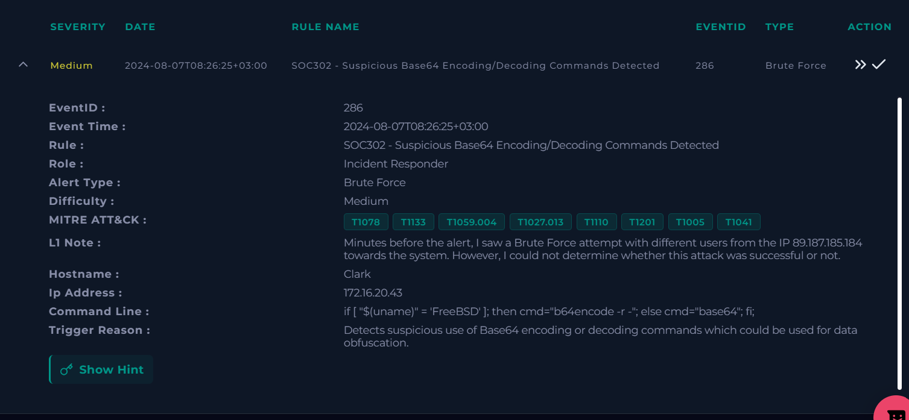

### 3.2 Authentication Log Review

Searching Log Management for 172.16.20.43 brings back the SSH activity the L1 analyst saw.

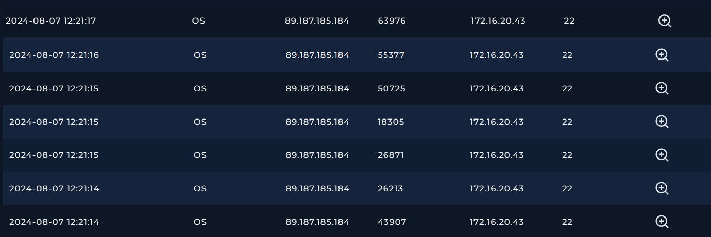

The attempts start at 08:21:14 and move through a short list of usernames. Yusuf and Dikec both come back as Failed password for invalid user, which tells us those accounts do not exist on this system.

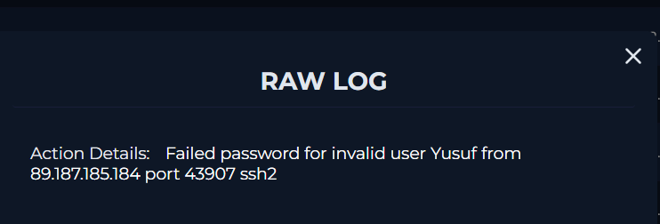

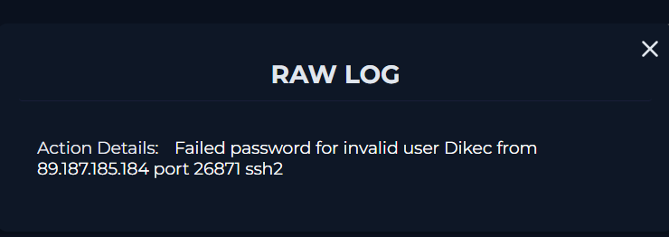

Two seconds in, at 08:21:16, the log changes tone: Accepted password for analyst. That answers the L1 question. The attack worked.

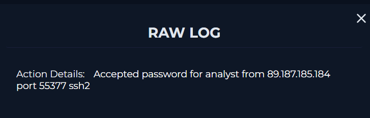

One second after the successful login, there is another failed attempt, this time for the invalid user Hitman. An attacker who has just landed a shell does not usually keep guessing. This reads like an automated list still running in the background.

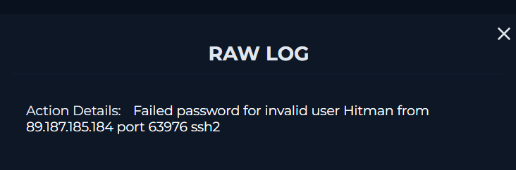

At 08:22:13 the analyst account logs in a second time, from the same address, on a different source port.

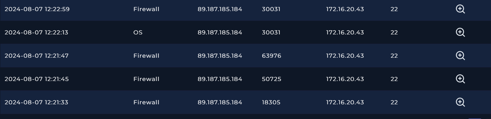

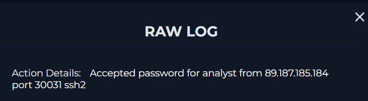

The detail that shaped the rest of the investigation is what the log does not contain. Not one failed attempt against analyst. The account was accepted on the first try while three other usernames failed. Password guessing produces failures against the account that eventually succeeds, and there are none here. The reading that fits is that the attacker already had the password, and the other usernames were noise.

### 3.3 Source Address Reputation

Every one of these events comes from 89.187.185.184. VirusTotal reports the address as clean.

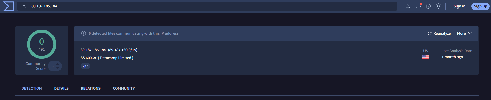

A clean verdict is worth pausing on, because it is the kind of result that can talk an analyst out of a conclusion the evidence already supports. It did not change anything here. The address belongs to AS 60068, Datacamp Limited, a commercial VPN provider, which is consistent with someone hiding where they are connecting from. More to the point, the authentication logs are direct behavioural evidence from our own host. Reputation data is secondary to that, and plenty of attacker infrastructure has never been reported by anyone.

### 3.4 Post Login Command Activity

With the login confirmed, the next question was what the session actually did. Log Management records a series of command events from the host after the login.

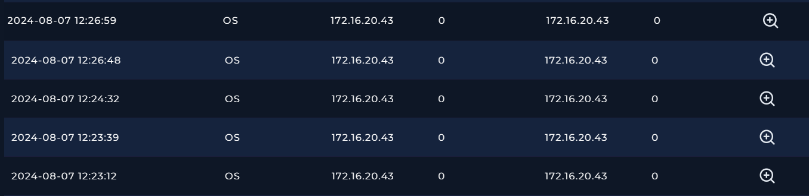

The first is netstat -tuln at 08:23:12, which lists listening services. Someone was mapping what the box runs.

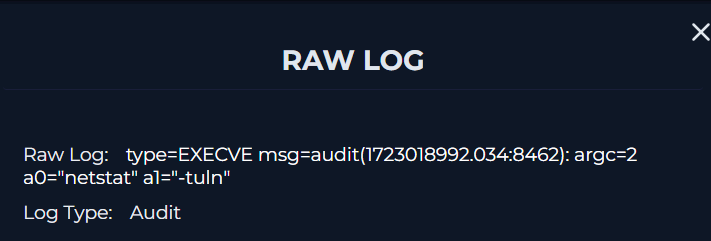

At 08:23:39, cat /etc/os-release identifies the distribution.

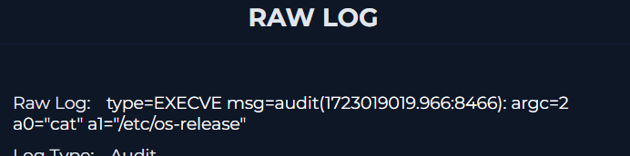

At 08:24:32, getent passwd dumps every user account on the system. This is the command that matters later, because it produces exactly the data that ends up leaving the host.

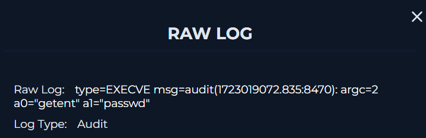

Then at 08:26:48 a curl command POSTs a file called encoded.dat to http://ukr-net-files-loading-application.ru/upload.

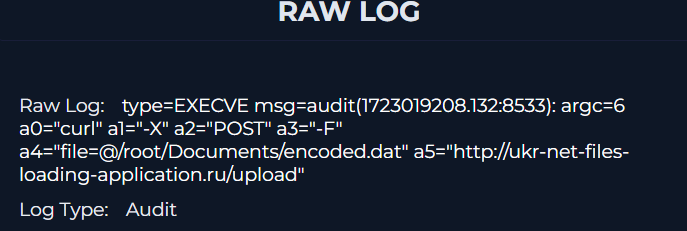

Eleven seconds later, at 08:26:59, the same command runs again. Either the first attempt failed quietly or the attacker wanted a second copy on the server.

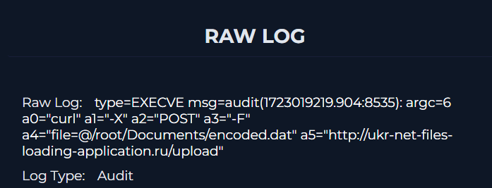

The destination URL is flagged as malicious by 14 of 96 vendors on VirusTotal. The hypothesis that this was ordinary administrative work did not survive this screenshot.

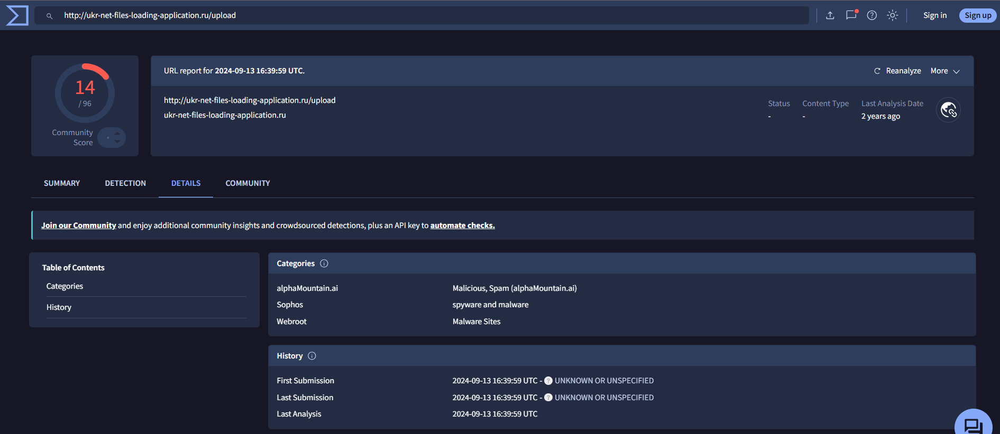

### 3.5 Endpoint Review and Terminal History

Clark is an Ubuntu 20.04.02 server with analyst as its primary user, and Containment was still off when the investigation started.

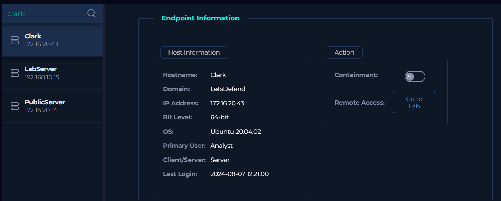

The terminal history fills in the gaps between the logged events. After escalating, the attacker ran whoami, netstat -tuln, hostname, cat /etc/os-release, cat /etc/group and getent passwd in sequence, then moved into the Documents directory.

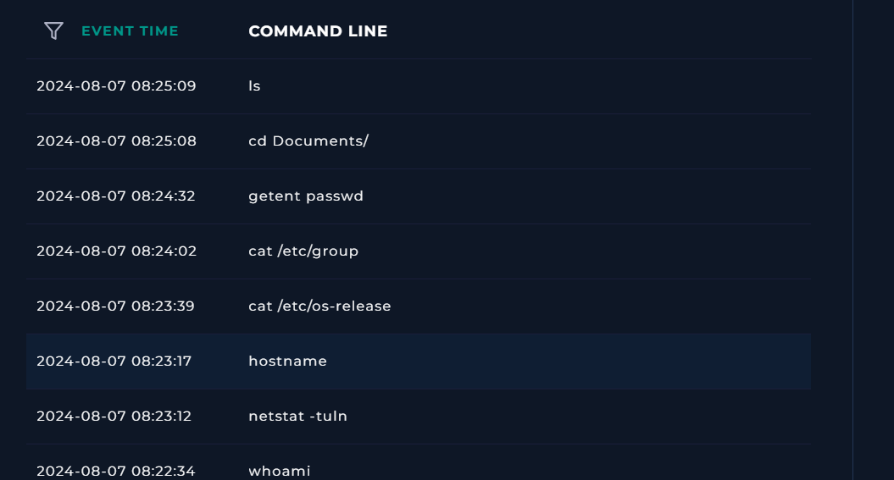

The staging phase is all in one screen. touch test.txt at 08:25:27, vi test.txt at 08:25:34, a cat to check the contents, then the Base64 selector, then the encode, then the upload.

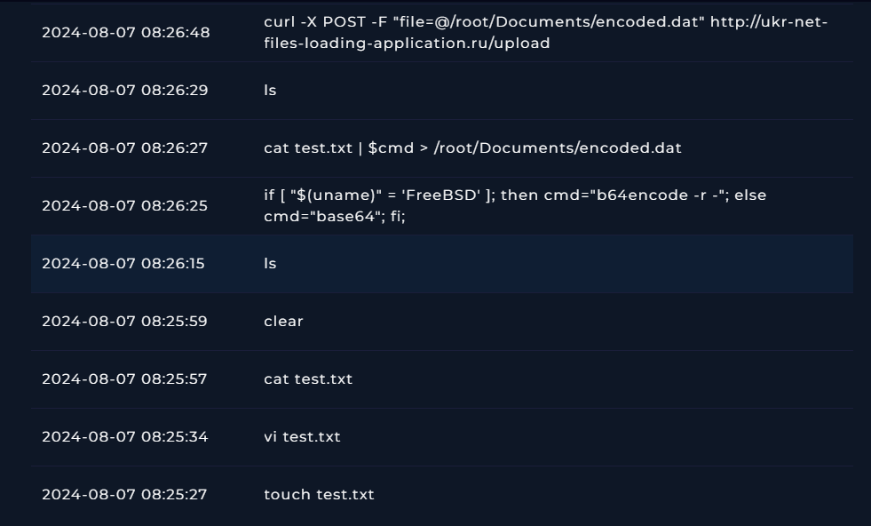

Here is the command that set the alert off:

It checks whether the system is FreeBSD. If so, it uses b64encode -r -, otherwise it falls back to base64. The two platforms ship different tools for the same job, and this one line papers over the difference. Nobody types that at a prompt on a box they already know is Ubuntu. It comes from a prepared script, which says the operator brought tooling rather than improvising.

The next command, cat test.txt | $cmd > /root/Documents/encoded.dat, is where the variable gets used and the data gets encoded.

### 3.6 Host Inspection

The remaining question was what was actually in test.txt, which the logs alone could not answer. Reading the file on the host settles it.

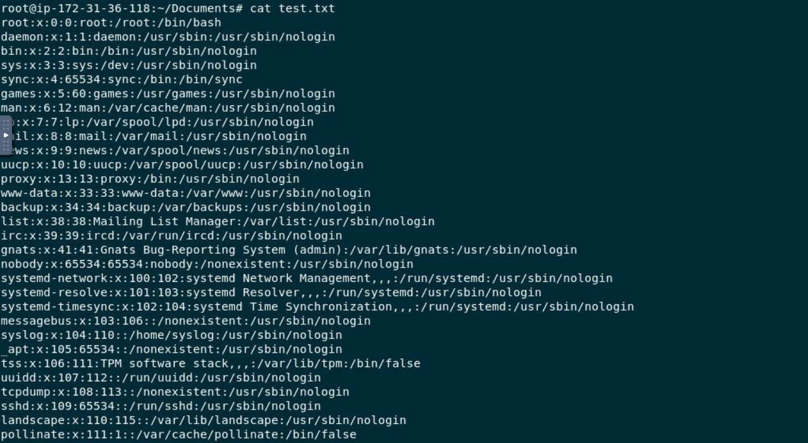

It is a copy of /etc/passwd, listing every system account with its UID, GID, home directory and shell. That matches the output of the getent passwd command run one minute earlier. The attacker enumerated the accounts, pasted the result into a file, encoded it, and shipped it out.

The impact needs stating carefully. /etc/passwd holds no password hashes; those live in /etc/shadow, which was never touched, so no credentials were directly exposed. The account list is still useful to an attacker. It shows which accounts exist, which have interactive shells, and which belong to privileged groups, which makes it a shortlist of targets for a later attempt.

The bash history for analyst explains how a non root user wrote files into /root/Documents in the first place.

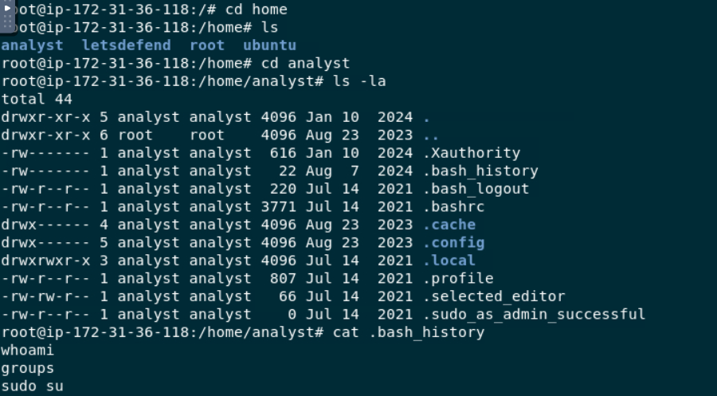

Three commands, in order: whoami, groups, sudo su. The presence of .sudo_as_admin_successful in the home directory, a marker Ubuntu drops the first time an account uses sudo successfully, confirms the escalation worked. analyst has UID 1001 and is an ordinary account, but it carries sudo rights, so the attacker was root within seconds of logging in. Everything after that sits in root's shell history instead of the user's, which is why the analyst history is so short.

### 3.7 Persistence Check

Before closing the analysis I checked the usual footholds, because a root compromise reads very differently depending on whether the attacker left a way back in.

/root/.ssh/authorized_keys holds one key, the default AWS AMI key, recognisable by its restrictive options and the command= directive that blocks direct root login. /home/analyst/.ssh/authorized_keys does not exist at all. The crontabs for root and analyst contain two @reboot entries, both for vncserver and websockify, which are the lab's own remote access components. Every file in /etc/cron.d/ is dated between 2019 and 2021 and none was modified on the day of the incident.

Nothing was planted. That narrows the response a lot. The attacker got in, took what was sitting there, and left. The way back in is the same credential that worked the first time, so resetting it and tracking down everywhere else it is used matters more than any cleanup on the host itself.
