# Incident Report: Akira ransomware executed after invoice phishing

**Incident:** Akira ransomware executed on an internal server after an invoice themed phishing email
**Platform:** LetsDefend
**Severity:** High
**Category:** Malware (Ransomware)
**Date:** 02/10/24
**Related Alerts:** SOC328

> Investigation answers and platform flags are redacted. This report documents the analysis process and reasoning, not the solution to the exercise.

---

## 1. Alert Overview

| Field               | Value                                  |
| ------------------- | -------------------------------------- |
| Alert ID            | SOC328                                 |
| Trigger Time        | 2024-10-02 05:52:00 (+03:00)           |
| Rule Name           | SOC328 Akira Ransomware IOC's Detected |
| Severity            | High                                   |
| Source Address      | 172.16.17.130 (Vergil)                 |
| Destination Address | 172.16.17.130 (Vergil)                 |
| Device Action       | Detected, not blocked                  |

The rule looks for hashes and host behaviour published by CISA in advisory AA24-109A, which describes how the Akira ransomware group operates. It fired because a known Akira payload hash ran from a user Downloads folder on a host called Vergil. The alert carried a note from the L1 analyst saying a user had received a ZIP attachment and seemed to have run the executable inside it, but that the analyst could not confirm the ransomware family was Akira. Confirming that family, and working out how far the attack got, became the two questions driving this investigation.

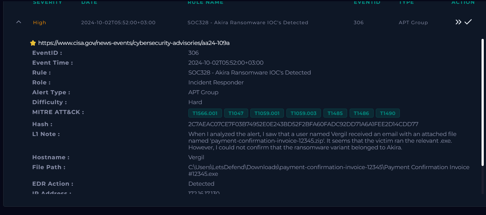

One practical note before the timeline. The platform shows times differently in different tools. Log Management displays events four hours ahead of Endpoint Security, so the same PowerShell command appears at 09:52:22 in one view and 05:52:30 in another. Unless stated otherwise, times in this report follow Log Management.

---

## 2. Alert Report

**Verdict:** True Positive

**Time of Activity:** The alert fired at 2024-10-02 05:52:00 (+03:00). The activity it belongs to runs from 09:25:00 to 09:53:12 in Log Management time, starting with mail delivery and ending with the ransom notes being written.

| Time                | Event                                                                                |
| ------------------- | ------------------------------------------------------------------------------------ |
| 2024-10-02 09:25:00 | Phishing email delivered to vergil@letsdefend.io, final action Allowed               |
| 2024-10-02 09:51:45 | User extracts payment-confirmation-invoice-12345.zip with 7-Zip, parent explorer.exe |
| 2024-10-02 09:52:10 | Payment Confirmation Invoice #12345.exe runs, Event ID 4688, parent explorer.exe     |
| 2024-10-02 09:52:10 | The executable writes Log-02-10-2024-05-52-10.txt beside itself, Sysmon Event ID 11  |
| 2024-10-02 09:52:17 | Windows Defender starts remediation activity                                         |
| 2024-10-02 09:52:22 | PowerShell deletes every Volume Shadow Copy through WMI, Event ID 4104               |
| 2024-10-02 09:53:12 | akira_readme.txt written to four directories                                         |

Twenty five seconds passed between the user extracting the archive and the payload running. Twelve seconds after that, the shadow copies were gone.

**Affected Entities:**

| Entity             | Value                                                                                                    |
| ------------------ | -------------------------------------------------------------------------------------------------------- |
| Affected host      | Vergil, 172.16.17.130, Windows 10 64 bit, classified as a server                                         |
| User account       | LetsDefend                                                                                               |
| Recipient          | vergil@letsdefend.io                                                                                     |
| Sender             | sale@thefasted.com                                                                                       |
| Sender IP          | 162.255.119.213                                                                                          |
| Payload hash       | 2C7AEAC07CE7F03B74952E0E243BD52F2BFA60FADC92DD71A6A1FEE2D14CDD77                                         |
| Files dropped      | Payment Confirmation Invoice #12345.exe, Log-02-10-2024-05-52-10.txt, akira_readme.txt in four locations |
| Processes involved | 7zG.exe, Payment Confirmation Invoice #12345.exe, powershell.exe                                         |

**Reasoning:**

The alert triggered on an Akira ransomware payload executing from the Downloads folder of the account LetsDefend on host Vergil (172.16.17.130). Investigation confirmed that the payload arrived as a ZIP attachment on a phishing email from sale@thefasted.com, delivered to vergil@letsdefend.io at 09:25:00 with the subject Payment Confirmation and allowed by the mail gateway, which indicates the invoice lure worked and the attack reached the execution stage. Two details in the message were already enough to treat it as hostile before any host data was touched: the body names an attachment ending in .pdf while the real attachment is a ZIP, and the contact address in the signature sits on a different domain from the sender. The attachment hash was flagged by 59 of 70 vendors on VirusTotal under the threat label ransomware.akira/misc, with behavioural tags for long sleeps, checking user input, and detecting a debug environment, so the sample was built to stay quiet when it suspects analysis.

Execution came from the user rather than from an automated dropper. At 09:51:45 the archive was extracted with 7-Zip under explorer.exe, and twenty five seconds later Payment Confirmation Invoice #12345.exe ran with the same parent and the LetsDefend account, which answers the question the L1 analyst had left open about whether the victim actually opened it. The payload wrote Log-02-10-2024-05-52-10.txt beside itself, and twelve seconds after execution PowerShell ran Get-WmiObject Win32_Shadowcopy | Remove-WmiObject and removed every Volume Shadow Copy on the host, taking native Windows rollback off the table. Using WMI instead of vssadmin matters, because most detection content for this behaviour watches vssadmin and misses the WMI path. At 09:53:12 the payload wrote akira_readme.txt into four directories, which matches the Akira behaviour documented in CISA AA24-109A, and submitting the note to ID Ransomware returned an Akira match. The family is therefore confirmed from host artefacts and not from a vendor label alone.

The execution was detected by Windows Defender but not blocked. Remediation activity began at 09:52:17, five seconds before the shadow copies went, and the payload deleted them anyway and carried on to drop its ransom notes, so impact on the host is confirmed rather than merely attempted. Encryption itself could not be verified, because remote access to Vergil failed throughout the investigation and no file carrying the .akira extension appears in any available log source. Sandbox analysis of the same hash shows encryption with that extension and a log file matching the naming pattern seen here, but that is sandbox evidence rather than proof from the affected system. Scope, at least, looks contained. Searching Email Security by sender and by subject returned one recipient, and no lateral movement or network propagation was visible from the host.

**Escalation:**

Escalated to L2.

Akira ransomware ran on Vergil and successfully disabled local recovery. The endpoint product recorded the activity without blocking it. The affected machine is a server rather than a workstation, which raises both the potential data impact and the risk of the infection spreading.

At the time of review the host was not isolated, so isolation is the first thing L2 should do. After that, the open question is whether encryption completed, which could not be answered here because remote access to the host was unavailable. The good news to hand over is that the campaign reached one mailbox and no propagation attempts were observed.

**Recommended Remediation Action:**

1. Isolate host 172.16.17.130 from the network before anything else, since the machine is a server and was still connected at the time of review.
2. Preserve akira_readme.txt, Log-02-10-2024-05-52-10.txt, and the payload as evidence, then establish whether file encryption completed and how much data is affected.
3. Block hash 2C7AEAC07CE7F03B74952E0E243BD52F2BFA60FADC92DD71A6A1FEE2D14CDD77 across all endpoints, and block sender sale@thefasted.com together with sender IP 162.255.119.213 at the mail gateway.
4. Restore affected data from offline backups, and confirm that immutable backups for this server exist and that a restore has actually been tested. Shadow copies are gone, so local rollback is not an option.
5. Close the delivery path by quarantining archives that contain executables at the gateway, restricting execution of binaries from user Downloads directories through application control, and running phishing awareness training on invoice lures.
6. Find out why the EDR detection did not become a block, and add alerting on shadow copy deletion by any method, including Win32_Shadowcopy through WMI rather than vssadmin alone.

**Indicators of Compromise:**

| Type           | Indicator                                                        | Notes                                                              |
| -------------- | ---------------------------------------------------------------- | ------------------------------------------------------------------ |
| Hash (SHA256)  | 2C7AEAC07CE7F03B74952E0E243BD52F2BFA60FADC92DD71A6A1FEE2D14CDD77 | Akira payload, 59 of 70 detections on VirusTotal                   |
| IP             | 162.255.119.213                                                  | Sender IP of the phishing email                                    |
| Email address  | sale@thefasted.com                                               | Sender of the fake payment confirmation                            |
| Email address  | billing@payment-confirmation.com                                 | Contact address in the signature, different domain from the sender |
| File name      | payment-confirmation-invoice-12345.zip                           | Malicious attachment                                               |
| File name      | Payment Confirmation Invoice #12345.exe                          | Payload executed by the user                                       |
| File name      | akira_readme.txt                                                 | Ransom note, written to four directories                           |
| File name      | Log-02-10-2024-05-52-10.txt                                      | Log file written by the payload at execution                       |
| File extension | .akira                                                           | Extension used by this variant for encrypted files                 |

**MITRE ATT&CK:**

| Tactic          | Technique                                            | ID        |
| --------------- | ---------------------------------------------------- | --------- |
| Initial Access  | Phishing: Spearphishing Attachment                   | T1566.001 |
| Execution       | User Execution: Malicious File                       | T1204.002 |
| Execution       | Command and Scripting Interpreter: PowerShell        | T1059.001 |
| Execution       | Command and Scripting Interpreter: Windows Cmd Shell | T1059.003 |
| Execution       | Windows Management Instrumentation                   | T1047     |
| Defense Evasion | Deobfuscate/Decode Files or Information              | T1140     |
| Impact          | Inhibit System Recovery                              | T1490     |
| Impact          | Data Destruction                                     | T1485     |
| Impact          | Data Encrypted for Impact                            | T1486     |

---

## 3. Investigation

### 3.1 Initial triage

The alert arrived with a hash, a file path inside a user Downloads folder, and an L1 note that already pointed at a phishing email with a ZIP attachment. The first thing worth checking was the hash, because if the file turned out to be benign the rest of the story would collapse immediately. Submitting it to VirusTotal returned 59 detections out of 70 vendors, with ransomware.akira/misc as the popular threat label and akira among the family labels.

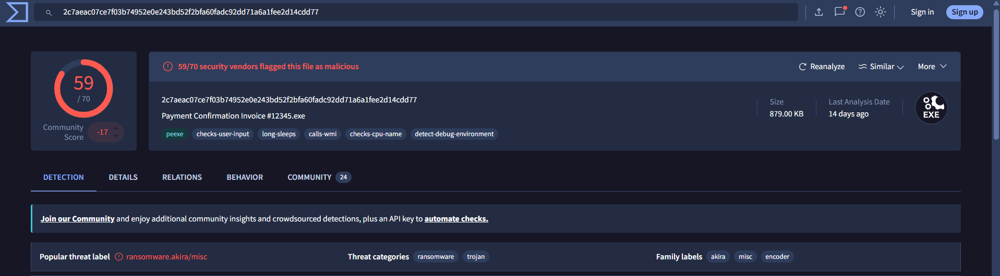

The details tab confirmed a Win32 PE executable of roughly 879 KB, compiled with Visual C++. The behavioural tags are the interesting part: long sleeps, checks user input, checks CPU name, and detect debug environment. Those are evasion features. The sample tries to work out whether it is running in an analysis environment and stays quiet if it thinks it is.

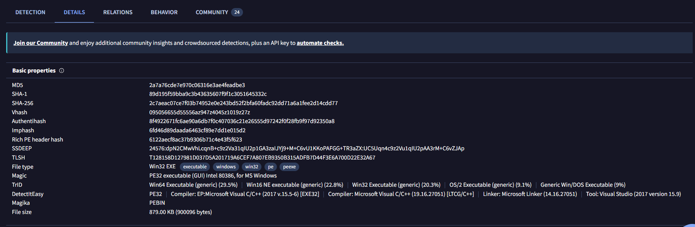

VirusTotal also lists execution parents, and payment-confirmation-invoice-12345.zip appears there. The file name matched the attachment described in the L1 note before I had even opened the mailbox, which told me the mail and the host activity were the same event rather than two unrelated things happening on the same morning.

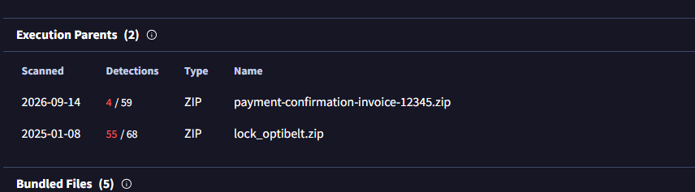

The dropped files list from sandbox detonation was useful later. It shows file after file rewritten with an .akira extension, and alongside them a text file named Log-27-08-2024-21-43-58.txt. That naming pattern comes back on the real host.

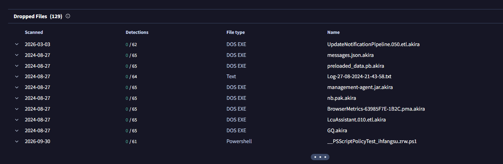

### 3.2 Mail analysis

Searching Email Security for the recipient returned exactly one message, which immediately bounded the scope. One mailbox, one delivery, final action Allowed.

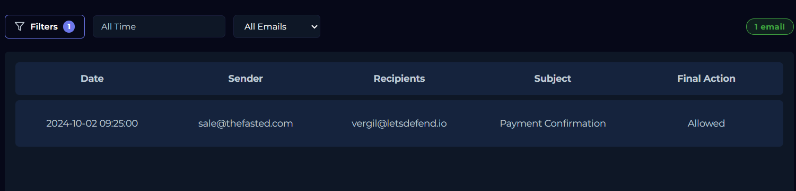

The message came from sale@thefasted.com with sender IP 162.255.119.213 and the subject Payment Confirmation. It tells the reader their invoice payment went through and asks them to review the attached document, with a 48 hour deadline attached to create urgency. Two things give it away. The body names an attachment ending in .pdf while the real attachment is a .zip, which is not a mistake an automated billing system tends to make.

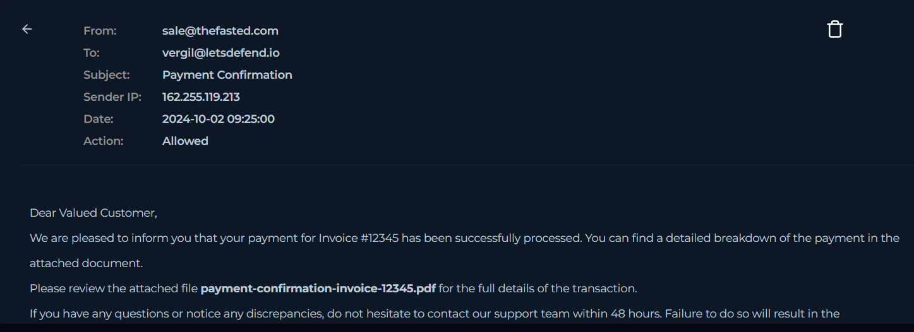

The signature block is the second tell. It signs off as the Payment Confirmation Team with a contact address at payment-confirmation.com, which has nothing to do with thefasted.com where the mail came from. Below it sits payment-confirmation-invoice-12345.zip, the same file VirusTotal had already flagged.

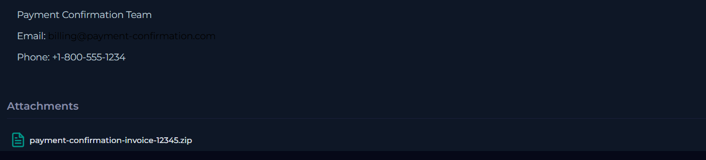

### 3.3 Log analysis on the host

With the mail confirmed malicious, the question moved to what happened on Vergil. Filtering Log Management on 172.16.17.130 produced a dense cluster of OS events between 09:51:45 and 09:53:12, which is a small enough window to read event by event.

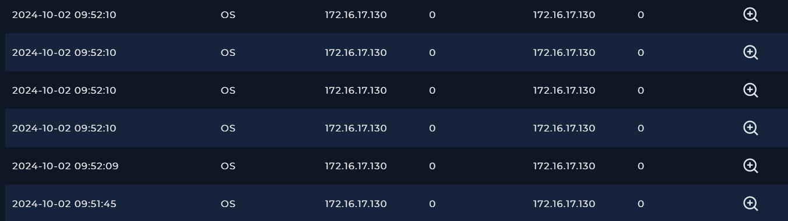

The first event in the cluster is 7zG.exe running at 09:51:45 with explorer.exe as its parent, extracting the archive into C:\Users\LetsDefend\Downloads\payment-confirmation-invoice-12345. The parent process is the useful part here. 7zG.exe is the graphical 7-Zip extractor, and when Explorer launches it the usual explanation is that somebody sat at the machine and opened the archive by hand.

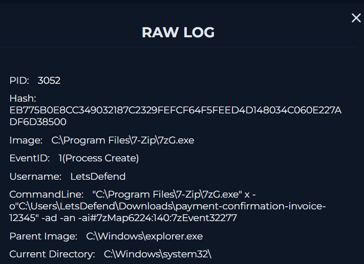

At 09:52:10 a Sysmon file creation event shows Payment Confirmation Invoice #12345.exe writing Log-02-10-2024-05-52-10.txt into the same folder. The image field names the payload itself, so the file came from the malware rather than from any legitimate process. The timestamp baked into the file name matches the endpoint clock, not the Log Management clock, which is a neat confirmation that the four hour offset is a display difference and not two separate events.

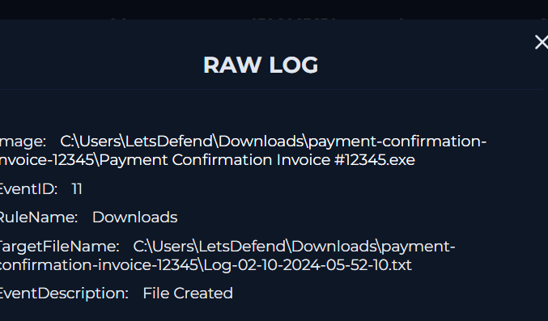

The process creation event sits at the same second. Event ID 4688, account LetsDefend, new process Payment Confirmation Invoice #12345.exe, parent explorer.exe. That settles the open question from the L1 note. The victim ran the executable.

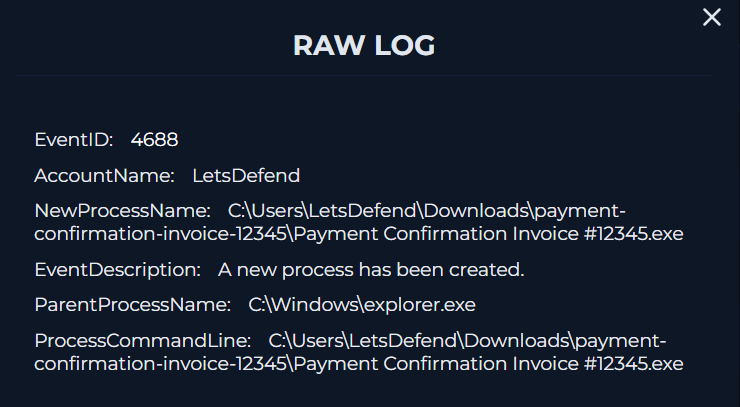

Twelve seconds later, at 09:52:22, PowerShell logged script block Get-WmiObject Win32_Shadowcopy | Remove-WmiObject under Event ID 4104. Every Volume Shadow Copy on the machine was deleted, so Previous Versions and System Restore are no longer options for the user. Using WMI rather than vssadmin is a deliberate choice by whoever wrote the payload, because vssadmin delete shadows is the string most detection content is built around.

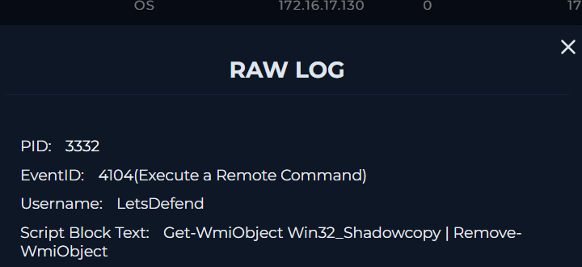

### 3.4 Confirming the ransomware family

The alert title said Akira, but a rule title is not evidence, and the L1 analyst had explicitly flagged that they could not confirm it. Vendor labels on VirusTotal are a reasonable signal, although they are still a third party opinion about a file rather than proof of what ran here. The stronger confirmation was on the host.

Starting at 09:53:12, the payload wrote akira_readme.txt into the Start Menu folder.

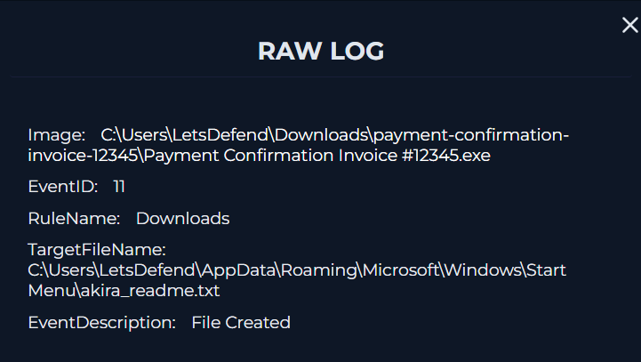

Then into the Downloads directory it had been extracted into.

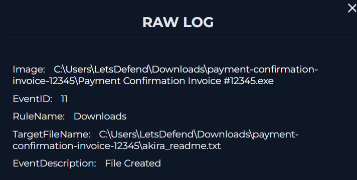

Then into the Microsoft Word STARTUP folder, which means the note also surfaces the next time Word opens.

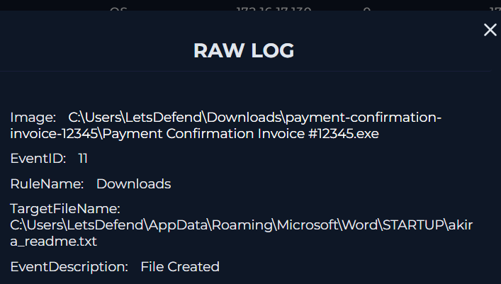

And finally into C:\Users\Public\Downloads, a directory every user profile on the machine can see.

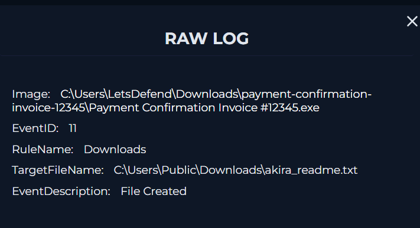

That is the same file name written into four directories inside a single second. CISA AA24-109A describes the same spread pattern for Akira, and uploading the note to ID Ransomware returned an Akira match. The attribution now rests on what the payload did on this host, with the vendor labels as supporting evidence rather than as the basis for it.

### 3.5 Endpoint review and the limits of this investigation

Endpoint Security confirms what kind of machine this is. Vergil is a 64 bit Windows 10 host in the LetsDefend domain, classified as a server, with the LetsDefend account as its primary user. The containment toggle was off, which is the detail that pushed this case to a priority escalation. A ransomware payload had already run and the machine was still on the network.

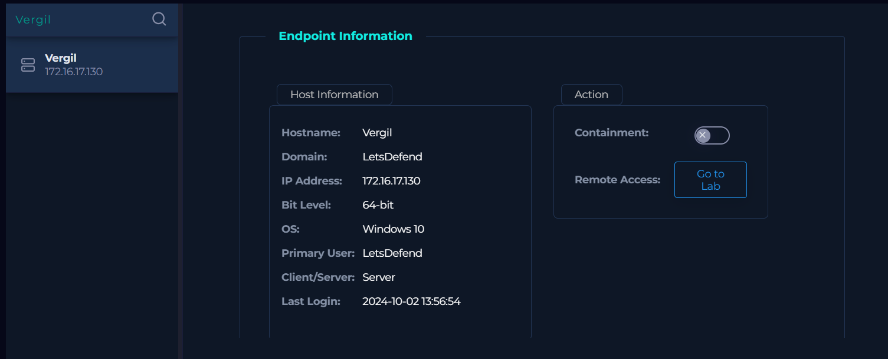

Terminal history filled in gaps the log platform did not show. Reading upward from 05:52:22 in endpoint time: mofcomp.exe compiling a Defender management MOF file, then MsMpEng.exe at 05:52:35, with the PowerShell shadow copy command sitting between them at 05:52:30. Defender was active in the same few seconds that the payload was destroying recovery points, and it still did not block anything. The alert field that reads Detected rather than Blocked is this gap written down in one word.

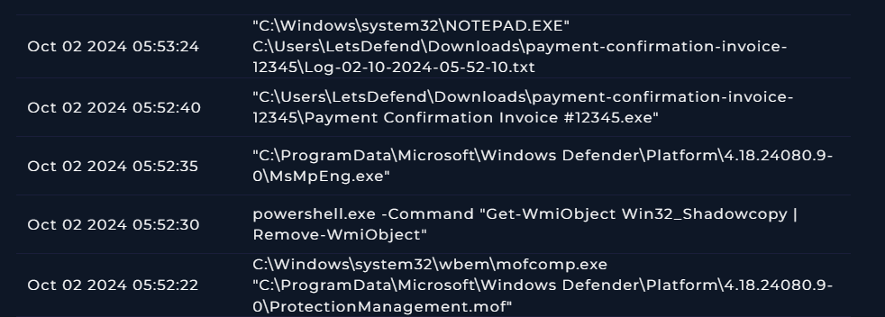

One entry needed a second look. At 05:53:24, NOTEPAD.EXE opened Log-02-10-2024-05-52-10.txt, the file the payload had written. My first reading was that this was attacker activity. The process list does not support that. Notepad ran as PID 5964 with explorer.exe as its parent, under the interactive LetsDefend session, which is the same pattern as the 7-Zip extraction earlier. Nothing here shows a remote session or a spawned shell.

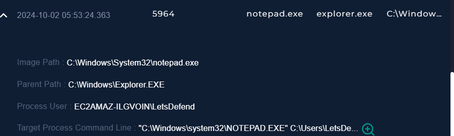

The command line confirms the target file.

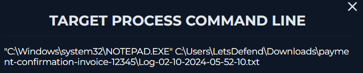

The likelier explanation is the user themselves, noticing a strange file appear next to the invoice they had just opened and double clicking it to see what it was. I cannot prove which of the two it was from the available data, so the report does not claim either. It is worth writing down because an analyst reading this later should not inherit an assumption that was never tested.

The last gap is the one that matters most. Remote access to Vergil failed every time it was attempted, so there was no way to list the file system and check for encrypted files directly.

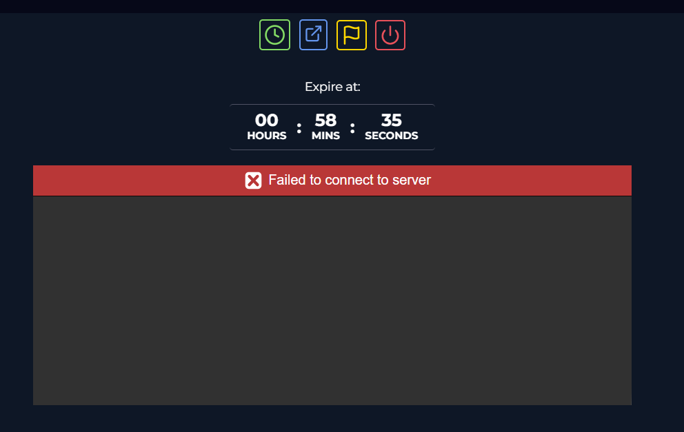

No file carrying the .akira extension appears in any log source available from the platform side, and absence in logs is not the same as absence on disk. Sandbox analysis of this exact hash shows encryption with that extension, so the capability is confirmed. Whether it finished on this host is the question L2 has to answer once they have the machine in front of them.
