# Incident Report: Lazarus Phishing Campaign Detected (APT38)

**Incident:** Lazarus (APT38) ClickFix phishing results in payload download and VBScript execution on the endpoint
**Platform:** LetsDefend
**Severity:** High
**Category:** Phishing
**Date:** 06/03/25
**Related Alerts:** SOC337

> Investigation answers and platform flags are redacted. This report documents the analysis process and reasoning, not the solution to the exercise.

## 1. Alert Overview

| Field               | Value                                               |
| :------------------ | :-------------------------------------------------- |
| Alert ID            | SOC337                                              |
| Trigger Time        | 2025-03-06 07:15:00 +03:00                          |
| Rule Name           | SOC337 Lazarus Phishing Campaign Detected (APT38)   |
| Severity            | High                                                |
| Source Address      | trevorgreer9312@gmail.com (SMTP 152.89.61.96)       |
| Destination Address | ellen@letsdefend.io                                 |
| Device Action       | Allowed                                             |

The rule looks for inbound mail that matches the tradecraft of Lazarus, also tracked as APT38. The group runs long lived recruitment campaigns against people who work in crypto and finance, and the usual opening move is a job offer that arrives from an ordinary consumer mailbox rather than the company it claims to represent. The rule fired because a message with a recruitment subject line reached an internal user, and because the device action was Allowed, the mail landed in her inbox instead of being quarantined.

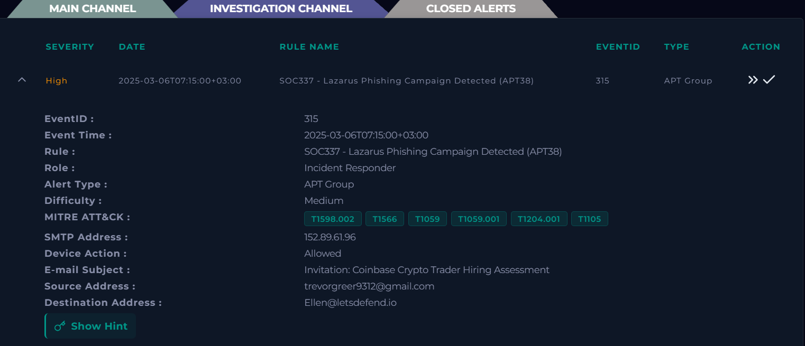

## 2. Alert Report

**Verdict:** True Positive

**Time of Activity:**

All timestamps below are in endpoint local time. Log Management shows the same events with a four hour offset, which matters when you line the two views up against each other.

| Time                      | Activity                                                              |
| :------------------------ | :-------------------------------------------------------------------- |
| 2025-03-06 11:15:00       | Phishing email delivered to ellen@letsdefend.io, final action Allowed  |
| 2025-03-07 00:21:35       | User visits blockchainjobhub.com/invite/E3fM8yF7                       |
| 2025-03-07 00:25:04       | curl.exe downloads nvidiaupdate.zip from api.drivercams.cloud          |
| 2025-03-07 00:25:26       | PowerShell extracts the archive to C:\Users\LetsDefend\nvidiadrive     |
| 2025-03-07 00:25:55       | wscript.exe runs nvidiadrive\update.vbs                                |
| 2025-03-07 00:24:59 to 00:27:37 | Outbound traffic reviewed, no connections to malicious infrastructure |

From the moment the link was opened to the moment the script ran, four minutes and twenty seconds passed.

**Affected Entities:**

| Entity            | Value                                                                       |
| :---------------- | :-------------------------------------------------------------------------- |
| Affected host     | 172.16.17.214 (Ellen)                                                       |
| User account      | EC2AMAZ-ILGVOIN\LetsDefend                                                  |
| Recipient         | ellen@letsdefend.io                                                         |
| Sender            | trevorgreer9312@gmail.com                                                   |
| Phishing URL      | https://blockchainjobhub.com/invite/E3fM8yF7                                |
| Payload source    | https://api.drivercams.cloud/nvidia-al.update                               |
| Files dropped     | C:\Users\LetsDefend\nvidiaupdate.zip, C:\Users\LetsDefend\nvidiadrive\update.vbs |
| Processes involved| curl.exe, powershell.exe, wscript.exe, all spawned by explorer.exe          |

**Reasoning:**

The alert triggered on a ClickFix phishing email that reached the inbox of ellen@letsdefend.io and was acted on from the workstation Ellen (172.16.17.214). Investigation confirmed that the user opened the linked page from the email, that curl.exe downloaded nvidiaupdate.zip from an external payload URL, and that PowerShell extracted the archive before wscript.exe executed update.vbs, which indicates the social engineering worked and the attack reached the execution stage.

Header analysis of the EML file confirmed that SPF, DKIM and DMARC all pass and that the Return Path matches the From field, which indicates the sender was not spoofed but authenticated from a genuine Gmail account impersonating a Coinbase recruiter. No attachment was present. The payload was delivered through a link in the message body, flagged malicious by VirusTotal and visited by the user at 00:21:35 on 2025-03-07.

Process history confirmed the chain that followed. At 00:25:04 curl.exe downloaded the archive from https://api.drivercams.cloud/nvidia-al.update, at 00:25:26 PowerShell extracted it to C:\Users\LetsDefend\nvidiadrive using Expand-Archive with the Force switch, and at 00:25:55 wscript.exe executed update.vbs. All three processes were spawned by explorer.exe, which indicates user initiated execution rather than automated delivery and matches the ClickFix pattern used in this campaign.

Review of update.vbs confirmed the script was never finished. The base URL is still the placeholder http://example.com/path/to/drivers, it waits on an InputBox prompt before any download, and it contains no registry writes, scheduled tasks or startup modifications, which indicates no persistence was established. Outbound connections between 00:24:59 and 00:27:37 support this, resolving only to Google, AWS, Microsoft and Akamai infrastructure.

The email was allowed through by the mail gateway instead of blocked, and no control stopped the download or the execution. Impact was avoided because the attacker's script was not fully configured, and no follow up activity was observed on the host.

**Escalation:** Escalated to L2.

A targeted phishing email attributed to Lazarus reached a user's inbox, the user acted on it, and an attacker supplied script executed on the endpoint. The host 172.16.17.214 has already been isolated from the network.

For scope, the activity is confined to this host and this user account. The executed script had no working payload URL, no persistence was created, no C2 was observed, and Email Security shows no other recipients from this campaign. The first thing L2 should pick up is confirmation that no second stage payload reached the host. After that, the control gaps that let the mail and the download through matter more than hunting for a wider compromise.

**Recommended Remediation Action:**

1. Preserve copies as evidence, then remove C:\Users\LetsDefend\nvidiaupdate.zip and the C:\Users\LetsDefend\nvidiadrive directory.
2. Block blockchainjobhub.com and api.drivercams.cloud at the web proxy and at the DNS layer.
3. Delete the phishing email from the recipient's mailbox and sweep the organisation for other copies.
4. Restrict execution of .vbs files for standard users through Group Policy, or disable Windows Script Host outright. Workstations rarely need it.
5. Review the egress controls that let curl.exe pull an archive straight from an unclassified external domain.
6. Add detection for curl.exe and wscript.exe spawned by explorer.exe, and flag mail from free providers that uses recruitment or assessment wording, since passing authentication proves nothing here.
7. Run an awareness follow up with the user covering recruitment lures and any web page that asks you to run a command.

**Indicators of Compromise:**

| Type         | Indicator                                      | Notes                                                        |
| :----------- | :--------------------------------------------- | :----------------------------------------------------------- |
| Email        | trevorgreer9312@gmail.com                      | Sender, fake Coinbase recruiter using a genuine Gmail account |
| IP           | 152.89.61.96                                   | SMTP address recorded in the alert                            |
| IP           | 91.231.86.6                                    | Resolution of blockchainjobhub.com at time of analysis        |
| Domain / URL | https://blockchainjobhub.com/invite/E3fM8yF7   | Phishing landing page visited by the user, 14/92 on VirusTotal|
| Domain / URL | https://api.drivercams.cloud/nvidia-al.update  | Payload download source, 15/98 on VirusTotal                  |
| File Name    | nvidiaupdate.zip                               | Downloaded archive                                            |
| File Name    | update.vbs                                     | Script executed through wscript.exe                           |
| File Path    | C:\Users\LetsDefend\nvidiadrive\               | Extraction directory                                          |

**MITRE ATT&CK:**

| Tactic               | Technique                                            | ID        |
| :------------------- | :--------------------------------------------------- | :-------- |
| Initial Access       | Phishing: Spearphishing Link                         | T1566.002 |
| Execution            | User Execution: Malicious Link                       | T1204.001 |
| Execution            | User Execution: Malicious File                       | T1204.002 |
| Execution            | Command and Scripting Interpreter: PowerShell        | T1059.001 |
| Execution            | Command and Scripting Interpreter: Visual Basic      | T1059.005 |
| Command and Control  | Ingress Tool Transfer                                | T1105     |
| Defense Evasion      | Deobfuscate/Decode Files or Information              | T1140     |
| Defense Evasion      | Masquerading: Match Legitimate Name or Location      | T1036.005 |

## 3. Investigation

### 3.1 Initial Triage

The alert gave me a sender, a recipient, a subject line about a Coinbase hiring assessment, and a device action of Allowed. That last field decided the order of work. If the mail was delivered, the question is no longer whether the message is malicious but whether the user acted on it, so I started in Email Security to understand the lure and then moved straight to the endpoint to look for the consequences. Working hypothesis going in: a recruitment lure from a Gmail address, most likely carrying a link rather than an attachment, since Lazarus prefers to keep the first hop clean.

### 3.2 Email analysis

Email Security holds one message for Ellen. The sender claims to represent Coinbase but writes from a personal Gmail address, which is the first thing that does not fit.

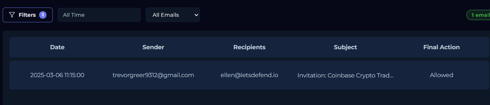

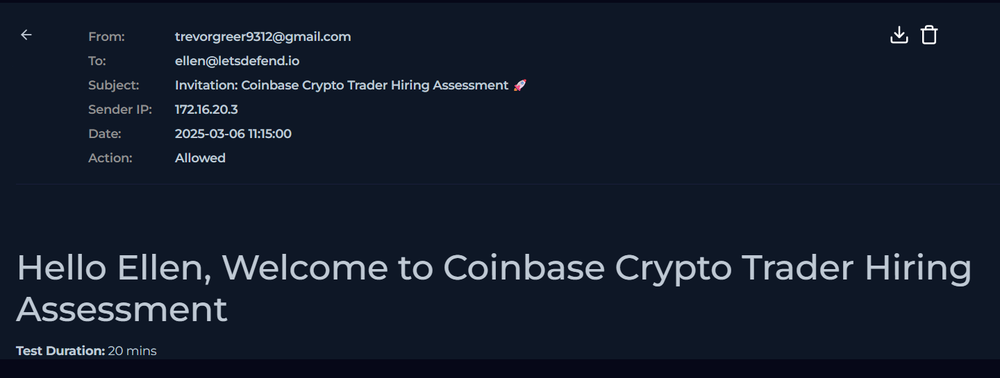

Downloading the EML and reading the headers produced the result I did not expect: SPF, DKIM and DMARC all pass. My first instinct was to treat that as a point in the sender's favour, and that instinct was wrong. Authentication only proves the mail really came from the Gmail account it claims to come from. The attacker owns that account, so there is nothing to spoof and nothing for the checks to catch. I discarded the spoofing hypothesis here and stopped treating authentication as a trust signal for the rest of the investigation.

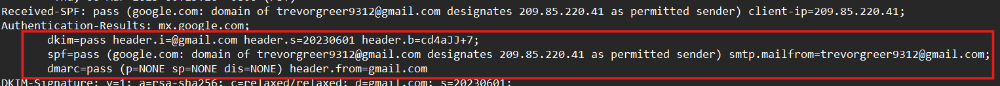

There is no attachment. The payload is a link in the message body.

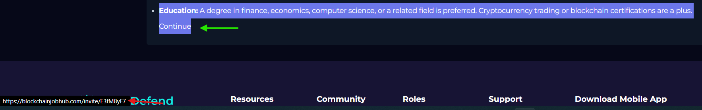

VirusTotal flags that URL as malicious, 14 vendors out of 92, and shows the domain resolving to 91.231.86.6.

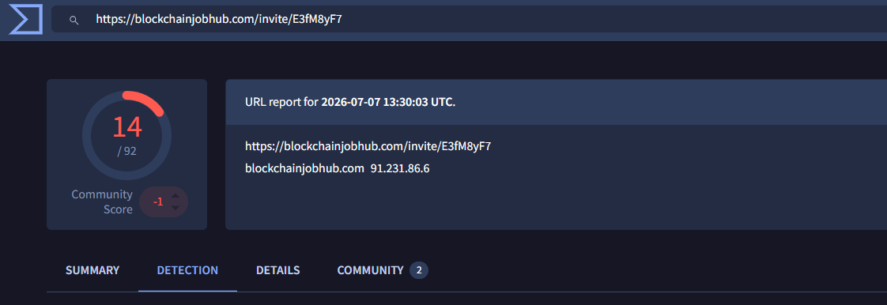

### 3.3 Browser history on the endpoint

With the mail confirmed as malicious, the open question was whether Ellen clicked. Endpoint Security answers it.

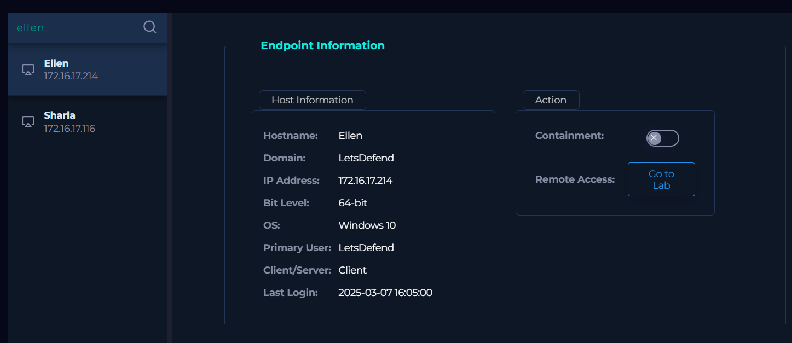

Browser history holds exactly one relevant entry, the same invite URL from the email, at 00:21:35 on 2025-03-07. The user clicked.

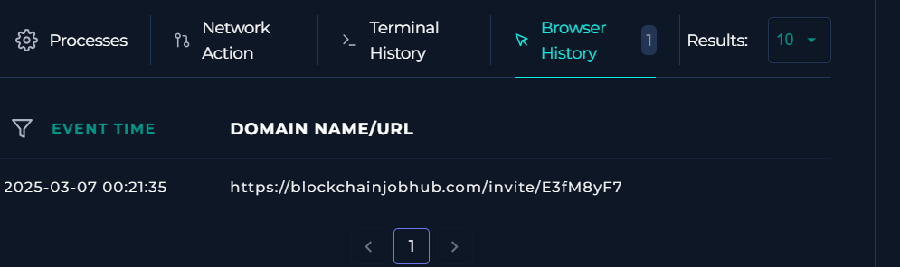

### 3.4 Terminal and process history

Terminal history shows one command repeating over and over. It extracts nvidiaupdate.zip into C:\Users\LetsDefend\nvidiadrive, and the Force switch means it overwrites anything already there without asking.

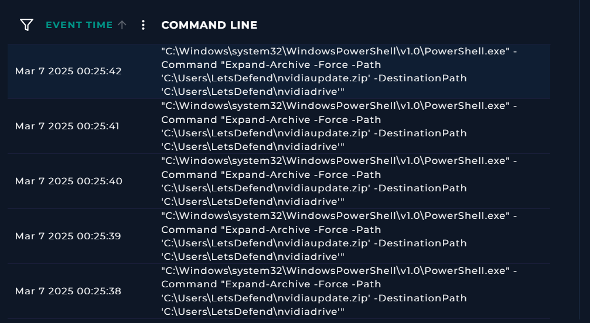

That gave me an execution window around 00:25, so I walked the process list forward from there rather than reading it from the top.

At 00:25:04, curl.exe downloads nvidiaupdate.zip.

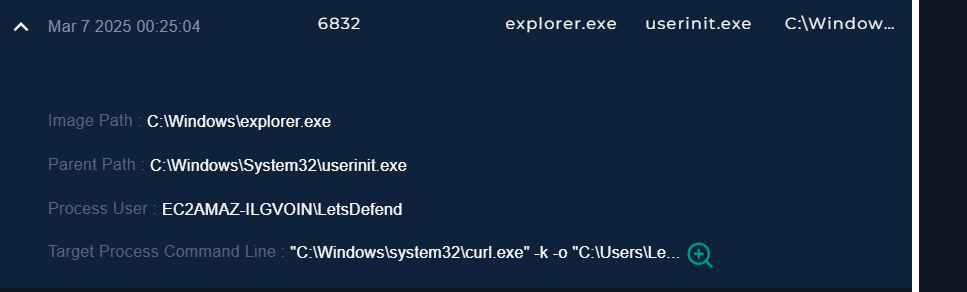

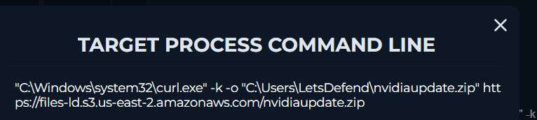

At 00:25:26, PowerShell runs the extraction command recorded in the terminal history.

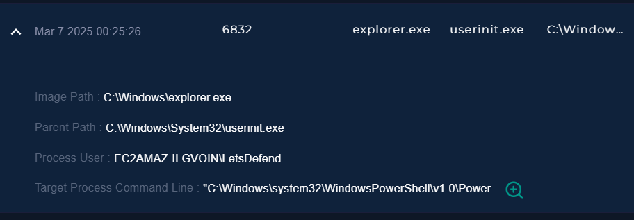

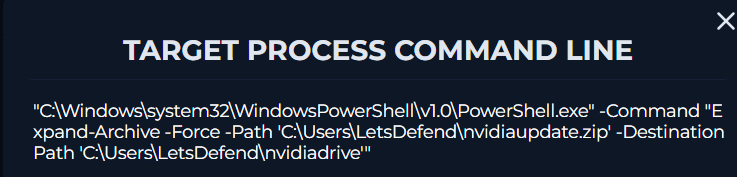

At 00:25:55, wscript.exe executes update.vbs.

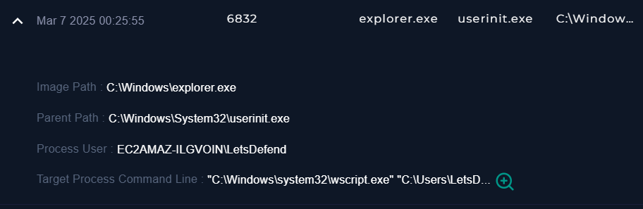

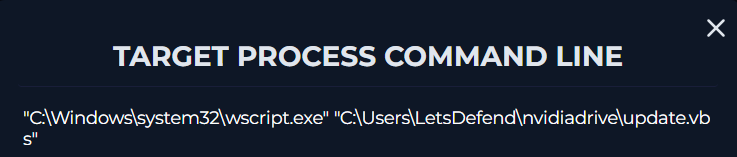

The parent process matters more than any of the three commands. All three were spawned by explorer.exe, not by a browser, a mail client or a dropper. Commands that arrive from explorer.exe were typed or pasted by the person at the keyboard, which rules out silent exploitation and points to ClickFix, where the victim is shown a fake device error and talked into running the fix herself.

### 3.5 Log management

Log Management records a single entry for this host, and it answers where nvidiaupdate.zip came from.

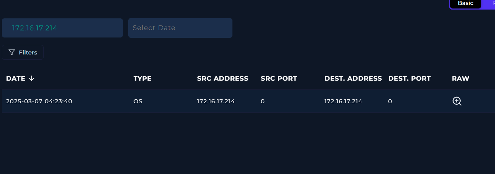

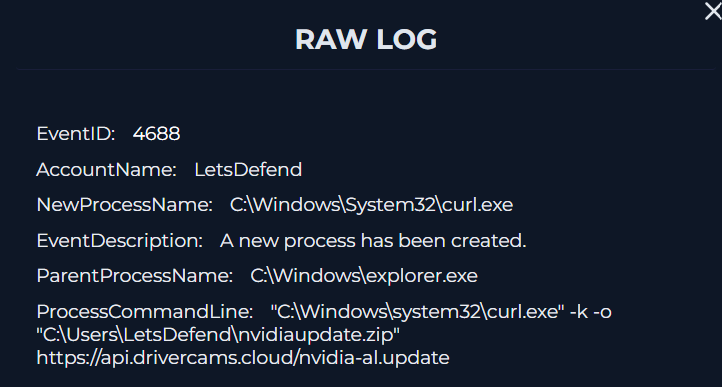

The download came from curl, and the source URL is https://api.drivercams.cloud/nvidia-al.update. VirusTotal flags it as malicious, 15 out of 98. This is also where the four hour offset between Log Management and the endpoint view becomes obvious, so I normalised everything to endpoint local time before building the activity table.

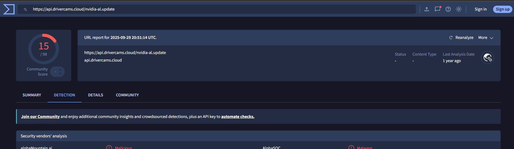

### 3.6 Payload review on the host

At this point the chain was proven and the remaining question was what the script actually does. The extraction directory holds a batch file, a signed driver package and update.vbs.

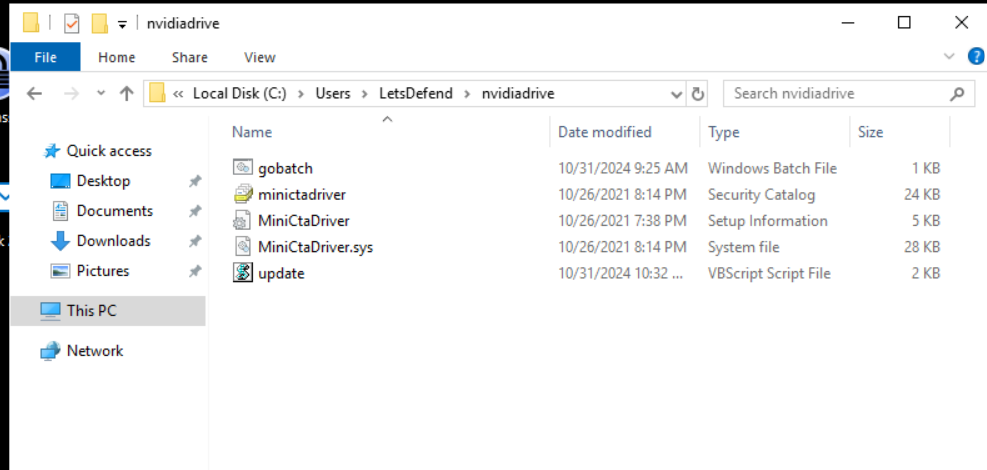

Opening update.vbs in VS Code changed the picture. The base URL is still http://example.com/path/to/drivers and the driver version is still x.xx.x, both untouched placeholders. The script shells out to nvidia-smi, then waits on an InputBox prompt before it downloads anything, and the file it would fetch is a Linux driver package on a Windows host.

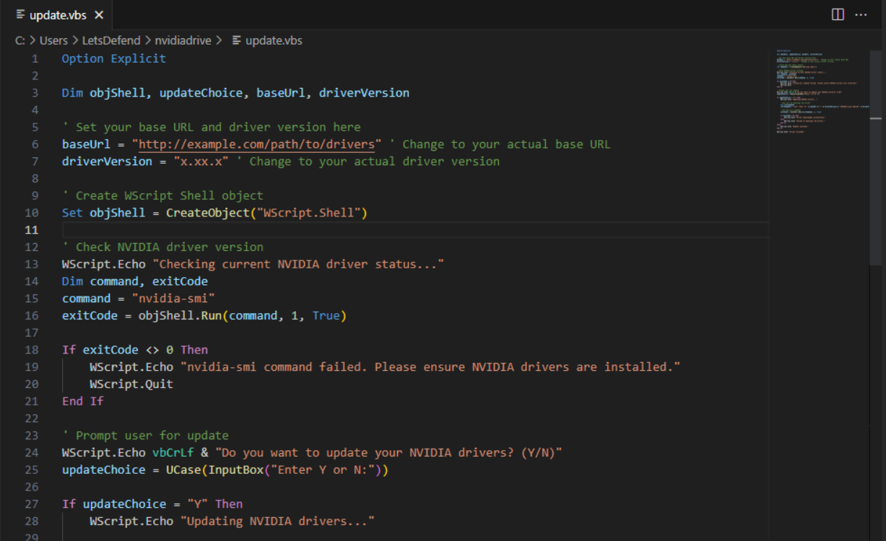

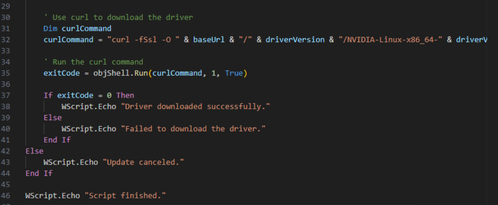

There are no registry writes, no scheduled tasks and no startup modifications anywhere in the script. The hypothesis I walked in with, that execution meant a live implant, does not survive that. The script ran and did nothing, and that is a property of the attacker's sloppiness rather than anything the defence did.

### 3.7 Network connections

Reading the script gave me a prediction to test. If the payload URL was never configured, the host should never have called anywhere interesting. I went through the outbound connections between 00:24:59 and 00:27:37 one at a time and every destination resolves to Google, AWS, Microsoft or Akamai. There is no command and control traffic in that window.

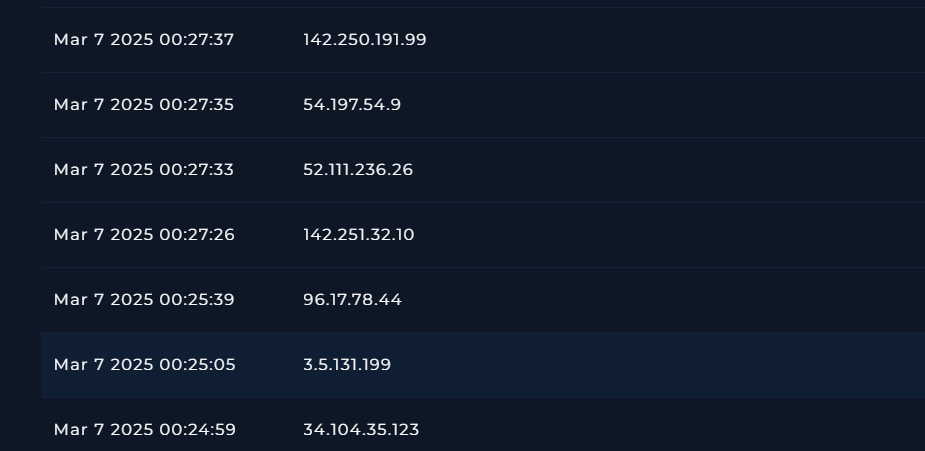

The script and the network traffic agree with each other, and that is the only reason I was comfortable telling L2 that no second stage arrived.
