# Incident Report — Lumma Stealer Delivered Through a Click Fix Phishing Page

**Incident:** Click Fix phishing results in PowerShell execution and an outbound payload request
**Platform:** LetsDefend
**Severity:** Critical
**Category:** Phishing
**Date:** 03/13/25
**Related Alerts:** SOC338

> Investigation answers and platform flags are redacted. This report documents the analysis process and reasoning, not the solution to the exercise.

An employee got an email offering a free upgrade to Windows 11 Pro. No attachment, so nothing for antivirus to scan. The email just told him to press three key combinations. Those keystrokes pasted a command the attacker had already written into his clipboard, and ran it. Eleven seconds after he clicked the link, his machine was talking to the attacker's server.

---

## 1. Alert overview

| Field               | Value                                                  |
| ------------------- | ------------------------------------------------------ |
| Alert ID            | SOC338                                                 |
| Trigger Time        | 2025-03-13 09:44 (UTC+3)                               |
| Rule Name           | Lumma Stealer, DLL Side Loading via Click Fix Phishing |
| Severity            | Critical                                               |
| Source Address      | update@windows-update.site (SMTP 132.232.40.201)       |
| Destination Address | dylan@letsdefend.io                                    |
| Device Action       | Allowed                                                |

The rule looks for mail pointing users at pages that carry a Click Fix script, which is how Lumma Stealer gets distributed. Click Fix skips the attachment entirely. The page copies a command into the victim's clipboard, and the page text talks the victim into pasting and running it himself. Since the victim types the keystrokes, the malicious command lands on the host without any file crossing the mail gateway or a download sandbox.

The field that made this urgent was Device Action. The mail was allowed into the inbox, not quarantined.

---

## 2. Alert report

**Verdict:** True Positive

**Time of Activity:** Endpoint logs are stamped UTC+3, firewall and proxy logs UTC. The timeline below is normalised to UTC+3.

13:44:00: Phishing email delivered to the inbox, device action Allowed
23:26:08: User opens windows-update.site from webmail
23:26:19: PowerShell executes an obfuscated command, truncated in the log
23:26:20: mshta.exe sends a GET request to overcoatpassably.shop, allowed by the firewall
23:26:31: PowerShell executes the same command in clear text
23:26:32: PowerShell executes the obfuscated command in full
after : No further outbound traffic from the host

**Affected Entities:**

Recipient : dylan@letsdefend.io |
Host : Dylan, 172.16.17.216, Windows 10 |
Process user : EC2AMAZ-ILGVOIN\LetsDefend |
Process : mshta.exe, PID 7284, C:\Windows\System32\mshta.exe |
Parent process : powershell.exe |
Sender : update@windows-update.site |
Sender IP : 132.232.40.201 |
Phishing URL : https://windows-update.site/ |
Payload URL : https://overcoatpassably.shop/Z8UZbPyVpGfdRS/maloy.mp4 |
Payload IP : 172.67.139.19 |

**Reasoning:**

The alert triggered on a Click Fix phishing email that reached the inbox of dylan@letsdefend.io and was acted on from the workstation Dylan (172.16.17.216). Investigation confirmed that the user opened the linked page from webmail, pasted the attacker's command into the Run dialog, and that PowerShell then launched mshta.exe against an external payload URL, which indicates the social engineering worked and the attack reached the execution stage.

The connection attempt was allowed by the perimeter firewall instead of blocked. No evidence of successful execution or follow up activity was observed on the host.

**Escalation:** Escalated to L2. The user interacted with every stage of this attack. Mail delivered, link clicked, attacker command executed, outbound request to attacker infrastructure permitted. Second stage execution could not be confirmed from the telemetry available at L1, but Lumma Stealer goes after browser credentials and session cookies, and it exfiltrates over HTTPS to infrastructure the host has already contacted. Treat the account as compromised until host forensics says otherwise.

L2 should start with memory and disk forensics on 172.16.17.216, specifically anything mshta.exe touched between 23:26:20 and containment.

Actions already taken at L1: phishing email deleted from the mailbox, host contained through EDR, alert closed as a true positive.

**Recommended Remediation Action:**

1. Reset the user's credentials and invalidate every active session, browser session cookies included.
2. Run host forensics to establish whether the second stage executed. Look for dropped files, scheduled tasks, registry autoruns, and DLLs sitting in user writable directories.
3. Block windows-update.site and overcoatpassably.shop at the DNS and proxy layer. Do not block 172.67.139.19. That address is Cloudflare, shared with legitimate sites.
4. Block the sender update@windows-update.site and the SMTP source 132.232.40.201 at the mail gateway.
5. Search mail logs for other recipients of the same campaign.
6. Query proxy and firewall logs for other internal hosts that contacted either domain.
7. Review why the gateway let through a message from a lookalike domain that had only existed for a week.

**Indicators of Compromise:**

| Type      | Indicator                                              | Notes                                                   |
| --------- | ------------------------------------------------------ | ------------------------------------------------------- |
| Email     | update@windows-update.site                             | Phishing sender                                         |
| IP        | 132.232.40.201                                         | SMTP source and phishing page host                      |
| Domain    | windows-update.site                                    | Click Fix landing page, 9 of 91 vendors on VirusTotal   |
| URL       | https://windows-update.site/                           | URL the user clicked                                    |
| Domain    | overcoatpassably.shop                                  | Payload delivery domain, 11 of 91 vendors on VirusTotal |
| URL       | https://overcoatpassably.shop/Z8UZbPyVpGfdRS/maloy.mp4 | Second stage payload                                    |
| IP        | 172.67.139.19                                          | Resolved address, Cloudflare, do not block              |
| File Name | maloy.mp4                                              | Requested by mshta.exe, not actually a video            |

**MITRE ATT&CK:**

The alert listed eight techniques. Six held up in the logs.

| Tactic              | Technique                                     | ID        |
| ------------------- | --------------------------------------------- | --------- |
| Initial Access      | Phishing: Spearphishing Link                  | T1566.002 |
| Execution           | User Execution: Malicious Link                | T1204.001 |
| Execution           | Command and Scripting Interpreter: PowerShell | T1059.001 |
| Stealth             | Obfuscated Files or Information               | T1027     |
| Stealth             | System Binary Proxy Execution: Mshta          | T1218.005 |
| Command and Control | Ingress Tool Transfer                         | T1105     |

---

## 3. Investigation

### 3.1 Initial triage

The alert named a Click Fix script, a Lumma Stealer distribution attempt, and a device action of Allowed. That last field set the order of work for me. Once mail is delivered, the gateway question is finished and the only question left is what the user did with it. I went in expecting the usual outcome, a phishing mail that landed and got ignored, and started at the mailbox.

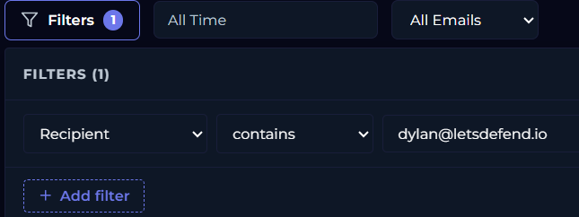

Filtering Email Security on the recipient gave me one message. Sent 13:44:00 from update@windows-update.site, subject "Upgrade your system to Windows 11 Pro for FREE", final action Allowed.

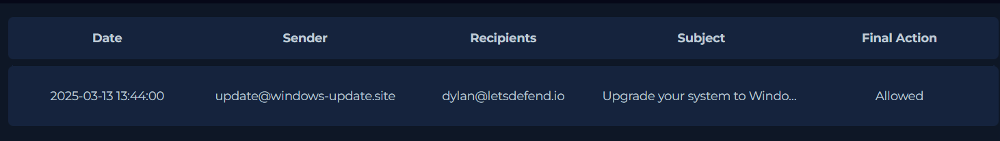

### 3.2 The email itself

It pretends to be a Microsoft offer for a free Windows 11 Pro upgrade. The host it landed on runs Windows 10, which is what makes the offer land.

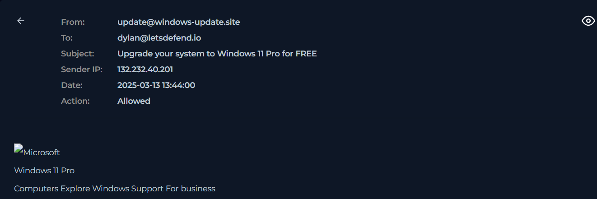

The body runs a countdown. "4 Days 23 Hours 59 Mins" until the free upgrade expires. The attacker needs the reader in a hurry, because anyone who slows down and reads the instructions properly will not follow them.


The call to action links to hxxps[://]www[.]windows-update[.]site. Built to read like Microsoft at a glance. Microsoft does not serve updates from it. The real domain is microsoft.com.

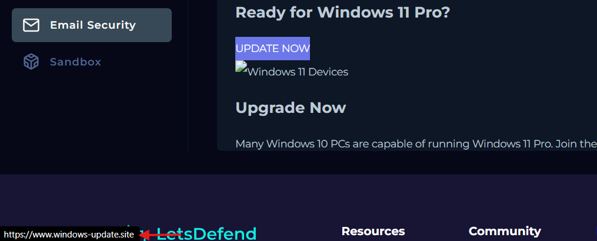

VirusTotal has it as malicious, 9 of 91 vendors. alphaMountain.ai, Sophos, Webroot and Forcepoint ThreatSeeker all file it under malware or spyware. First submission 2025-03-06, a week before the attack. That gap fits a domain registered for one campaign and then abandoned.

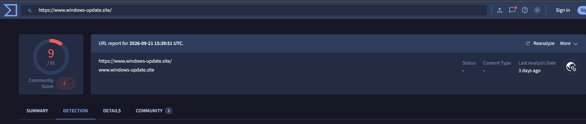

The middle of the email sells the upgrade with a feature comparison against Windows 10, warming the reader up before the instructions arrive.


### 3.3 The Click Fix instruction

The attack lives in the last section. A step by step upgrade procedure: press Win+R, then Ctrl+V, then Enter.

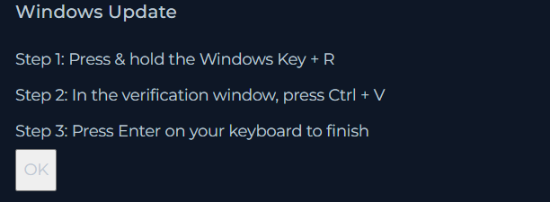

None of that belongs in a Windows upgrade. Updates run from Settings. What those keystrokes actually do is open the Run dialog, paste whatever is in the clipboard, and execute it. The clipboard was filled silently by a script on windows-update.site when the user clicked the button there, and what it held was a PowerShell command. The victim performs the execution himself. That is the whole point of the technique, and it explains why the mail carried nothing for antivirus to catch.

### 3.4 Endpoint, did the user act on it?

Browser history on 172.16.17.216 answered the first half of that.

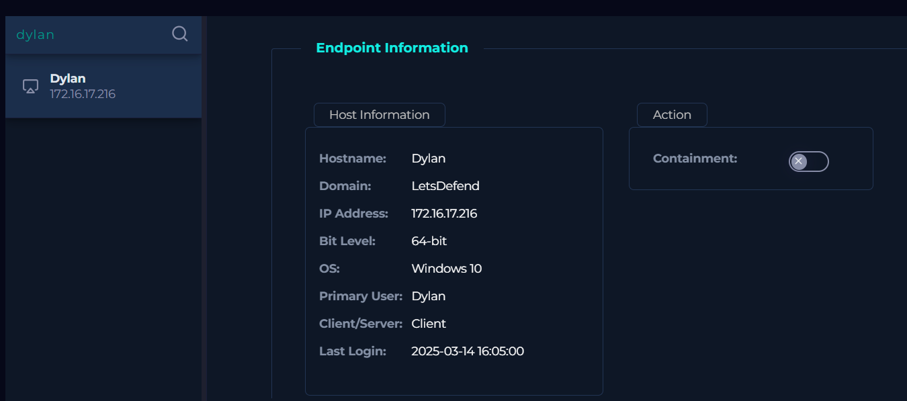

He visited windows-update.site at 23:26:08. So much for the ignored phishing mail theory.

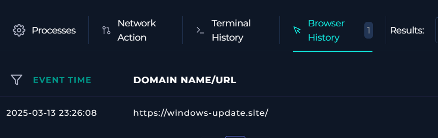

Terminal history answered the second half. PowerShell ran at 23:26:19, eleven seconds after the page visit, which is about how long Win+R, Ctrl+V, Enter takes if you are following written instructions. Three executions were recorded: a truncated obfuscated version at 23:26:19, a clear text version at 23:26:31, and the full obfuscated version at 23:26:32.

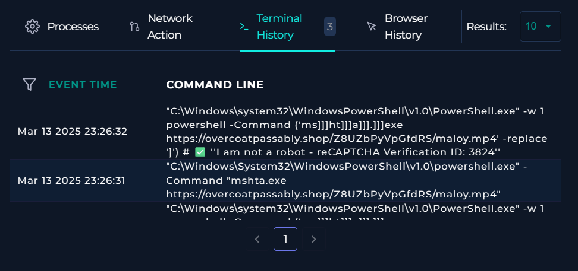

### 3.5 Reading the command

Underneath the noise it is one instruction. PowerShell calls mshta.exe against https://overcoatpassably.shop/Z8UZbPyVpGfdRS/maloy.mp4.

mshta.exe is a signed Microsoft binary that executes HTML Application content, and it will pull that content straight from a URL without ever writing a file to disk. That makes it a living off the land binary. What a defender sees is a trusted Windows process making a web request, not an unknown executable appearing on the system.

The attacker wrote the binary name as `ms]]]ht]]]a]]].]]]exe` and tacked on `-replace ']'` to strip the brackets at runtime. The string "mshta.exe" never appears in the command as typed, which kills any detection rule looking for the literal name.

`-w 1` hides the PowerShell window. The user hits Enter and sees nothing at all.

Then there is the extension. mshta cannot play video, so .mp4 is cover. Whatever sits behind that URL is HTA or script content.

The command also ends with a comment, "I am not a robot, reCAPTCHA Verification ID: 3824". Comments never execute. That line is there for the user who glances at the Run dialog before pressing Enter and wants a reason to believe the text is some kind of verification step. Small detail, but it tells you the campaign was built with the victim's hesitation in mind.

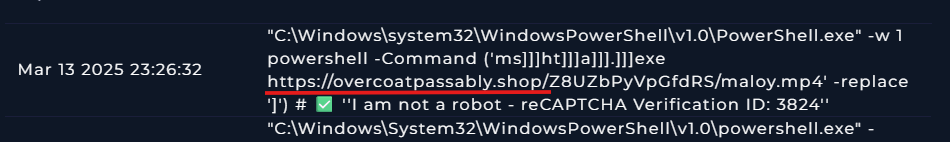

### 3.6 Reputation of the payload domain

overcoatpassably.shop comes back flagged by 11 of 91 vendors.

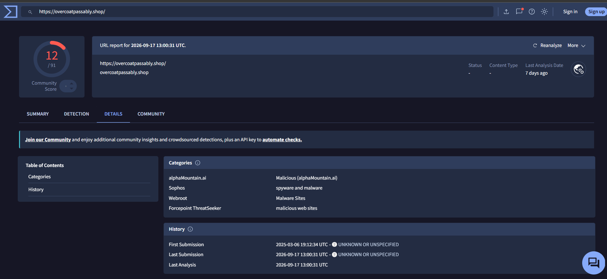

The relations tab gives two resolved addresses, 172.67.139.19 and 104.21.94.177. Both are Cloudflare. The real origin server is hidden behind the CDN and the traffic looks like an ordinary request to a shared service. This is also the reason only the domains belong on a block list. Blocking 172.67.139.19 would take down legitimate sites sharing the same Cloudflare range, which is a good way to turn an incident into an outage.

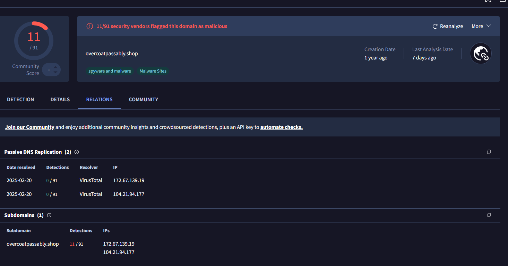

### 3.7 Matching the addresses against endpoint telemetry

Network Action returns a hit for 172.67.139.19.

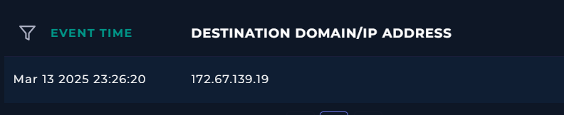

104.21.94.177 returns nothing. Only one of the two resolved addresses was ever contacted.

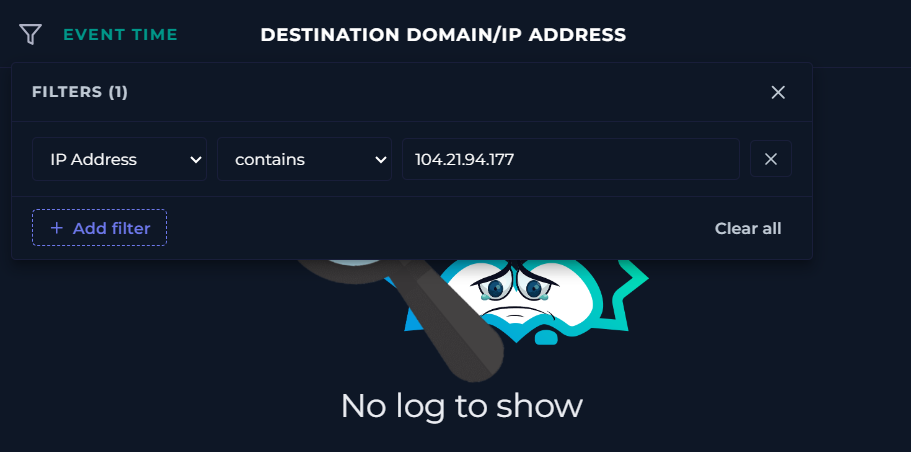

### 3.8 Process telemetry

The Processes tab confirms mshta.exe ran. PID 7284, image path C:\Windows\System32\mshta.exe, parent powershell.exe.

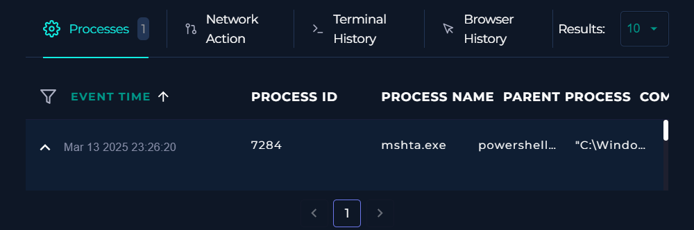

The next search was the one I expected to prove the alert's own title, and it did not. Filtering on Parent Path contains mshta came back empty. Nothing was spawned by mshta.exe anywhere in the endpoint telemetry, so the DLL side loading in the rule name has no evidence behind it on this host. Worth saying out loud, because an analyst who treats the alert title as already proven ends up writing a report the host data does not support.

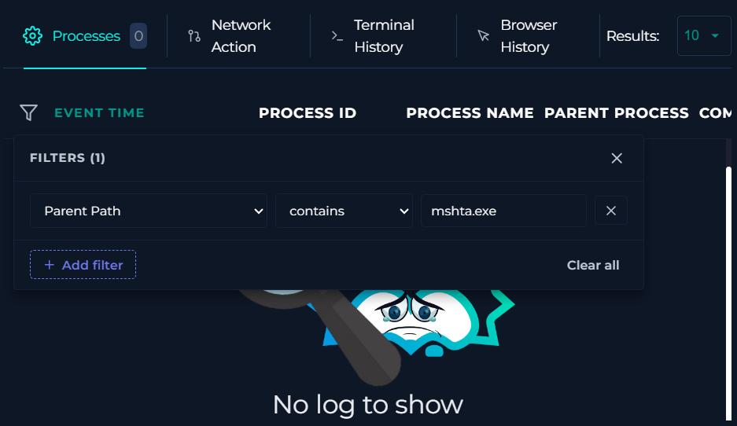

### 3.9 Firewall and proxy logs

Log Management on destination address 172.67.139.19 returns the outbound request.

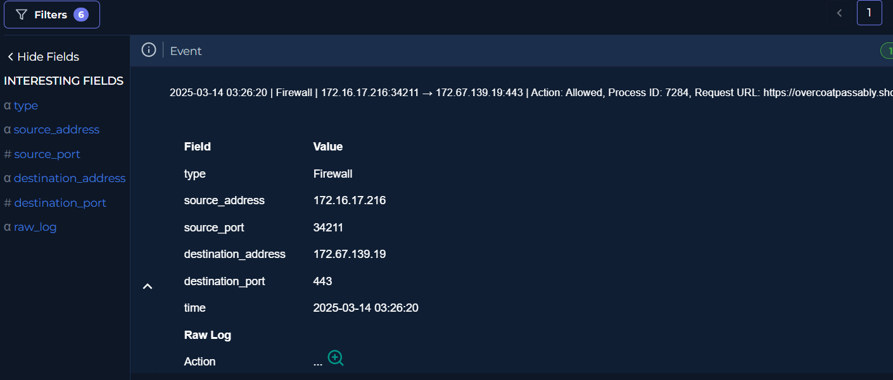

The firewall logged a GET from mshta.exe to the attacker's server, and allowed it.

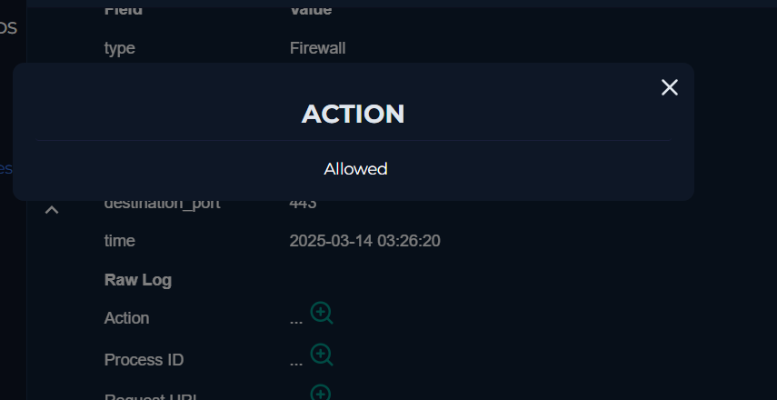

Process ID in the firewall log is 7284, the same PID I had from the endpoint. Two separate sources agreeing on the same process is what lets me state the outbound request as fact rather than inference.

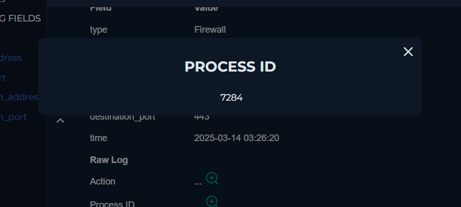

Searching on source address 172.16.17.216 pulled up a proxy log twelve seconds earlier.

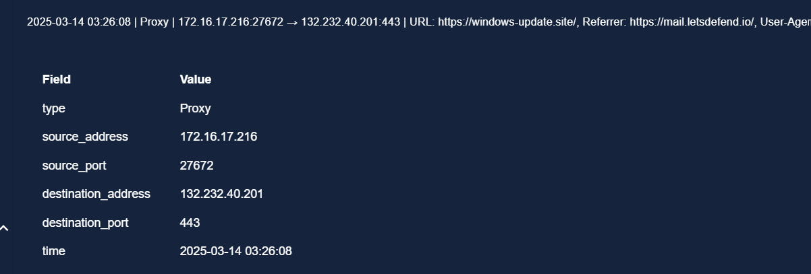

Its Referrer field reads mail.letsdefend.io. For me that field is the one that closes the case, because it proves the user reached the phishing page by clicking the link inside webmail, not by typing the address or arriving from somewhere unrelated. Up to that point the email to landing page connection was an assumption. After it, it is documented.

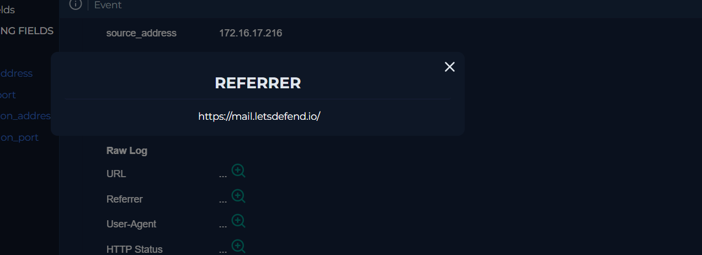

### 3.10 Where the chain stops

The same source address search shows the last outbound connection from the host at 23:26:20. Everything after that is dated 9 to 11 March, before the attack.

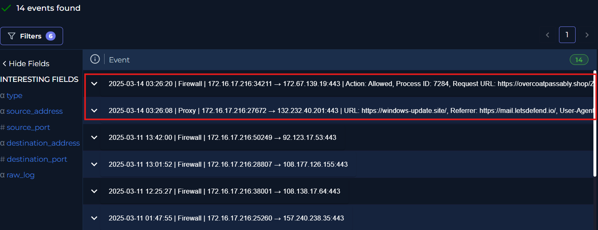

No C2 traffic, no exfiltration after mshta.exe reached the attacker's server. On the evidence available, the chain stops at payload retrieval. Four things I could not prove: whether the second stage downloaded successfully, whether Lumma Stealer executed, whether DLL side loading happened, and whether any credentials or cookies left the host.

None of that means the answer is no. It means L1 telemetry cannot see that far, which is why the host got contained and the alert went up to L2.

```

```
