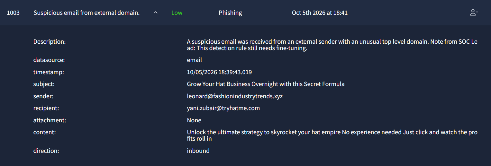

# Incident Report: Suspicious Email from External Domain

**Incident:** Suspicious Email from External Domain Delivered to Internal User
**Platform:** TryHackMe
**Severity:** Low
**Category:** Phishing
**Date:** 05/10/26
**Related Alerts:** 1003

> Investigation answers and platform flags are redacted. This report documents the analysis process and reasoning, not the solution to the exercise.

---

## 1. Alert Overview

| Field               | Value                                 |
| ------------------- | ------------------------------------- |
| Alert ID            | 1003                                  |
| Trigger Time        | 2026-10-05 18:41                      |
| Rule Name           | Suspicious email from external domain |
| Severity            | Low                                   |
| Source Address      | leonard@fashionindustrytrends.xyz     |
| Destination Address | yani.zubair@tryhatme.com              |
| Device Action       | Allowed                               |

This rule watches inbound mail and raises an alert when the sender address belongs to an unusual top level domain. Domains such as .xyz are cheap to register and are often used for throwaway infrastructure, so attackers favour them for phishing campaigns. The rule is a broad first filter rather than a precise one, and the alert itself carries a note from the SOC lead saying that the detection still needs fine-tuning. On this occasion the message passed the mail gateway and landed in the user's inbox, so the alert needed to be reviewed to decide whether it carried any real risk.

---

## 2. Alert Report

**Verdict:** False Positive

**Time of Activity:**

10/5/26 5:39:30.019 PM: Email received by user

**Affected Entities:**

recipient: yani.zubair@tryhatme.com

sender: leonard@fashionindustrytrends.xyz

**Reasoning:**

This alert was triggered by the email sender domain (.xyz). There is also a message from the SOC lead, "This detection rule still needs fine-tuning". At 5:39:30.019 PM user yani.zubair@tryhatme.com received an email from leonard@fashionindustrytrends.xyz. The purpose of the email is promotion. There are no attachments or links embedded in the email, so the email has no mechanism for delivering a payload or harvesting credentials. The .xyz top level domain is the only indicator supporting the detection and is not sufficient on its own. This confirms this email is a spam email.
