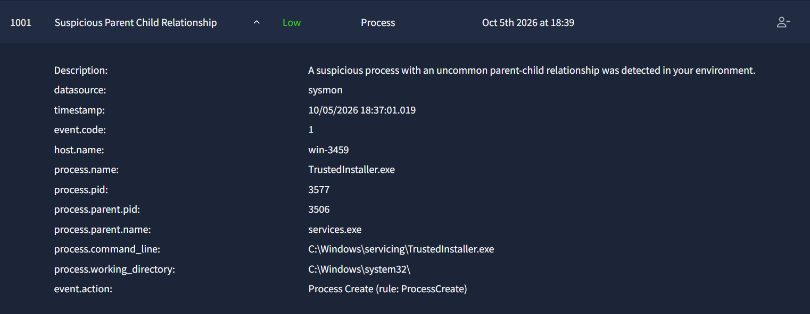

# Incident Report: Suspicious Parent Child Relationship

**Incident:** Uncommon Parent Child Process Relationship Detected on an Internal Host
**Platform:** TryHackMe
**Severity:** Low
**Category:** Execution
**Date:** 05/10/26
**Related Alerts:** 1001

> Investigation answers and platform flags are redacted. This report documents the analysis process and reasoning, not the solution to the exercise.

---

## 1. Alert Overview

| Field               | Value                                |
| ------------------- | ------------------------------------ |
| Alert ID            | 1001                                 |
| Trigger Time        | 2026-10-05 18:39                     |
| Rule Name           | Suspicious Parent Child Relationship |
| Severity            | Low                                  |
| Source Address      | win-3459                             |
| Destination Address | Not applicable                       |
| Device Action       | Allowed                              |

This rule reads Sysmon process creation events (event code 1) and raises an alert when a process is started by a parent that is not usually associated with it. Attackers rely on this pattern constantly, since techniques such as process injection, living off the land execution and malicious macros all tend to leave a child process hanging off a parent that has no business starting it. The rule is deliberately broad, so it also catches legitimate system behaviour that happens to look unusual on paper. The alert here fired on a process created on host win-3459 and needed review to establish whether the relationship was genuinely abnormal or simply normal Windows activity.

---

## 2. Alert Report

**Verdict:** False Positive

**Time of Activity:**

2026-10-05 18:36:48.019: TrustedInstaller.exe (PID 3577) created on win-3459

**Affected Entities:**

| Entity                    | Value                                     |
| ------------------------- | ----------------------------------------- |
| host.name                 | win-3459                                  |
| process.name              | TrustedInstaller.exe                      |
| process.pid               | 3577                                      |
| process.command_line      | C:\Windows\servicing\TrustedInstaller.exe |
| process.parent.name       | services.exe                              |
| process.parent.pid        | 3506                                      |
| process.working_directory | C:\Windows\system32\                      |

**Reasoning:**

The alert triggered on a reported uncommon parent-child relationship on host win-3459. Sysmon event code 1 recorded the creation of TrustedInstaller.exe (PID 3577) at 2026-10-05 18:36:48.019, with parent process services.exe (PID 3506). TrustedInstaller.exe is the Windows Modules Installer, a legitimate system service responsible for installing, modifying and removing Windows updates and system components. The image path C:\Windows\servicing\TrustedInstaller.exe is its expected location, and the working directory C:\Windows\system32\ is normal for a system service. As a Windows service, TrustedInstaller.exe is started by the Service Control Manager, so services.exe is the expected parent process rather than an anomalous one. The process was executed with no additional command-line arguments, and no suspicious child processes or network activity were observed. The parent-child relationship flagged by the rule is therefore expected behaviour for this binary, and the activity is consistent with routine Windows servicing.
